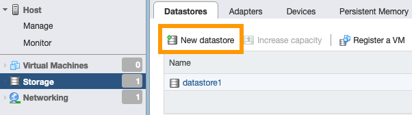

> [!primary]
> Questa traduzione è stata generata automaticamente dal nostro partner SYSTRAN. I contenuti potrebbero presentare imprecisioni, ad esempio la nomenclatura dei pulsanti o alcuni dettagli tecnici. In caso di dubbi consigliamo di fare riferimento alla versione inglese o francese della guida. Per aiutarci a migliorare questa traduzione, utilizza il pulsante "Modifica" di questa pagina.
>

**Ultimo aggiornamento: 08/11/2022**

## Obiettivo

Il servizio NAS-HA OVHcloud ti permette di gestire uno storage di file accessibile da una rete.

**Questa guida ti mostra come accedere al tuo NAS-HA tramite NFS sui sistemi operativi più utilizzati.**

> [!warning]
> OVHcloud offre una serie di servizi di cui è responsabile la configurazione e la gestione. Spetta quindi a te assicurarti che funzionino correttamente.
>
> Questa guida ti aiuta a eseguire le operazioni necessarie sul tuo VPS. Tuttavia, in caso di difficoltà o dubbi relativi all'amministrazione, all'utilizzo o alla creazione di servizi su un server, ti consigliamo di rivolgerti a un [fornitore specializzato](https://partner.ovhcloud.com/it/directory/) o di contattare la [nostra community](https://community.ovh.com/en/).
>

## Prerequisiti

- Disporre di una soluzione [NAS-HA OVHcloud](https://www.ovhcloud.com/it/storage-solutions/nas-ha/)
- Disporre di un servizio OVHcloud associato a un indirizzo IP pubblico (Hosted Private Cloud, server dedicato, VPS, istanza Public Cloud, ecc...)
- Disporre di un sistema operativo compatibile con NFS sul server
- [Aver creato una partizione sul tuo servizio con il protocollo NFS attivo](https://docs.ovh.com/it/storage/file-storage/nas/get-started/#partition)
- [Avere un record ACL per l'indirizzo IP del server](https://docs.ovh.com/it/storage/file-storage/nas/get-started/#addaccess)
- Avere accesso amministrativo (root) al server via SSH o GUI

## Procedura

Le sezioni seguenti contengono esempi di configurazione per le distribuzioni/sistemi operativi più utilizzati. Per prima cosa accedi al tuo server in SSH o accedi all'interfaccia grafica del tuo sistema operativo installato. Gli esempi che seguono presuppongono che tu sia connesso come utente con elevate autorizzazioni.

Ti ricordiamo inoltre il **nome interno** e **l'indirizzo IP** del tuo servizio NAS-HA, che troverai nell'email ricevuta dopo l'installazione o nel tuo [Spazio Cliente OVHcloud](https://www.ovh.com/auth/?action=gotomanager&from=https://www.ovh.it/&ovhSubsidiary=it).

I seguenti rating sono utilizzati come argomenti nelle sezioni di riga di comando qui di seguito. Sostituiscili con i valori appropriati al momento dell'inserimento degli ordini.

|Argomento|Descrizione|
|---|---|
|IP_HA-NAS|L'indirizzo IP del NAS-HA (esempio: `10.1.1.1`)|
|NFS_PATH|il percorso di accesso alla partizione NAS-HA da creare, composto dal nome del servizio e dal nome delle tue partizioni (esempio: `zpool-123456/partition01`)|
|MOUNTING_FOLDER|La cartella locale per la tua partizione montata|

> [!warning]
>
> L'utente NFS è `root`, le modifiche dei diritti con questo utente possono generare conflitti con i diritti CIFS/SMB esistenti.
>

### Distribuzioni basate su Debian

Installa il package `nfs-common`:

```bash
ubuntu@server:~$ sudo apt install nfs-common
```

A questo punto, utilizza il comando:

```bash
ubuntu@server:~$ sudo mount -t nfs IP_HA-NAS:NFS_PATH /MOUNTING_FOLDER
```

**Esempio:**

```bash
ubuntu@server:~$ sudo mount -t nfs 10.1.1.1:zpool-123456/partition01 /mount/ha_nas
```

Adesso puoi accedere alla tua partizione montata nella cartella specificata.

> [!primary]
>
> Per automatizzare il processo di montaggio ad ogni avviamento del server, aggiungi questa riga al file `/etc/fstab`:
>
> `IP_HA-NAS:/NFS_PATH /MOUNTING_FOLDER nfs rw 0 0`
>

### CentOS 7 / AlmaLinux / Rocky Linux

Verifica che le ultime versioni dei package `nfs-utils` e `rpcbind` siano installate:

```bash
centos@server:~$ sudo yum install nfs-utils rpcbind
```

Se necessario, riavvia il servizio `rpcbind` con questo comando:

```bash
centos@server:~$ sudo systemctl restart rpcbind
```

Per effettuare il mount della partizione, utilizza il comando:

```bash
centos@server:~$ sudo mount -t nfs IP_HA-NAS:NFS_PATH /MOUNTING_FOLDER
```

**Esempio:**

```bash
centos@server:~$ sudo mount -t nfs 10.1.1.1:zpool-123456/partition01 /mount/ha_nas
```

Adesso puoi accedere alla tua partizione montata nella cartella specificata.

> [!primary]
>
> Per automatizzare il processo di montaggio ad ogni avviamento del server, aggiungi questa riga al file `/etc/fstab`:
>
> `IP_HA-NAS:NFS_PATH /MOUNTING_FOLDER nfs rw 0 0`
>

### Fedora

Installa il package `nfs-utils`:

```bash
fedora@server:~$ sudo dnf -y install nfs-utils
```

A questo punto, utilizza il comando:

```bash
fedora@server:~$ sudo mount -t nfs IP_HA-NAS:NFS_PATH /MOUNTING_FOLDER
```

**Esempio:**

```bash
fedora@server:~$ sudo mount -t nfs 10.1.1.1:zpool-123456/partition01 /mount/ha_nas
```

Adesso puoi accedere alla tua partizione montata nella cartella specificata.


### Proxmox

Nell'interfaccia di amministrazione Proxmox, clicca su `Storage`{.action} nel menu verticale.

{.thumbnail}

Clicca sul pulsante `Add`{.action} e seleziona `NFS`{.action}.

Nella nuova finestra, inserisci le seguenti informazioni:

|Descrizione|Descrizione|
|---|---|
|ID|Identificatore della condivisione|
|Server|Indirizzo IP del NAS-HA (esempio: `10.1.1.1`)|
|Export|Percorso verso la partizione NAS-HA (Deve essere rilevato dalla scansione automatica: selezionalo nella lista)|
|Content|Tipi di contenuti per questa condivisione NFS (Disk image, ISO image, Container template, VZDump backup file, Container, Snippets)|

{.thumbnail}

Clicca su `Add`{.action} per montare la tua partizione.

### VMware ESXI

Dall'interfaccia di amministrazione VMware ESXI, clicca su `Storage`{.action} nel menu a sinistra.

Clicca sul pulsante `New datastore`{.action} per aprire l'assistente.

{.thumbnail}

Nella nuova finestra, seleziona `Mount NFS datastore`{.action} e clicca su `Next`{.action}.

{.thumbnail}

Compila il form con i seguenti dettagli:

|Descrizione|Descrizione|
|---|---|
|Name|Identificatore della condivisione|
|NFS server|Indirizzo IP del NAS-HA (esempio: `10.1.1.1`)|
|NFS share|Percorso verso la partizione NAS-HA da mount (esempio: `zpool-123456/partition01`)|

{.thumbnail}

Clicca su `Next`{.action}. Clicca su `Finish`{.action} nell'ultimo step.

La tua partizione NAS-HA è montata in datastore.

{.thumbnail}

## Per saperne di più

Contatta la nostra Community di utenti all’indirizzo <https://community.ovh.com/en/>.
