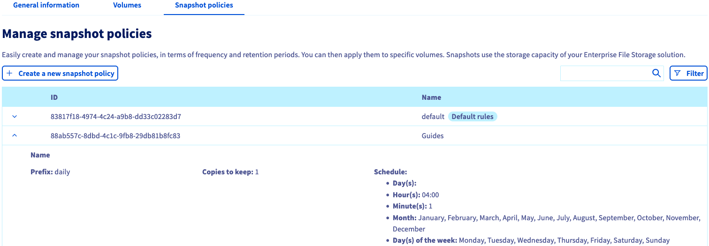

**Last updated 14th April 2022**

## Objective

Enterprise File Storage services can be managed [via the OVHcloud API](https://docs.ovh.com/ie/en/storage/file-storage/netapp/quick-start/) or in the OVHcloud Control Panel.

**This guide explains how to manage Enterprise File Storage volumes and snapshots in the OVHcloud Control Panel.**

## Requirements

- An Enterprise File Storage service in your OVHcloud account
- Access to the [OVHcloud Control Panel](https://www.ovh.com/auth/?action=gotomanager&from=https://www.ovh.ie/&ovhSubsidiary=ie)

## Instructions 

Log in to your [OVHcloud Control Panel](https://www.ovh.com/auth/?action=gotomanager&from=https://www.ovh.ie/&ovhSubsidiary=ie) and switch to `Bare Metal Cloud`{.action} in the top navigation bar. Open `Storage and Backup`{.action} and `Enterprise File Storage`{.action} in the left-hand menu, then select your service from the list.

{.thumbnail}

The `General information`{.action} tab displays some technical information, general subscription details and a shortcut to [create a volume](#create_volume).

> [!primary]
> Please visit the [concepts page](https://docs.ovh.com/ie/en/storage/file-storage/netapp/concepts/) for detailed information on the technical properties of Enterprise File Storage.
>

### Managing volumes 

Switch to the tab `Volumes`{.action}. The table lists all volumes you have created for the selected service. You can click on a volume ID to open its [management page](#modify_volume). 

{.thumbnail}

You can carry out some actions by clicking on the `...`{.action} button in each row of the table.

- **Modify the volume**: Opens the ["General information" section](#modify_volume) of the volume.
- **Create a snapshot**: Opens the ["Backups" section](#snapshots) to take a manual snapshot of the volume.
- **Manage snapshots**: Opens the ["Backups" section](#snapshots) of the volume.
- **Manage IP access (ACL)**: Opens the ["Access control list (ACL)" section](#access_control) where you can manage access control for the volume.
- **Delete the volume**: Will delete this volume after confirming the action in the popup window.

#### Creating a volume 

Click on the button `Create a volume`{.action}. In the new window, enter a name and description for the volume. Determine the size in GB and click on `Create a volume`{.action} to confirm.

{.thumbnail}

You can remove a volume by clicking on the `...`{.action} button in the table and then on `Delete the volume`{.action}.

#### Modifying a volume 

Click on a volume ID in the table to open the management page of this volume.

{.thumbnail}

The `General information`{.action} tab displays your volume's details as well as step-by-step instructions on how to connect to the volume including the individual parameters.

#### Creating and managing volume snapshots 

The `Backups`{.action} tab lists all the snapshots that have been created for the selected volume.

{.thumbnail}

To manually add a new snapshot of the volume in its current state, click on the `Actions`{.action} button and then on `Create a snapshot`{.action}.

In the popup window, you can enter a name and a description for it. Click on the `Create a snapshot`{.action} button to execute the creation.

On this tab you can also view all of the [snapshot policies](#snapshot_policy) created for the service and apply them to this volume.

{.thumbnail}

Click on the row of the policy concerned to review the details of the snapshot schedule. Select a policy via the circular selector button and then click on the button `Apply the policy`{.action} below the table.

In order to configure your [snapshot policies](#snapshot_policy), navigate back to the [volume management section](#instructions) of your service and open the tab `Snapshot policies`{.action}.

#### Listing and restoring snapshots 

The Control Panel functions do not include accessing and restoring your snapshots.

To access snapshots from your mount point, you can use the commands provided in the [NetApp documentation](https://library.netapp.com/ecmdocs/ECMP1196991/html/GUID-36DC110C-C0FE-4313-BF53-1C12838F7BBD.html){.external}.

#### Managing volume ACLs 

Access control to volumes works via IP address restrictions. Since none are configured by default, the first step with new volumes is to define IP addresses or ranges from which access will be authorised.

Click on the button `Add a new access`{.action}.

{.thumbnail}

This creates a new row in the table in which you can enter an IP address or an address block (CIDR). Select `Read-only` or `Read and write` as the access type in the drop-down menu and click on the check mark button to add this entry to the ACL.

To remove a volume access, click on the respective trash can icon in the table.

### Managing snapshot policies 

Adding policies allows you to schedule the creation of snapshots for all of your volumes.

Switch to the tab `Snapshot policies`{.action}. The table lists all policies created for the selected service.

A default policy is already in place which cannot be altered. To add your own, click on the button `Create a new snapshot policy`{.action}.

{.thumbnail}

In this view, you can enter a name and a description for the policy. Then use the button `Add a new rule`{.action} to add one or more rules to the policy.

{.thumbnail}

Fill in the fields to specify the time of day, days of a month, week days and months for the snapshot creation. You also have to enter a prefix for the snapshots, needed for naming them.

You can find more detailed information for each value by clicking on the question mark icon. By expanding the `Example`{.action} section you can view two sets of policy rules with an explanation of their outcome.

Click on the check mark button to add the new rule. Once all rules are added, click on `Create a new snapshot policy`{.action}.

[Select a volume](#manage_volume) and go to the `Backups`{.action} tab in order to [apply your policies](#snapshots).

To remove a policy, click on the respective trash can icon in the table.

> [!primary]
>
> Snapshots use the storage capacity of your Enterprise File Storage solution. 5% of a volume's size are always reserved for snapshots.
>

### First steps 

If you are new to using Enterprise File Storage, you can follow this sequence of steps to get started:

- [Create a volume](#create_volume)
- [Configure access control](#access_control)
- [Configure snapshot policies](#snapshot_policy) (optional)
- [Apply snapshot policies to the volume](#snapshots) (optional)
- [Access snapshots](#access_snapshots) (optional)
- [Connect to your volume by following the instructions in the "General information" section](#modify_volume)
- [Learn how to use Enterprise File Storage via API by consulting our guides](#gofurther) (optional)

## Go further 

[API Quickstart](https://docs.ovh.com/ie/en/storage/file-storage/netapp/quick-start/)

[Managing volumes via API](https://docs.ovh.com/ie/en/storage/file-storage/netapp/volumes/)

[Managing volume ACLs via API](https://docs.ovh.com/ie/en/storage/file-storage/netapp/volume-acl/)

[Managing volume snapshots via API](https://docs.ovh.com/ie/en/storage/file-storage/netapp/volume-snapshots/)

Join our community of users on <https://community.ovh.com/en/>.