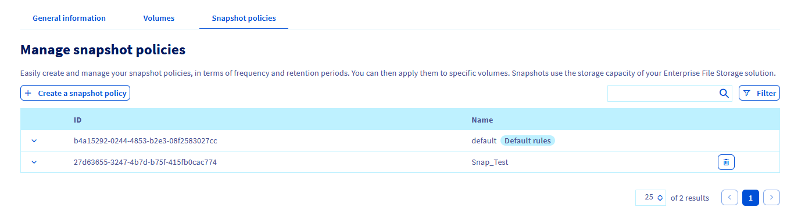
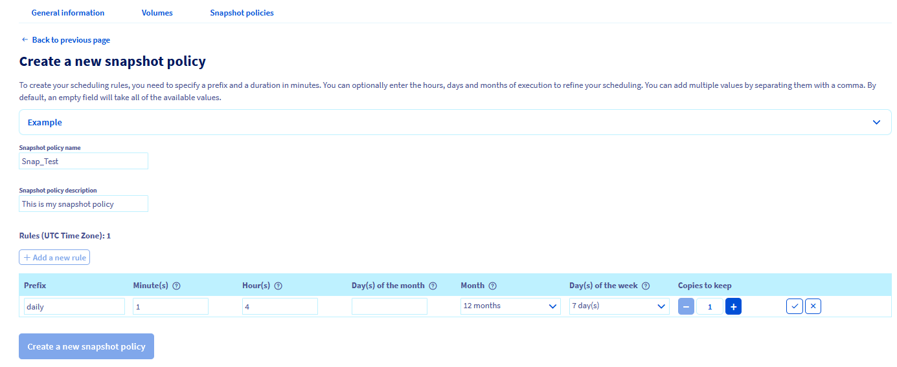
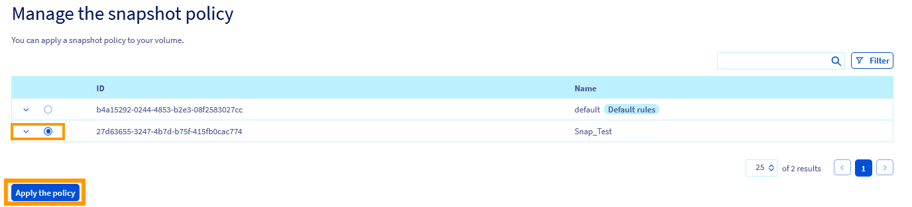

## Objective
  
In this guide, we will provide an overview of how to manage your snapshot policies for OVHcloud Enterprise File Storage volumes.
Learn how to create a snapshot policy, apply it to your volume, modify and delete it using the OVHcloud Control Panel.
  
## Requirements

- An OVHcloud Enterprise File Storage service with an available volume
- Access to the [OVHcloud Control Panel](https://ca.ovh.com/auth/?action=gotomanager&from=https://www.ovh.com/sg/&ovhSubsidiary=sg)

## Basics

A volume snapshot is a point-in-time, read-only copy of a volume. 
Snapshots are created from an existing, operational volume. They cannot exist without it. 
A snapshot policy allows you to automate the snapshot creation using different parameters. The policy can then be modified and deleted if you no longer need it.

## Instructions

Log in to your [OVHcloud Control Panel](https://ca.ovh.com/auth/?action=gotomanager&from=https://www.ovh.com/sg/&ovhSubsidiary=sg) and switch to `Bare Metal Cloud`{.action} in the top navigation bar. Open `Storage and Backup`{.action} and `Enterprise File Storage`{.action} in the left-hand menu, then select your service from the list.

### Creating your snapshot policy

A snapshot policy allows you to automate snapshots by defining the creation frequency in minutes, hours, days, weeks, or months. 
It is also required to specify the number of copies you want to retain.

1\. From your OVHcloud Enterprise File Storage Control Panel, select the `Snapshot policy`{.action} tab.
{.thumbnail}

2\. Set your snapshot policy name, a policy description and then use the button `+ Add a new rule`{.action} to add one or more rules to the policy.
{.thumbnail}

3\. Fill in the fields to specify the time of day, days of a month, week days and months for the snapshot creation. You also have to enter a prefix for the snapshots, needed for naming them.

You can find more detailed information for each value by clicking on the question mark icon. By expanding the `Example`{.action} section you can view two sets of policy rules with an explanation of their outcome.

Click on the check mark button to add the new rule. Once all rules are added, click on `Create a new snapshot policy`{.action}.

> [!primary]
> You need to specify a prefix and a duration in minutes. You can optionally enter the hours, days and months of execution to refine your scheduling.
>

You cannot modify a snapshot policy after creating it. You will have to delete it and create another one if you need to apply new frequency parameters.  

### Applying a snapshot policy 

Once the snapshot policy is created, you can apply it to a volume.

1\. Go to the tab `Volumes`{.action} of your capacity pool.
{.thumbnail}

2\. Choose the volume you want the snapshot policy applied to from the list.
3\.	Go the `Snapshots`{.action} section and in the `Manage the snapshot policy`{.action} section, select the policy you want to apply. 
4\.	Click on the button `Apply the policy`{.action}.
{.thumbnail}

### Deleting a snapshot policy

> [!warning]
>
> A snapshot policy attached to a volume cannot be deleted. If you want to delete a snapshot policy associated to one or more volumes, you will have to disassociate the snapshot policy first by associating another snapshot policy to these volumes.
>

To delete a snapshot policy:

1\.	Go to the `Snapshot policies`{.action} tab of your capacity pool.
{.thumbnail}

2\.	Select the policy you want to delete.
3\.	Click on the `Trash can`{.action} deletion button.
{.thumbnail}

## Go further

If you need training or technical assistance to implement our solutions, contact your sales representative or click on [this link](https://www.ovhcloud.com/en-sg/professional-services/) to get a quote and ask our Professional Services experts for assisting you on your specific use case of your project.

Join our community of users on <https://community.ovh.com/en/>.
