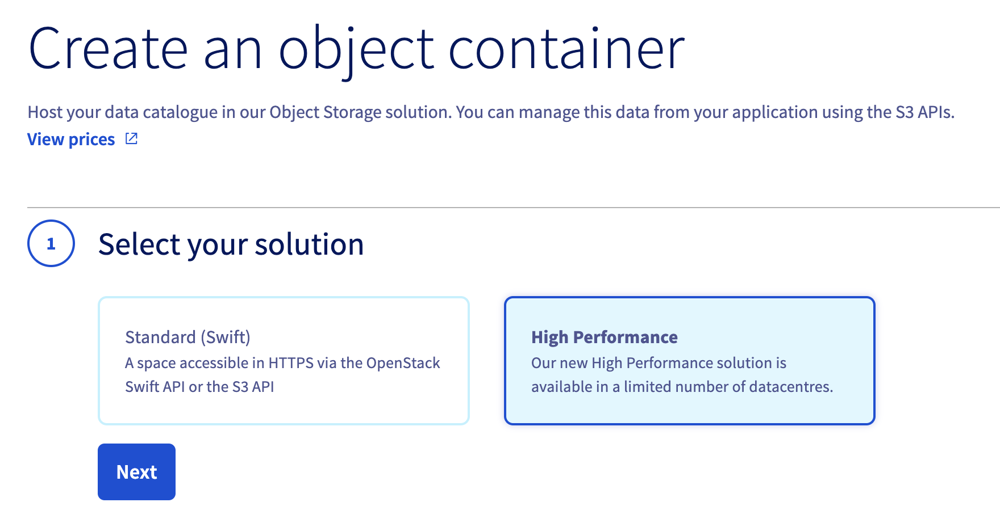
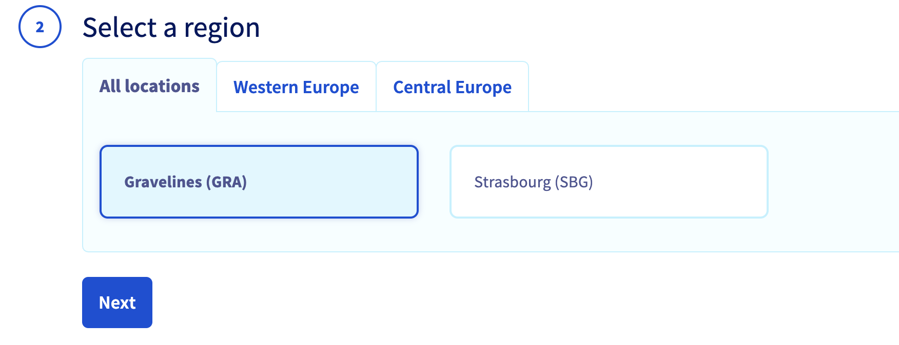
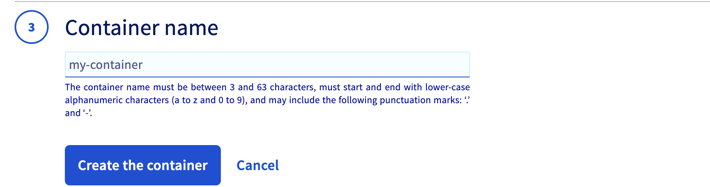
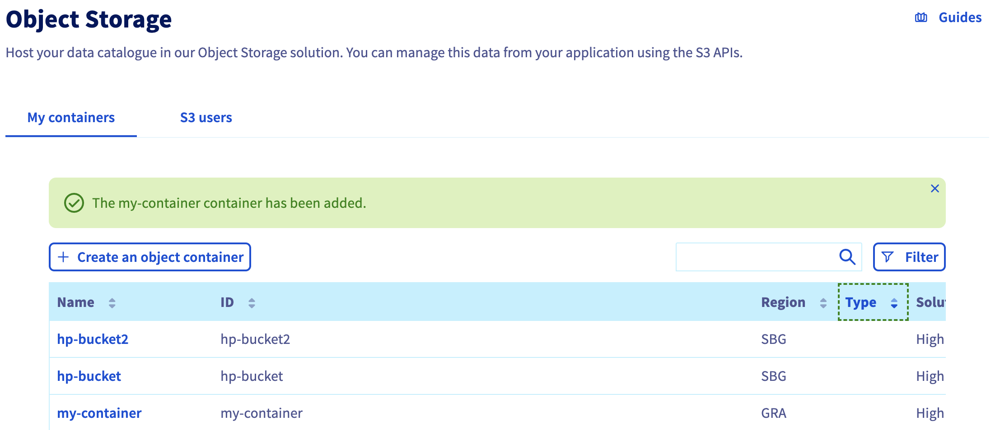

**Last updated 11th July 2022**

## Objectif

Nowadays, part of the applications need more speed because the objects are bigger and plentiful. That’s the case for Big Data use cases and IA scenarios but also for the majority of modern applications.

- Those who work on Big Data analysis know that you can wait hours before getting your result in many cases. Working on data to analyze users behavior, system deviation, cost optimization requires powered compute resources but also high performance storage. Big Data clusters needs to access the date quickly to provide a result in time.
- Training IA models and fine tuning the predictions requires a lot of data analysis also that takes hours and slow down your progress if your storage solution is the bottleneck.
- Serving media that are bigger and bigger (4K video, HD pictures on smartphones, …) on high speed network (fiber, 5G) challenge the previous solutions.

The High Performance Object Storage solution offers a storage solution for these needs.

**This guide explains how to create an OVHcloud High Performance Object Storage container from the OVHcloud Control Panel.**

## Requirements

- Access to the [OVHcloud Control Panel](https://www.ovh.com/auth/?action=gotomanager&from=https://www.ovh.co.uk/&ovhSubsidiary=GB)

## Instructions

### Creating an Object Storage container from the OVHcloud Control Panel

Log in to the [OVHcloud Control Panel](https://www.ovh.com/auth/?action=gotomanager&from=https://www.ovh.co.uk/&ovhSubsidiary=GB), go to the `Public Cloud`{.action} section and select the Public Cloud project concerned. Then, click on `Object Storage`{.action} in the left-hand navigation bar under "Storage".
Finally, click `Create an object container`{.action}.

If this is your first container:

If this is not your first container:

Select `High Performance` solution and click on `Next`{.action}.

Select the region of your container, then click `Next`{.action}:

Name your container, then click `Create the container`{.action}:

Your container is now created:

## Go further

Join our community of users on [https://community.ovh.com/en/](https://community.ovh.com/en/).
