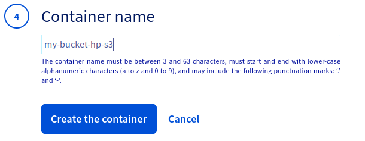
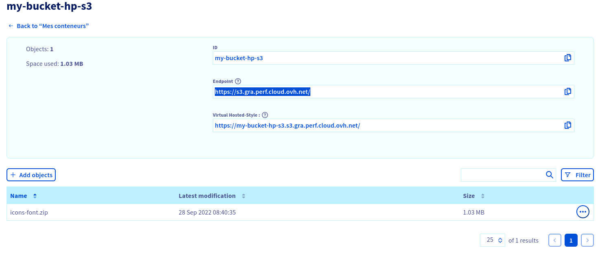

**Last updated September 27th 2022**

## Objective

**This guide aims to familiarise you with creating a bucket**

> [!primary]
>
> - If you are interested in storage class ***Standard object storage - SWIFT API***, please follow this [guide](https://docs.ovh.com/ie/en/storage/pcs/create-container/)
> - If you are interested in storage class ***Cloud Archive - SWIFT API***, please follow this [guide](https://docs.ovh.com/ie/en/storage/pca/create-container/).
>

## Requirements

- A [Public Cloud project](https://www.ovhcloud.com/en-ie/public-cloud/) in your OVHcloud account
- Access to your [OVHcloud Control Panel](https://www.ovh.com/auth/?action=gotomanager\&from=https://www.ovh.co.uk/\&ovhSubsidiary=GB)

## In practice

### Using the Control Panel

To create an Object Storage bucket, first log in to your [OVHcloud Control Panel](https://www.ovh.com/auth/?action=gotomanager\&from=https://www.ovh.co.uk/\&ovhSubsidiary=GB) and open your `Public Cloud`{.action} project. Click on `Object Storage`{.action} in the navigation bar on the left and then on the `My containers`{.action} tab.

Click `Create Object Container`{.action} and select your storage class:

Select a region:

> [!primary]
>
> Regions can vary depending on the storage class selected.
>

You must link a user to the bucket:

To do this, you can either link an existing S3 user:

You can view the user credentials by clicking on `View credentials`{.action}:

Or you can create a new S3 user:

The user credentials are then displayed:

Finally, name your bucket:

Congratulations, your bucket is created:

### Where to find the Endpoint URL of a bucket

Click on the name of your bucket to view its details and content:

## Go further

Join our community of users on <https://community.ovh.com/en/>.
