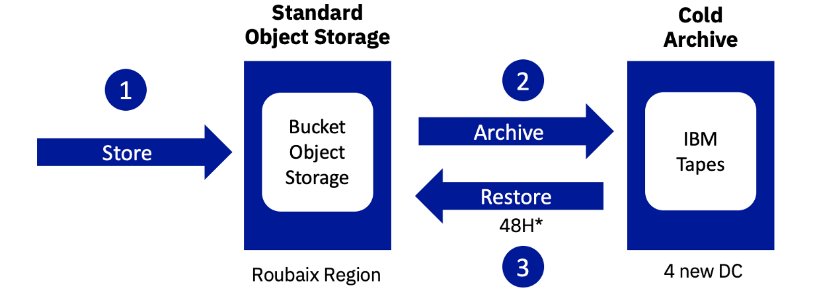

**Last updated September 27th 2022**

## General questions

#### What is OVHcloud Object Storage?

Object Storage is a family of storage solutions that offer high-performance, scalable and secure storage spaces.

With object storage solutions, you can store static files (videos, images, web files...) in an unlimited space via a public access point, called an endpoint. You can use these files from an application, or you can make them accessible on the web. These storage spaces are accessible via a standard S3 API interface for the Object Storage S3 and Swift storage classes for the Object Storage SWIFT storage classes.

#### In what use is an object storage solution used?

Object storage is adapted to store unstructured data in an unlimited way in volume and time, for use cases such as websites, ecommerce platforms, video streaming, image libraries, analytics, backups, archives.

#### What is the difference between S3 object storage classes and SWIFT object storage classes?

The Object Storage S3 storage classes are largely compatible with the S3 protocol and have a recent design, high performance and good bandwidth. This solution is regularly updated with new features.

SWIFT storage classes are older generation classes and no longer benefit from developments. They are accessible through the OpenStack SWIFT protocol.

#### How do I know which storage class is suitable for my uses?

OVHcloud offers three S3 storage classes:

- **High Performance** for your latency and bandwidth intensive applications
- **Standard** for large storages for which you are looking for a better price/performance ratio, e.g. for websites, image-sharing libraries or backup devices,
- **Cold Archive** for your archives.

Storage classes are described [here](https://docs.ovh.com/gb/en/storage/s3/choosing-a-suitable-storage-class/).

#### What features are available for my S3 storage classes?

Object S3 storage classes have enhanced features to better manage your data: S3 user profile management, object-based access rights configuration, data protection with bucket immutability, version management.
In our roadmap, new functions are coming, we invite you to regularly consult our public roadmap GitHub [here](https://github.com/ovh/public-cloud-roadmap/projects/3).

#### Which S3 APIs are compatible with Object Storage S3 storage classes?

S3 object storage classes offer wide support for S3 APIs. All compatible APIs are described [here](https://docs.ovh.com/gb/en/storage/s3/choosing-a-suitable-storage-class/).

#### What tools are compatible with S3 object storage?

Most of the tools on the market that are compatible with standard S3 storage are compatible with S3 object storage.

### Can the S3 object storage work with my backup management tools?

Yes, S3 object storage is largely compatible with S3 APIs and can be integrated with market tools such as [Veeam](https://docs.ovh.com/gb/en/storage/s3/veeam/), [Owncloud](https://docs.ovh.com/gb/en/storage/s3/owncloud/), [Nextcloud](https://docs.ovh.com/gb/en/storage/s3/nextcloud/).

#### How is the service billed?

Object Storage is billed according to the storage space used, with a granularity of 1 GB. To make it easier to read, the price is displayed per GB/month, but the billing granularity is per GB/hour, considering that on average there are 720 hours in a month. Prices are available [here](https://www.ovhcloud.com/en-gb/public-cloud/prices/).

### Access & security

#### By which APIs can I access storage solutions?

We have designed the S3 storage classes to be **compatible with the S3 API**, considered as a benchmark in the object storage market. You can therefore use Object Storage with most data management tools via endpoints defined by region and storage class.

Locate your S3 access keys and access the different storage classes via command line AWS-CLI or s3cmd and others...

The list of endpoints is available [here](https://docs.ovh.com/gb/en/storage/s3/location/).

### Can I access the service using a private network (vRack)?

Object storage endpoints are available across the public network. Object storage class is not available on the private network.

#### Can I manage multiple user profiles?

You can manage multiple user profiles with S3 Policies. A guide is available [here](https://docs.ovh.com/gb/en/storage/s3/getting-started-with-s3/).

#### How do I configure access permissions by object or by bucket?

Access rights can be configured by user profile and by object. A guide is available [here](https://docs.ovh.com/gb/en/storage/s3/identity-and-access-management/).

It is not yet possible to configure access permissions by bucket.

#### Can I encrypt my data?

Using server-side encryption with client-provided encryption keys (SSE-C) allows you to define your own encryption keys.

When you load an object, S3 Object Storage uses the encryption key you provide to apply AES-256 encryption to your data. When retrieving an object, you must provide the same encryption key as part of your request. S3 Object Storage first checks that the encryption key you provided matches, then decrypts the object before returning the object data to you.

A guide is available [here](https://docs.ovh.com/gb/en/storage/s3/encrypt-your-objects-with-sse-c/).

#### How do I protect my backups?

We recommend that you protect your backups with immutability, a function available via the S3 object lock API.

Object locking is a feature that allows you to store objects using a Write Once, Read Many (WORM) template and can be used in scenarios where it is imperative that data is not modified or deleted after writing.

A guide is available [here](https://docs.ovh.com/gb/en/storage/s3/managing-object-lock/).

### Bandwidth

#### What is the bandwidth?

Bandwidth is shared and not guaranteed. We offer a maximum of 1 Gbps/connection in upload and download.

### How is the bandwidth billed?

Prices are set and displayed on [this web page](https://www.ovhcloud.com/en-gb/public-cloud/prices/#439).

An OVHcloud server is a server operated for an OVHcloud service, e.g. a server from the Bare Metal, Public Cloud or Hosted Private Cloud range (Dedicated server/VPS/Public Cloud/Hosted Private Cloud/So you Start/Kimsufi)

- Incoming internal traffic is represented by data downloaded from an OVHcloud server to an OVHcloud server
- Outgoing internal traffic is represented by data downloaded from an OVHcloud server to an OVHcloud server
- Incoming public traffic is represented by data downloaded from the internet to an OVHcloud server
- Outgoing public traffic is represented by data uploaded from an OVHcloud server to the internet

### Availability

#### What level of availability can I achieve with Object Storage?

When the Service is unavailable or experiencing faults for which OVHcloud may be held responsible, you can contact the OVHcloud teams and open an incident ticket from your OVHcloud Control Panel.

OVHcloud agrees to ensure the Service levels for Service availability, as described in the T&Cs you can view [here](https://docs.ovh.com/gb/en/storage/s3/choosing-a-suitable-storage-class/).

### Durability

#### How reliable and durable is my data?

Storage classes are all designed to provide 99.999% (5x9) durability of objects in a given year.

The data and their additional information that can be used to reconstruct the data (erasure coding) are saved on different fault zones in order to guarantee data resilience after a fault zone has been shut down or lost.

As in any environment, the current best practice we recommend to all our customers is to keep a backup of the data and put in place protection against accidental or malicious deletions. For example, we strongly recommend monitoring access permissions, and implementing replication across multiple regions, as well as versioning and maintaining functional, regularly-tested backups.

| Storage Class | Durability |
|------:|:------|
| Object Storage S3 High Performance | 99,999 % (5x9) |
| Object Storage S3 Standard Performance | 99,999 % (5x9) |
| Object Storage S3 Cold Archive | 99.9999999999 % (11x9) This level of durability corresponds to an expected annual average loss of 0.0000001 % of objects. For example, if you store 10,000,000 objects with S3, you can expect to lose a single object on average once every 10,000 years. |
| Object Storage Swift Standard Performance | 99,999 % (5x9) |
| Object Storage Swift Cloud Archive | 99,999 % (5x9) |

## Cold Archive

#### How do I archive data with the Cold Archive storage class?

Data archiving is done in two steps.

1. First, you upload your data to a bucket in the standard object storage class, in order to receive your archives (endpoint: <https://s3.rbx.archive.cloud.ovh.net/>)
2. You archive your data with the API `put archive`

At any time you can unarchive your data (`get archive`) or delete your archive (`delete archive`).

At any time, the metadata remains available instantly and can be consulted free of charge on the standard object class, allowing you to consult the list of your archives.

#### How long do I need to unarchive my data?

Unarchiving an archive is not free and may take up to 48 hours for the first objects to be available again on the standard class.

Data recovery availability time depends on the amount of data. For example, for a recovery of several hundreds TB, the average time is 48 hours. For a volume of a few TBs, this can range from a few minutes to a few hours.

#### How is the Cold Archive service billed?

- The standard object storage bill starts when the data is uploaded to the storage class and stops when the bucket is archived (`put archive` API)
- The Cold Archive storage invoice starts when the `put archive` API is called and is stopped when an `delete archive` API is called.

The volume is calculated with the total capacity of all compartments in a Public Cloud project ID.

A discount is applied to all volumes, when available.

#### Is there a minimum commitment duration?

There is no minimum commitment period, except for the Cold Archive class, for which the minimum duration is 180 days. If an archive is deleted before this time (date = date between 0 days and 180 days), an additional cost calculated by the customer is billed: storage class '[180 days - date] x price'.

### Upload / download data

#### How do I replicate my data from one region to another?

You can choose to synchronise your data from one region to another using rclone [here](https://docs.ovh.com/gb/en/storage/s3/rclone/).

#### Is it possible to manage the life cycles of the data?

Lifecycle options are not yet available. Please follow our public roadmap on GitHub to be informed about its release [here](https://github.com/ovh/public-cloud-roadmap/projects/3).

### Performance

#### How do I upload large volumes of data?

To download large volumes of data, it is recommended to parallelise connections. (multithread upload). Several requests are in progress in parallel and the bandwidth is multiplied (1 Gbps per connection). More details on the methodology are available [here](https://docs.ovh.com/gb/en/storage/s3/optimise-the-sending-of-your-files/).

#### What bandwidth is available for upload and download?

The maximum bandwidth is 1gbps per connection.

## Go further

Join our community of users on <https://community.ovh.com>.
