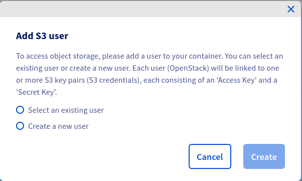
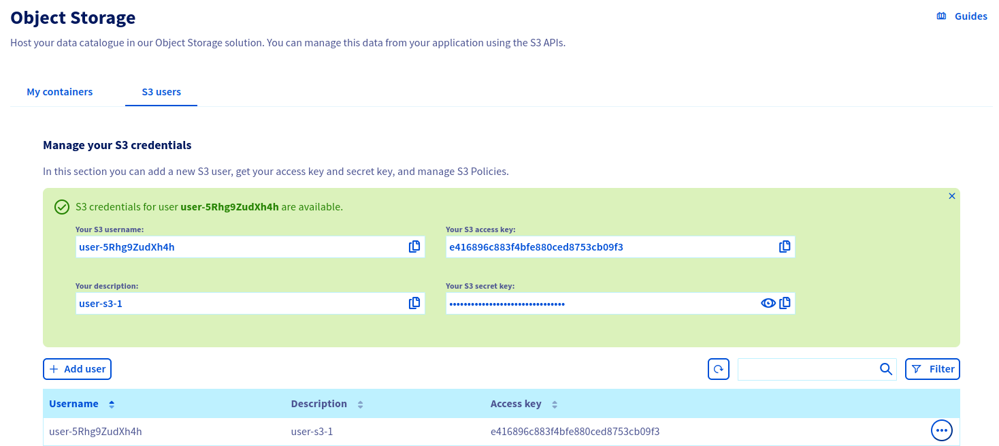
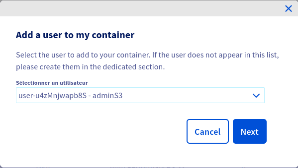
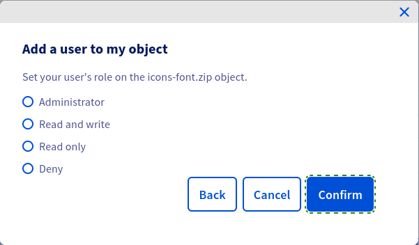

**Last updated September 27<sup>th</sup> 2022**

## Objective

The purpose of this guide is to show you how to manage your identities and access your S3 Object Storage resources.

## Requirements

- A [Public Cloud project](https://www.ovhcloud.com/es-es/public-cloud/) in your OVHcloud account
- Access to your [OVHcloud Control Panel](https://www.ovh.com/auth/?action=gotomanager&from=https://www.ovh.es/&ovhSubsidiary=es)

## Instructions

Log in to [the OVHcloud Control Panel](https://www.ovh.com/auth/?action=gotomanager&from=https://www.ovh.es/&ovhSubsidiary=es), go to the `Public Cloud`{.action} section, and select the Public Cloud project concerned. Then click on `Object Storage`{.action} in the left-hand menu.

### Creating a user

Click `Create User`{.action}.

If you already have OpenStack users, you can select one of these:



then


> [!primary]
>
> If you choose to select an existing user, ensure that the user has an `ObjectStore operator` or `Administrator` role.
>

Otherwise, create a new user:


Once your user has been created, you will see the credentials:



> [!primary]
>
> By clicking on the `...`{.action} at the end of a user's line, you can, among other things, download the rclone configuration file, see the user's secret key, delete the user.
>

### Manage access to a bucket via a profile

You can define access to your buckets via predefined profiles.

Click on the `...`{.action} at the end of your bucket line, then `Add a user to a container`{.action}.


Select the user to add to your bucket and click `Next`{.action}.



Set access to your bucket for this user and click on `Confirm`{.action}.


### Manage access to an object via a profile

You can also set access to your objects via predefined profiles.

Click on the `...`{.action} at the end of your object line, then `Add user to my object`{.action}.


Select the user and click `Next`{.action}.


Select the access profile for this user and click `Confirm`{.action}.



### Advanced resource access management

You can refine your permissions by importing a JSON configuration file. To do this, go to the `S3 Policy Users`{.action} tab.


Click on the `...`{.action} at the end of your user's line, then `Import JSON file`{.action}.

> [!primary]
>
> If you want to change a user's rights, you may need to download the JSON configuration file in advance by selecting `Download JSON File`{.action}.
>

Some examples of JSON configuration files:

**Read/write access to a bucket and its objects**

```json
{
  "Statement":[{
    "Sid": "RWContainer",
    "Effect": "Allow",
    "Action":["s3:GetObject", "s3:PutObject", "s3:DeleteObject", "s3:ListBucket", "s3:ListMultipartUploadParts", "s3:ListBucketMultipartUploads", "s3:AbortMultipartUpload", "s3:GetBucketLocation"],
    "Resource":["arn:aws:s3:::hp-bucket", "arn:aws:s3:::hp-bucket/*"]
  }]
}
```

**Read-only access to a bucket and its objects**

```json
{
  "Statement":[{
    "Sid": "ROContainer",
    "Effect": "Allow",
    "Action":["s3:GetObject", "s3:ListBucket", "s3:ListMultipartUploadParts", "s3:ListBucketMultipartUploads"],
    "Resource":["arn:aws:s3:::hp-bucket", "arn:aws:s3:::hp-bucket/*"]
  }]
}
```

**Allow all operations on all project resources**

```json
{
  "Statement":[{
    "Sid": "FullAccess",
    "Effect": "Allow",
    "Action":["s3:*"],
    "Resource":["*"]
  }]
}
```

**Read/write access to all objects in a specific folder (`/home/user2`) in a specific bucket (`companybucket`)**

```json
{
  "Statement":[{
    "Sid": "RWContainer",
    "Effect": "Allow",
    "Action":["s3:GetObject", "s3:PutObject", "s3:DeleteObject", "s3:ListBucket", "s3:ListMultipartUploadParts", "s3:ListBucketMultipartUploads", "s3:AbortMultipartUpload", "s3:GetBucketLocation"],
    "Resource":["arn:aws:s3:::companybucket", "arn:aws:s3:::companybucket/home/user2/*"]
  }]
}
```


### List of supported actions

| Action | Scope |
|------|:------|
| s3:AbortMultipartUpload | Object |
| s3:CreateBucket | Bucket |
| s3:DeleteBucket | Bucket |
| s3:DeleteObject | Object |
| s3:GetBucketLocation | Bucket |
| s3:GetObject | Object |
| s3:ListBucket | Bucket |
| s3:ListBucketMultipartUploads | Bucket |
| s3:ListMultipartUploadParts | Object |
| s3:PutObject | Object |

## Go further

Join our community of users on [https://community.ovh.com](https://community.ovh.com/en/).
