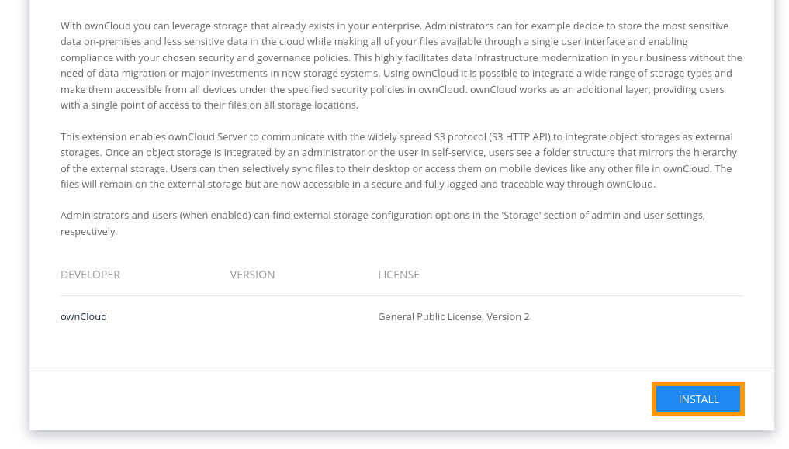
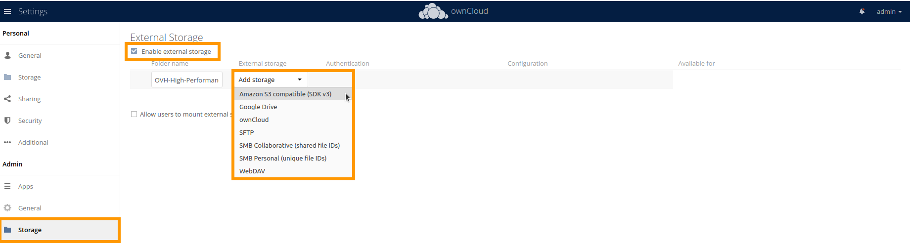

**Dernière mise à jour le 3/01/2022**

## Objectif

Owncloud est une suite de logiciels client-serveur pour créer et utiliser des services d'hébergement de fichiers.

Ce guide explique comment configurer le stockage dans Owncloud pour utiliser un bucket High Performance.

## Prérequis

- Avoir créé un bucket
- Avoir créé un utilisateur et avoir défini les droits d'accès requis sur le bucket
- Connaître vos informations d'identification S3 (access_key et secret_access_key).

cf : [Débuter avec S3 High Performance](https://docs.ovh.com/fr/storage/s3/debuter-avec-s3-high-performance)

## En pratique

Si besoin, installez le plugin `External Storage: S3` depuis le `Market`{.action}

Rechercher le plugin `External Storage: S3`

Et `installez le`{.action}

Allez dans les `Paramètres`{.action}

Puis :
1. dans `Storage`{.action}
2. activez `Enable external storage `{.action}
3. nommez votre dossier
4. ajoutez un stockage de type `Amazon S3 compatible (SDK v3)`{.action}

Renseignez les informations suivantes:

1. Indiquez le nom de votre bucket
2. Définissez l'hôte comme tel : `s3.<region>.perf.cloud.ovh.net`
3. Définissez le port : 443
4. Indiquez la région
5. Activez SSL
6. Renseigner votre clé d'accès
7. Renseigner votre clé secrète

Allez dans `Files`{.action}

Puis dans `External storage`{.action}

Résultat

## Aller plus loin

Échangez avec notre communauté d'utilisateurs sur [https://community.ovh.com](https://community.ovh.com){.external}.
