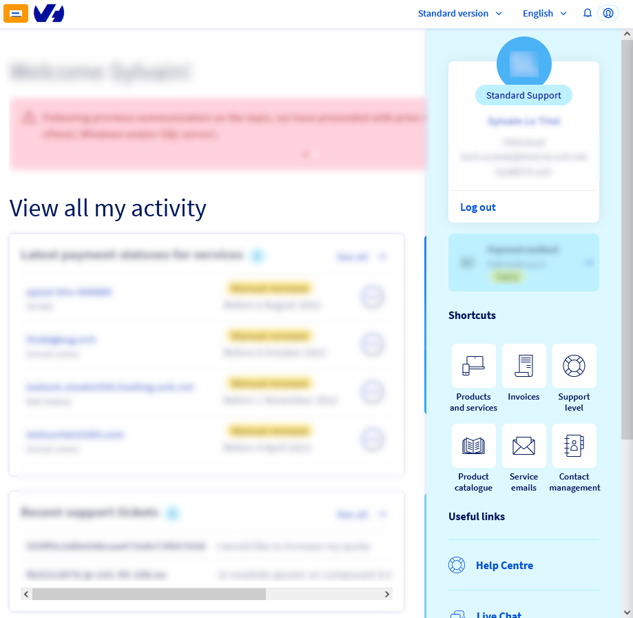
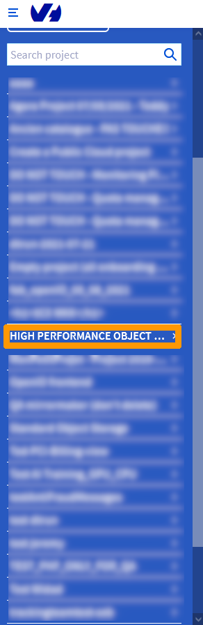
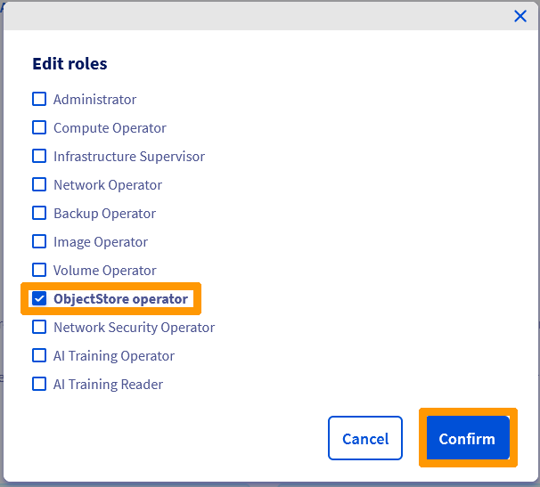
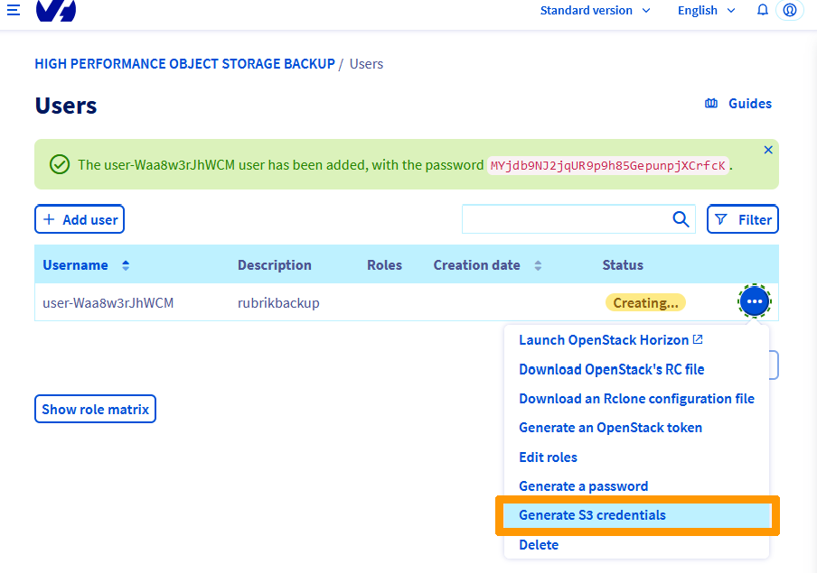

**Dernière mise à jour le 20/07/2022**

## Objectif

Rubrik est une solution de sauvegarde robuste et sécurisé qui autorise l'archivage sur un stockage High Performance Object Storage OVHcloud.

**Ce guide explique comment configurer High Performance Object Storage OVHcloud en tant qu'archive du logiciel Rubrik.**

> [!warning]
>
> OVHcloud met à votre disposition des services dont la configuration, la gestion et la responsabilité vous incombent. Il vous revient de ce fait d'en assurer le bon fonctionnement.
>
> Nous mettons à votre disposition ce guide afin de vous accompagner au mieux sur des tâches courantes. Néanmoins, nous vous recommandons de faire appel à un [prestataire spécialisé](https://partner.ovhcloud.com/fr/) et/ou de contacter l'éditeur du logiciel si vous éprouvez des difficultés. En effet, nous ne serons pas en mesure de vous fournir une assistance. Plus d'informations dans la section « Aller plus loin » de ce guide.
>

## Prérequis

- Avoir créé un projet public au travers de l'espace client OVHcloud.

Consultez notre guide « [Débuter avec S3 Object Storage](https://docs.ovh.com/fr/storage/s3/debuter-avec-s3/) » pour plus de détails.

## En pratique

### Création d'un utilisateur sur un projet public OVHcloud

Nous allons créer un compte dans un projet public qui sera capable de créer des buckets sur un stockage **High Performance Object Storage**

Connectez-vous à l'espace client OVHcloud au travers de l'url [OVHcloud](https://www.ovhcloud.com)

Cliquez en haut à gauche sur le `menu principal`{.action}.

Choisissez `Public Cloud`{.action}.

Cliquez en haut à droite sur la `flêche vers la droite`{.action}.

Cliquez sur votre `projet`{.action}.

Cliquez en haut à gauche sur le `menu principal`{.action}.

Cliquez en haut à gauche sur le `menu principal`{.action}.

Sélectionnez `Public Cloud`{.action}.

Utilisez la `barre de défilement`{.action} et cliquez sur `Users & Roles`{.action}.

cliquez sur `Create user`{.action}.

Saisissez un `nom d'utilisateur` dans **User description** et cliquez sur `Next`{.action}.

Cochez la case `ObjectStore operator`{.action} et cliquez sur `Confirm`{.action}.

Un compte est crée avec son mot de passe mais il ne servira pas pour la sauvegarde, il faut créer un accés S3 , pour cela cliquez sur `l'icône rond avec 3 petits points`{.action} à droite.

Choisissez sur `Generate S3 credentials`{.action} à droite.

Les accès S3 ont été créé ils est composé de ces éléments :

- **access key** ;
- **secret key** .

### Création d'une clé RSA

### Configuration du stockage dans le logiciel Rubrik

## Aller plus loin

Site Officiel [Rubrik](https://www.rubrik.com/)

Échangez avec notre communauté d'utilisateurs sur [https://community.ovh.com](https://community.ovh.com){.external}.

