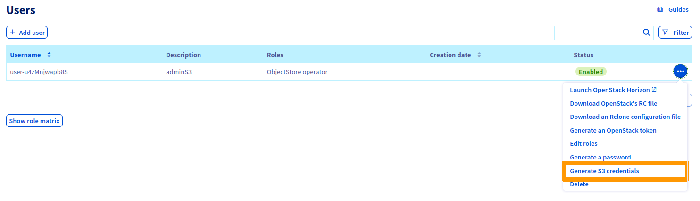
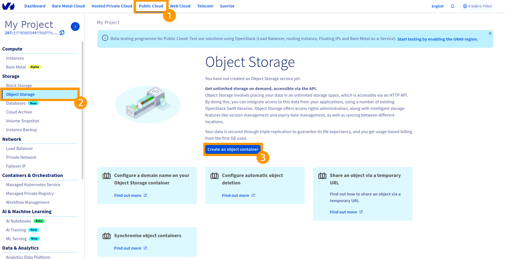
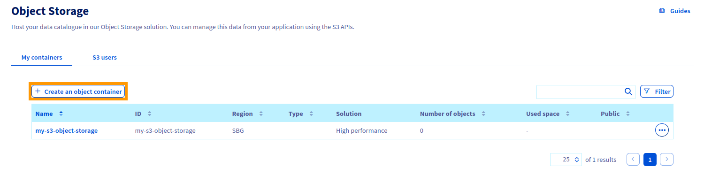
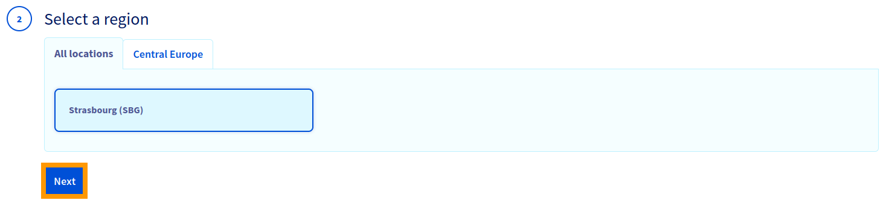
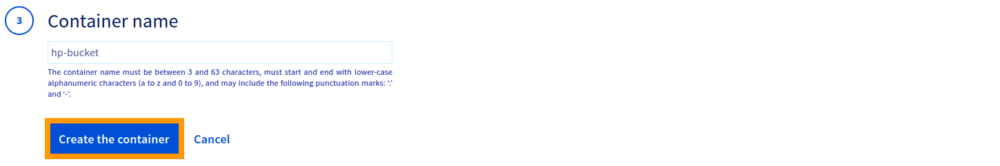
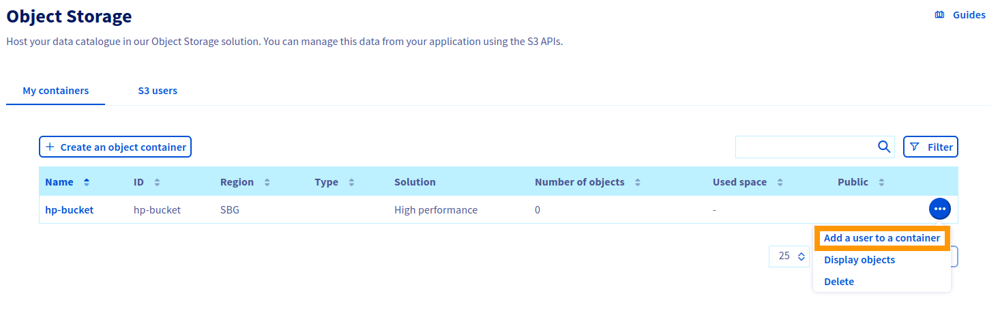
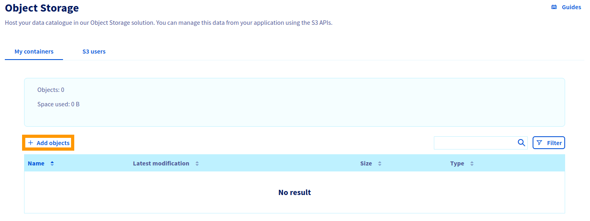
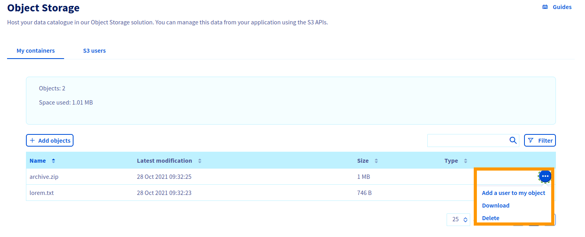

**Last updated 21<sup>st</sup> July 2022**

## Objective

This guide aims to familiarise you with the management of your containers / objects.

## Requirements

- Access to the [OVHcloud Control Panel](https://www.ovh.com/auth/?action=gotomanager&from=https://www.ovh.co.uk/&ovhSubsidiary=GB)
- an [OpenStack user](https://docs.ovh.com/gb/en/public-cloud/creation-and-deletion-of-openstack-user/)

## Instructions

### User management

Once your user has been created with `ObjectStore operator` role or with `Administrator` role, you must generate its S3 credentials.



> [!primary]
>
> Be sure to save the acces and secret keys shown in the green message box to a password manager at this time


### Bucket management

#### Creating a bucket from the customer Control Panel

> [!primary]
>
> It is not possible to create a Public Cloud Archive bucket.
>

Log in to the [OVHcloud Control Panel](https://www.ovh.com/auth/?action=gotomanager&from=https://www.ovh.co.uk/&ovhSubsidiary=GB) and switch to the `Public Cloud`{.action} section. Select `Object Storage`{.action} in the left hand menu, then click `Create an object container`{.action}

If this is your first bucket, you should be displayed the following:



If this is not your first bucket:



Select the High Performance solution and click `Next`{.action}.


Select the region of your bucket and click `Next`{.action}.



Name your bucket and click `Create the container`{.action}.

  

> [!warning]
>
> - Bucket names can be between 3 and 63 characters long.  
> - Bucket names can only be lowercase letters, numbers, full stops (.) and hyphens (-).  
> - Bucket names must begin and end with a letter or number.  
> - Bucket names must not use the same format as IP addresses (e.g. 192.168.5.4).  
> - Bucket names must be unique within a region.  
>

#### Binding a user to a bucket

At this stage, you can not interact with your bucket because no S3 user is associated with it.

Click on the `...`{.action} at the end of the line of your bucket and then `Add a user to a container`{.action}.



Select the user to add to your bucket and click `Next`{.action}.


Define access to your bucket for this user and click `Next`{.action}.


### Managing objects

Click on the `...`{.action} at the end of the line of your bucket and then on `Display objects`{.action}.


Click on `+ Add objects`{.action}.



If needed, set a prefix, click `Select files`{.action} then `Import`{.action}.


You can now interact with your object.



### Using the AWS CLI

#### Installation

```bash
user@host:~$ pip3 install awscli awscli-plugin-endpoint
```

> [!primary]
>
> `awscli-plugin-endpoint` is optional  
> Install the `groff` package if you want to use the command line help
>

#### Configuration

Configure the `aws` client as follows:

```bash
user@host:~$ cat ~/.aws/credentials

[default]
aws_access_key_id = <access_key>
aws_secret_access_key = <secret_key>

user@host:~$ cat ~/.aws/config

# Delete the next two lines if you don't installed `awscli-plugin-endpoint`
[plugins]
endpoint = awscli_plugin_endpoint

[profile default]
region = <region_in_lowercase>
s3 =
  endpoint_url = https://s3.<region_in_lowercase>.perf.cloud.ovh.net
  signature_version = s3v4
s3api =
  endpoint_url = https://s3.<region_in_lowercase>.perf.cloud.ovh.net
```

> [!primary]
>
> The region must be lowercase, not uppercase!
> Else, the `aws` CLI may not recognize the region and will redirect you to the default endpoint `https://s3.<region_in_lowercase>.amazonaws.com/` instead of your defined endpoint URL.
>

> [!primary]
>
> You can also use interactive configuration by running the following command:
> `aws --configure`
>

Here are the configuration values you can specifically set:

| Variable | Type | Value | Definition |
|:--|:--|:--|:--|
| max_concurrent_requests | Integer | **Default:** 10 | The maximum number of simultaneous requests. |
| max_queue_size | Integer | **Default:** 1000 | The maximum number of jobs in the job queue. |
| multipart_threshold | Integer<br>String | **Default:** 8MB |  The size threshold that the CLI uses for multipart transfers of individual files. |
| multipart_chunksize | Integer<br>String | **Default:** 8MB<br>**Minimum for uploads:** 5MB |  When using multipart transfers, this is the chunk size that the CLI uses for multipart transfers of individual files. |
| max_bandwidth | Integer | **Default:** None | The maximum bandwidth that will be consumed for uploading and downloading data to and from your buckets. |
|  verify_ssl  | Boolean | **Default:** true | Enable / Disable verification of SSL certificates |

#### Usage

> [!primary]
>
> If you don't have `awscli-plugin-endpoint` installed, you must add `--endpoint-url https://s3.<region_in_lowercase>.perf.cloud.ovh.net` to the command line.
>

> [!primary]
>
> If you have defined multiple profiles, add `--profile <profile>` to the command line.
>

**Create a bucket**

```bash
aws s3 mb s3://<bucket_name>
aws --endpoint-url https://s3.<region_in_lowercase>.perf.cloud.ovh.net --profile default s3 mb s3://<bucket_name>
```

**List your buckets**

```bash
aws s3 ls
```

**Upload your files as objects into your bucket**

```bash
aws s3 cp /datas/test1 s3://<bucket_name>
```

**By default, objects are named after the files, but they can be renamed.**

```bash
aws s3 cp /datas/test1 s3://<bucket_name>/other-filename
```

**Downloading an object from a bucket**

```bash
aws s3 cp s3://<bucket_name>/test1 .
```

**Download an object from one bucket to another bucket**

```bash
aws s3 cp s3://<bucket_name>/test1 s3://<bucket_name_2>
```

**Download or upload an entire bucket to the host/bucket**

```bash
aws s3 cp s3://<bucket_name> . --recursive
aws s3 cp s3://<bucket_name> s3://<bucket_name_2> --recursive
```

**Synchronization of buckets**

```bash
aws s3 sync . s3://<bucket_name>
aws s3 sync s3://<bucket_name> s3://<bucket_name_2>
```

**Deleting objects and buckets**

```bash
# Deleting an object
aws s3 rm s3://<bucket_name>/test1
# Delete all objects in a bucket
aws s3 rm s3://<bucket_name> --recursive
# Deleting a storage area. To delete a bucket, it must be empty.
aws s3 rb s3://<bucket_name>
# If the bucket is not deleted, you can use the same command with the --force option.
# This command deletes all objects in the bucket, then deletes the bucket.
aws s3 rb s3://<bucket_name> --force
```

**Setting tags on a bucket**

```bash
aws s3api put-bucket-tagging --bucket <bucket_name> --tagging 'TagSet=[{Key=myKey,Value=myKeyValue}]'
aws s3api get-bucket-tagging --bucket <bucket_name>
```
```json
{
  "TagSet": [
    {
    "Value": "myKeyValue",
    "Key": "myKey"
    }
  ]
}
```

**Removing tags from a bucket**

```bash
aws s3api s3api delete-bucket-tagging --bucket <bucket_name>
```

**Define tags on an object**

```bash
aws s3api put-object-tagging --bucket <bucket_name> --key test1 --tagging 'TagSet=[{Key=myKey,Value=myKeyValue}]'
aws s3api get-bucket-tagging --bucket <bucket_name>
```
```json
{
  "TagSet": [
    {
    "Value": "myKeyValue",
    "Key": "myKey"
    }
  ]
}
```

**Removing tags from an object**

```bash
aws s3api s3api delete-object-tagging --bucket <bucket_name> --key test1
```

## Go further

Join our community of users on [https://community.ovh.com/en/](https://community.ovh.com/en/){.external}.
