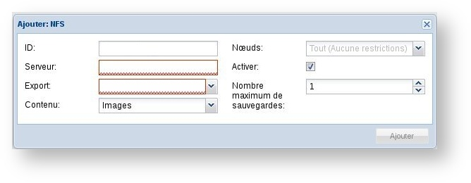

**Última actualización: 21/02/2022**

## Requisitos

Esta guía explica cómo realizar el montaje NFS en las distribuciones más comunes. Para ello necesitará:

- Un [servidor dedicado](https://www.ovhcloud.com/es-es/bare-metal/) **o** un [VPS](https://www.ovhcloud.com/es-es/vps/) **o** una [instancia de Public Cloud](https://www.ovhcloud.com/es-es/public-cloud/).
- Una oferta [NAS-HA](https://www.ovh.es/nas/).
- Una distribución compatible con NFS.


### Linux

Compatibilidad: Debian y Ubuntu

Para montar un recurso compartido por NFS en Linux:

- Conéctese al servidor por SSH.
- Instale el paquete `nfs-client` con el siguiente comando:


```sh
aptitude install nfs-client
```

A continuación, utilice el siguiente comando para montarlo: 


```sh
mount -t nfs -o _netdev,mountproto=tcp IP_NAS:/RUTA_NFS /DIRECTORIO_MONTAJE
```

|Argumento|Descripción|
|---|---|
|IP_NAS|Nombre o IP del NAS.|
|RUTA_NFS|Ruta del recurso compartido en el servidor NFS (p.ej.: «nas-000YY/miparticion»).|
|DIRECTORIO_MONTAJE|Carpeta del servidor en la que quiere montar el recurso compartido por NFS.|


> [!primary]
>
> Puede automatizar el montaje del NAS al arrancar su distribución añadiendo la siguiente línea al archivo **/etc/fstab**:
> 
> ```
> IP_NAS:/RUTA_NFS /DIRECTORIO_MONTAJE nfs rw,_netdev,mountproto=tcp 0 0
> ```
>

**Ejemplo:**

```sh
mount -t nfs -o _netdev,mountproto=tcp 10.16.XXX.YYY:zpool-999888/PartitionName /media/NasHA -v
```

|Argumento|Descripción|
|---|---|
|IP_NAS|10.16.XXX.YYY|
|RUTA_NFS|zpool-999888/PartitionName|
|DIRECTORIO_MONTAJE|/media/NasHA -v|

### CentOS

Para montar un recurso compartido por NFS en CentOS:

- Conéctese al servidor por SSH.
- Instale los paquetes `nfs-utils` y `rpcbind` mediante el siguiente comando:


```sh
yum install nfs-utils rpcbind
```

A continuación, reinicie el servicio rpcbind mediante el siguiente comando:


```sh
/etc/init.d/rpcbind start
```

A continuación, utilice el siguiente comando para montarlo: 

```sh
mount -t nfs -o _netdev,mountproto=tcp IP_NAS:/RUTA_NFS /DIRECTORIO_MONTAJE
```

|Argumento|Descripción|
|---|---|
|IP_NAS|Nombre o IP del NAS.|
|/RUTA_NFS|Ruta del recurso compartido en el servidor NFS (p.ej.: «nas-000YY/miparticion»).|
|DIRECTORIO_MONTAJE|Directorio del servidor en el que quiere montar el recurso compartido por NFS.|


> [!primary]
>
> Puede automatizar el montaje del NAS al arrancar su distribución añadiendo la siguiente línea al archivo **/etc/fstab**:
> 
> ```
> IP_NAS:/RUTA_NFS /DIRECTORIO_MONTAJE nfs rw,_netdev,mountproto=tcp 0 0
> ```
>

### Gentoo

Para montar un recurso compartido por NFS en Gentoo:

- Conéctese al servidor por SSH.
- Instale el paquete `nfs-client` con el comando:


```sh
emerge nfs-utils
```

A continuación, reinicie el servicio NFS mediante el siguiente comando:

```sh
/etc/init.d/nfs start
```

Por último, utilice el siguiente comando para montarlo:


```sh
mount -t nfs IP_NAS:/RUTA_NFS /CARPETA_MONTAJE
```

|Argumento|Descripción|
|---|---|
|IP_NAS|Nombre o IP del NAS.|
|/RUTA_NFS|Ruta del recurso compartido en el servidor NFS (p.ej.: «nas-000YY/miparticion»).|
|DIRECTORIO_MONTAJE|Directorio del servidor en el que quiere montar el recurso compartido por NFS.|


> [!primary]
>
> Puede automatizar el montaje del NAS al arrancar su distribución añadiendo la siguiente línea al archivo **/etc/fstab**:
> 
> ```
> IP_NAS:/RUTA_NFS /DIRECTORIO_MONTAJE nfs rw 0 0
> ```
> 
> A continuación, para que el servicio nfsmount se inicie al arrancar el servidor, utilice el siguiente comando:
> 
> ```
> rc-update add nfsmount default
> ```
>

### Proxmox

Compatibilidad: Proxmox 3.X

Para montar un recurso compartido por NFS en Proxmox:

- Conéctese al panel de control de Proxmox.
- Abra la pestaña `Almacenamiento`{.action}.


{.thumbnail}

- Haga clic en `Añadir`{.action} y seleccione `NFS`{.action}.


{.thumbnail}


|Argumento|Descripción|
|---|---|
|ID|Nombre que quiera asignarle al recurso compartido por NFS.|
|Servidor|Nombre del NAS.|
|Export|Ruta del recurso compartido en el servidor NFS.|
|Contenido|Tipo de contenido (valores posibles: Images, ISO, Template, Backups, Containers)|


> [!primary]
>
> Puede automatizar el montaje del NAS al arrancar su distribución añadiendo la siguiente línea al archivo **/etc/fstab**:
> 
> ```
> IP_NAS:/RUTA_NFS /DIRECTORIO_MONTAJE nfs rw 0 0
> ```
>

### ESXi

Para montar un recurso compartido por NFS en ESXi:

- Conéctese al servidor mediante vSphere.
- En el panel de control, haga clic en `Inventory`{.action}: 


{.thumbnail}

- Abra la pestaña `Configuration`{.action}:


{.thumbnail}

- Por último, haga clic en `Storage`{.action} en el menú de la izquierda:


{.thumbnail}

Complete los siguientes campos en el formulario:


{.thumbnail}

|Argumento|Descripción|
|---|---|
|Server|Nombre o IP del NAS.|
|Folder|Ruta del recurso compartido en el servidor NFS (p.ej.: «nas-000YY/miparticion»).|
|Datastore Name|Nombre que quiera asignarle al datastore.|


## Información adicional


> [!alert]
>
> El usuario NFS es «root». Las modificaciones de permisos con este usuario pueden generar conflictos con permisos CIFS/SMB existentes.
> 

## Más información

Interactúe con nuestra comunidad de usuarios en <https://community.ovh.com/en/>.