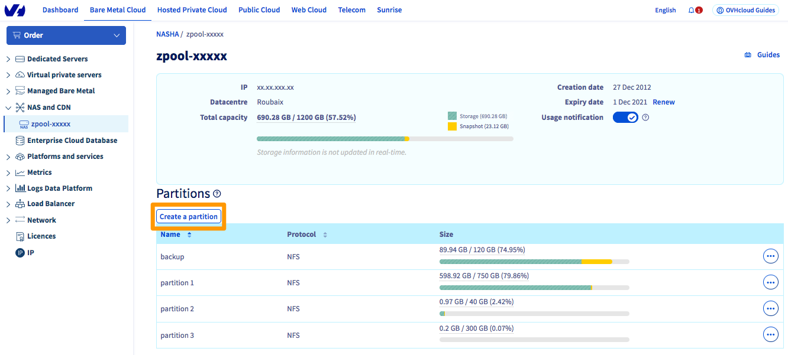

> [!primary]
> Diese Übersetzung wurde durch unseren Partner SYSTRAN automatisch erstellt. In manchen Fällen können ungenaue Formulierungen verwendet worden sein, z.B. bei der Beschriftung von Schaltflächen oder technischen Details. Bitte ziehen Sie beim geringsten Zweifel die englische oder französische Fassung der Anleitung zu Rate. Möchten Sie mithelfen, diese Übersetzung zu verbessern? Dann nutzen Sie dazu bitte den Button “Mitmachen“ auf dieser Seite.
>

**Stand 16.09.2021**

## Ziel

Das NAS (Network Attached Storage) ist ein Dateiserver, der mit einem Netzwerk verbunden ist und dessen Hauptfunktion darin besteht, Daten in einem zentralisierten Volumen für heterogene Netzwerkkunden zu speichern.

## Voraussetzungen

- Sie verfügen über eine IP-Adresse, die an einen OVHcloud Dienst angehängt ist (Hosted Private Cloud, Dedicated Server, VPS, Public Cloud Instanz, usw.)
- Sie verfügen über einen [HA-NAS](https://www.ovh.de/nas/)
- Sie sind in Ihrem [OVHcloud Kundencenter](https://www.ovh.com/auth/?action=gotomanager&from=https://www.ovh.de/&ovhSubsidiary=de){.external} angemeldet.

## In der praktischen Anwendung

Die Verwaltung Ihres HA-NAS erfolgt über das OVHcloud [Kundencenter](https://www.ovh.com/auth/?action=gotomanager&from=https://www.ovh.de/&ovhSubsidiary=de){.external}.

Klicken Sie nach dem Login auf `Bare Metal Cloud`{.action} und dann im linken Menü auf `NAS`{.action} und CDN. Klicken Sie auf Ihre Dienstleistung, um Zugriff auf das Verwaltungsmenü zu erhalten.

{.thumbnail}

### Eine Partition erstellen

Um eine neue Partition hinzuzufügen, klicken Sie auf `Eine Partition erstellen`{.action}.

{.thumbnail}

Geben Sie dann einfach den **Namen Ihrer Partition**, deren **Größe** sowie das autorisierte **Protokoll (NFS oder** CIFS) ein.

{.thumbnail}

### Größe einer Partition ändern

Um die Größe einer Partition zu ändern, klicken Sie auf den Button `...`{.action} rechts neben der betreffenden Partition und anschließend auf `Größe ändern`{.action}.

{.thumbnail}

Geben Sie die neue Größe ein und bestätigen Sie.

### Die Frequenz der Snapshots ändern

Standardmäßig erfolgt stündlich eine Sicherung des Inhalts Ihres NAS und wird auf Ihrem NAS gespeichert.

Sie können jedoch auf Wunsch bis zu 3 zusätzliche Snapshots mit unterschiedlichen Frequenzen erstellen, die ebenfalls auf Ihrem NAS gespeichert werden.

Klicken Sie hierzu rechts neben der betreffenden Partition auf `...`{.action} und dann auf `Frequenz der Snasphots`{.action}.

{.thumbnail}

Wählen Sie die neue Frequenz aus und bestätigen Sie.

### Snapshot erstellen

Zusätzlich zu den automatisch erstellten Snapshots können Sie jederzeit einen Snapshot einer Partition erstellen, indem Sie auf den Button `...`{.action} rechts neben der Partition und dann auf `Snapshot klicken`{.action}.

{.thumbnail}

Benennen Sie den Snapshot und klicken Sie auf `Hinzufügen`{.action}

### Zugang hinzufügen

Um auf die zuvor von Ihnen erstellte Partition zuzugreifen, müssen Sie einen Zugang konfigurieren.

> [!primary]
>
> Nur IP-Adressen von OVHcloud Diensten können auf Ihr NAS zugreifen (z.B.: einem dedizierten Server, einem VPS, einer Public Cloud Instanz usw.)
>

Um einer IP den Zugriff auf das NAS zu erlauben, klicken Sie auf `...`{.action} rechts neben der bestehenden Partition und anschließend auf `Zugriff verwalten`{.action}.

{.thumbnail}

Klicken Sie auf `Zugang hinzufügen`{.action} und wählen Sie dann die IP-Adresse Ihres OVHcloud-Produkts aus.
 Sie müssen auch festlegen, ob der erlaubte Zugriff auf diese IP-Adresse nur lesend (*Read-only*) oder lesend/schreibend (*Read/Write*) ist.

{.thumbnail}

#### Zugang löschen

Um einen Zugang zu einer Partition zu löschen, klicken Sie rechts neben der betreffenden IP-Adresse auf `...`{.action}) und dann auf `Löschen`{.action}.

{.thumbnail}

### Einstellungen Z File System (ZFS)

> [!warning]
>
> Alle standardmäßigen ZFS-Einstellungen werden optimiert. Obwohl wir von einer Änderung dieser Einstellungen abraten, erlaubt dieses Menü die Anpassung des vom HA-NAS verwendeten ZFS.
>

Um die ZFS-Einstellungen einer Partition zu ändern, klicken Sie auf den Button `...`{.action} rechts neben der betreffenden Partition und dann auf `Z File System (ZFS)`{.action}.

{.thumbnail}

- **Das Update der Zugriffszeiten (*atime*)** deaktivieren Die Deaktivierung *des* Atimus bedeutet, dass der Kernel die Dateisysteme nicht mehr bei jedem Dateizugriff aktualisieren wird. Dies kann nützlich sein, um häufige Lesevorgänge zu beschleunigen, beispielsweise auf statischen Webseiten. Diese Deaktivierung ist jedoch für Anwendungen mit kritischer Konsistenz, wie Datenbanken, nicht ratsam.
- **ZFS recordsize**: Diese Eigenschaft ändert die maximale Blockgröße im ZFS-Dateisystem. Bitte beachten Sie, dass ZFS immer eine kleinere Blockgröße verwenden wird, wenn die Datei kleiner als die maximale Größe ist. So wird beispielsweise in einer 16-KB-Datei ein Block mit 16 KB (plus Metadaten) verwendet, um keinen Speicherplatz zu verschwenden. Daher empfehlen wir Ihnen generell nicht, das ZFS zu *ändern*.
- **Sync**: Diese Einstellung verändert das Verhalten der Transaktionen des ZFS-Dateisystems in Bezug auf die Pufferung der RAM-Daten und das Schreiben der Daten auf die Festplatte. Wenn keine besonderen Gründe vorliegen, empfehlen wir Ihnen, diese Eigenschaft nicht zu ändern.

### Eine Partition löschen

> [!alert]
>
> Beim Löschen einer Partition werden alle darin enthaltenen Daten vollständig und endgültig gelöscht.
>

Um eine Partition zu löschen, klicken Sie auf den `...`{.action} Button rechts neben der bestehenden Partition und anschließend auf `Löschen`{.action}.

{.thumbnail}

## Weiterführende Informationen

Für den Austausch mit unserer User Community gehen Sie auf <https://community.ovh.com/en/>.
