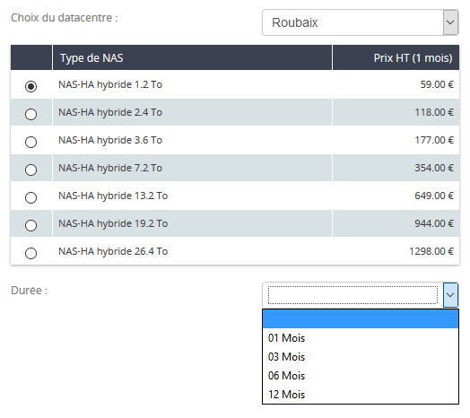
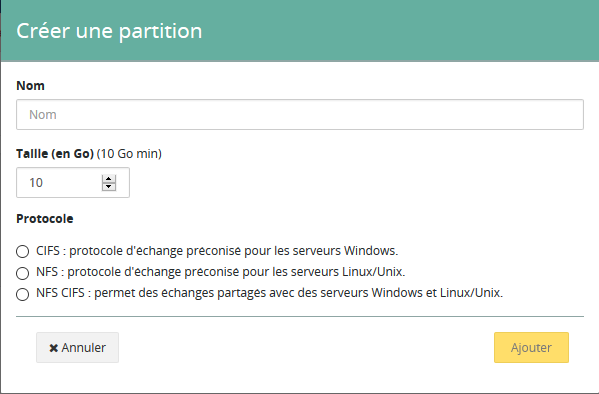
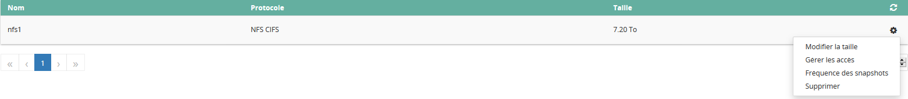
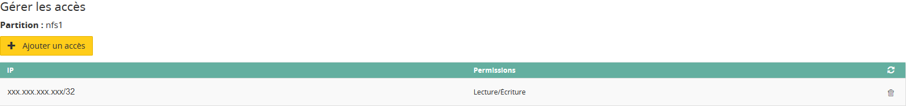

## Requirements
The Network Attached Storage (NAS) is a file server connected to a network whose main function is the sotcking of data in a centralized volume for heterogeneous network clients.

To order and configure a NAS-HA, you must:

- Have an IP attached to an OVH service (dedicated server, VPS, Public Cloud instance, ADSL, ...)
- Access to the customer area.

## Order a NAS-HA
To order a NAS-HA, you must first connect to your customer area.

Then, go to the universe `Cloud`{.action}, section `Platforms and services`{.action}, then select `NAS`{.action}.

{.thumbnail}

You can choose the location of your NAS, the type of NAS, and the initial commitment time.

All you have to do is read and validate the general conditions in order to generate the order form that will allow you to settle the rental of the NAS.

## Use a NAS-HA

### Creating a Partition
Once you have the NAS-HA in your possession, go to your customer area, universe `Cloud`{.action}, section `Platforms and services`{.action}, tab `NAS`{.action}, and select your NAS.

Then click `Create a partition`{.action}.

{.thumbnail}

All you have to do is fill in the **Name of your partition**, **size** of the partition, as well as the **authorized protocol** (NFS or CIFS).

### Change the size of a partition
To change the size of a partition, go to your customer space, universe `Cloud`{.action}, section `Platforms and services`{.action}, tab `NAS`{.action}, and select your NAS.

Click on the gear to the right of the existing partition, then `Change size`{.action}.

{.thumbnail}

Specify the new size, then validate.

### Change the frequency of snapshots
By default, a snapshot of the content of your NAS happens every hour, and registers on your NAS.

However, you can create up to 3 additional snapshots at different frequencies if desired, which will also be stored on your NAS.

To do this, go to your customer area, universe `Cloud`{.action}, section `Platforms and services`{.action}, tab `NAS`{.action}, and select your NAS.

Click on the gear to the right of the existing partition, then `Snapshot frequency`{.action}.

{.thumbnail}

Select the frequency and confirm.

### Add an access
In order to access the partition you created earlier, you need to configure an access.

> [!primary]
>
> Only the IPs of OVH services are compatible with the use of your NAS (eg : a dedicated server, an ADSL line, a VPS, a Public Cloud instance, etc.)
> 

Go to your customer area, universe `Cloud`{.action}, section `Platforms and services`{.action}, tab `NAS`{.action}, and select your NAS.

Click on the gear located to the right of the existing partition, then `Manage access`{.action}.

{.thumbnail}

Now you can `Add access`{.action}, and select the IP of your OVH product.

{.thumbnail}

### Remove a partition

> [!warning]
>
> Deleting a partition results in the total and permanent deletion of any data present on it.
> 

To delete a partition, go to your customer space, universe `Cloud`{.action}, section `Platforms and services`{.action}, tab `NAS`{.action}, and select your NAS.

Click on the gear to the right of the existing partition, then `Delete`{.action}.

{.thumbnail}

### Delete an access
To delete an access, go to your customer space, universe `Cloud`{.action}, section `Platforms and services`{.action}, tab `NAS`{.action}, and select your NAS.

Click on the gear located to the right of the existing partition, then `Manage access`{.action}.

{.thumbnail}

Then click on the icon to the right of the access currently present, and confirm the deletion.