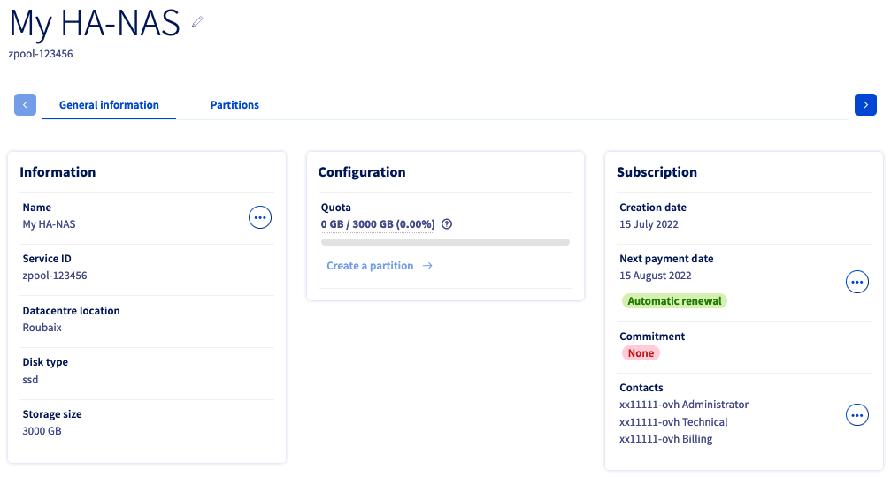
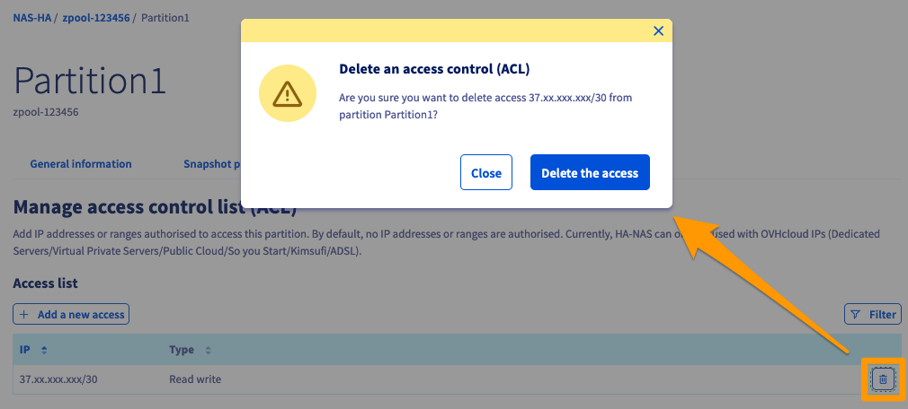
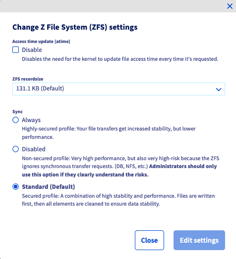

**Last updated 22nd August 2022**

## Objective

Network Attached Storage (NAS) is a file server connected to a network whose main function is the storing of data in a centralised volume for heterogeneous network clients.
You can manage your HA-NAS service via the [OVHcloud API](https://docs.ovh.com/gb/en/storage/nas/nas-quickapi/) or in your OVHcloud Control Panel.

**This guide explains how to manage HA-NAS partitions and snapshots in the OVHcloud Control Panel.**

## Requirements

- An [OVHcloud HA-NAS solution](https://www.ovh.co.uk/nas/)
- An OVHcloud service with a public IP address attached to it (Hosted Private Cloud, dedicated server, VPS, Public Cloud instance, etc.)
- Access to the [OVHcloud Control Panel](https://www.ovh.com/auth/?action=gotomanager&from=https://www.ovh.co.uk/&ovhSubsidiary=GB)

## Instructions

Log in to the [OVHcloud Control Panel](https://www.ovh.com/auth/?action=gotomanager&from=https://www.ovh.co.uk/&ovhSubsidiary=GB), go to the `Bare Metal Cloud`{.action} section and 
open `NAS and CDN`{.action}. Click on your service to access the `General information`{.action} tab.

{.thumbnail}

The `General information`{.action} tab displays some technical information, the `Quota` of the service, general subscription details and a shortcut to [create a partition](#create_partition).

> [!primary]
> Please visit the [FAQ page](https://docs.ovh.com/gb/en/storage/faq-nas/) for detailed information on the technical properties of the HA-NAS solution.
>

### Managing partitions <a name="manage_partition"></a>

Switch to the tab `Partitions`{.action}. The table lists all partitions you have created for the selected service. You can click on a partition name to open its management page.

{.thumbnail}

The **General metrics** section shows how much of the available disk space is being used by data and by snapshots (`Total capacity`). The percentage of space currently taken up by snapshots is indicated in yellow. By default, a snapshot takes place every hour.

Additional space is allocated to your HA-NAS service to store snapshots. This space corresponds to 20% of the initial volume size. In case you exceed this limit, further snapshots will utilise your main storage space.

You can activate the option `Usage notification`{.action} to receive email warnings when a 90% usage quota is reached.

You can carry out some actions by clicking on the `...`{.action} button in each row of the table.

- **Edit / View**: Opens the "General information" section of the partition.
- **Manage snapshots**: Opens the ["Snapshot policies" section](#snapshots) of the partition.
- **Manage access**: Opens the ["Access control (ACL)" section](#access_control) where you can manage IP address access rights for the partition.
- **Edit size**: Opens a window to [change the size](#modify_partition) of the partition.
- **Z File System (ZFS) settings**: Opens a window to edit the [Z File System settings](#zfs).
- **Delete**: Opens a window to [delete this partition](#deletion).

#### Creating a partition <a name="create_partition"></a>

To add a new partition, click on the button `+ Create a partition`{.action} above the table.

{.thumbnail}

Enter a **name** for the partition, determine the **size** in GB, and select the access **protocols** (NFS, CIFS or both) to authorise.

Provide a description if required, then click on `Create a partition`{.action}.

#### Editing the size of a partition <a name="modify_partition"></a>

To change the size of a partition, click on the `...`{.action} button to the right of the partition concerned, then select `Edit size`{.action}.

{.thumbnail}

Enter the new size, then click on `Edit size`{.action}.

#### Creating and managing snapshots <a name="snapshots"></a>

Click on the `...`{.action} button to the right of the partition concerned, then select `Manage snapshots`{.action}.

By default, a snapshot of your data takes place every hour and is saved on your HA-NAS. This policy is displayed in the table of the tab `Snapshot policies`{.action}.

{.thumbnail}

You can activate additional snapshot policies which will create snapshots at preset frequencies by clicking on the drop-down button under `Options`. Select the frequencies and click the `Check mark`{.action} button on the right.

{.thumbnail}

In the popup window, wait until the process is completed, then click on `Close`{.action}. The additional snapshots will also be saved on your HA-NAS.

##### **Creating an instant snapshot**

Apart from the snapshots taken automatically, you can create an instant snapshot of a partition at any time. Click on the button `+ Create a manual snapshot`{.action} above the table.

{.thumbnail}

The snapshot will be added to the table. Provide a snapshot name after the prefix, then click the `Check mark`{.action} button on the right.

##### **Listing and restoring snapshots**

The Control Panel functions do not include accessing and restoring your snapshots. They are stored as read-only on the partition.

To access snapshots from your mount point, you need to navigate to the directory `.zfs/snapshot` of your partition.

For example, on your service with the ID `zpool-123456`, a partition named `partition1` exists of which you have created a snapshot named `snap-snapshot01`. You can find the snapshot with this command:

```bash
ls -al /zpool-123456/partition1/.zfs/snapshot/snap-snapshot01/
```

To restore your snapshot, copy it from the `.zfs` file path to the new directory where you want to restore the snapshot. You can use a tool like "rsync" that allows you to perform restores.

You can find more information in the [Go further](#gofurther) section of this guide.

#### Managing partition ACLs <a name="access_control"></a>

Access control to partitions works via IP address restrictions. Since none are configured by default, the first step with new partitions is to define IP addresses or ranges from which access will be authorised.

> [!primary]
>
> Only IP addresses attached to OVHcloud services can access your HA-NAS (e.g. a dedicated server, a VPS, a Public Cloud instance, etc.).
>

##### **Adding an access**

Click on the button `Add a new access`{.action}.

{.thumbnail}

This creates a new row in the table in which you can select an IP address or an address block (CIDR). Choose `Read`(RO) or `Read write` (RW) as the access type in the drop-down menu and click on the `Check mark`{.action} button to add this entry to the ACL.

In the popup window, wait until the process is completed, then click on `Close`{.action}.

##### **Deleting an access**

To remove a partition access, click on the respective `Trash can`{.action} icon in the table.

{.thumbnail}

In the popup window, confirm by clicking on `Delete the access`{.action}, then wait until the process is completed. Click on `Close`{.action}.

### ZFS settings <a name="zfs"></a>

> [!warning]
>
> All the default Z File System settings are optimised. Though we do not recommend changing those settings, this menu allows you to adjust the ZFS that the HA-NAS is using.
>

To change the ZFS settings of a partition, click on the `...`{.action} button to the right of the partition concerned, then select `Z File System (ZFS) settings`{.action}.

{.thumbnail}

- **Disabling access time update (atime)**: Disabling *atime* means the kernel will no longer update the file system timestamp each time a file is accessed. This can be useful to speed up frequent read operations, for example on static web pages. However, it should not be enabled for consistency-critical applications such as databases.
- **ZFS recordsize**: This property changes the maximum block size on the ZFS filesystem. Please note that ZFS will still use a smaller block size if the file is smaller than the maximum. For example, a 16 KB file will use a 16 KB block (plus metadata) to not waste storage space. We generally advise against changing ZFS *recordsize* for this reason.
- **Sync**: This changes the behaviour of filesystem transactions with regard to RAM data buffering and writing data to disk. We do not recommend changing this property without an appropriate reason.

### Deleting a partition <a name="deletion"></a>

> [!warning]
>
> Deleting a partition will erase all of the data stored on it permanently.
>

To delete a partition, click on the `...`{.action} button to the right of the partition, then select `Delete`{.action}.

{.thumbnail}

Confirm the action in the popup window by clicking on `Delete partition`{.action}. Wait until the process is completed, then click on `Close`{.action}.

## Go further <a name="gofurther"></a>

[Managing partitions via API](https://docs.ovh.com/gb/en/storage/nas/nas-partitions-api/)

[Managing partition ACLs via API](https://docs.ovh.com/gb/en/storage/nas/nas-manage-acls/)

[Managing snapshots via API](https://docs.ovh.com/gb/en/storage/nas/nas-snapshots-api)

[Mounting your HA-NAS via NFS share](https://docs.ovh.com/gb/en/storage/nas-nfs/)

[Mount your NAS on Windows Server via CIFS](https://docs.ovh.com/gb/en/storage/nas/nas-cifs/)

Join our community of users on <https://community.ovh.com/en/>.
