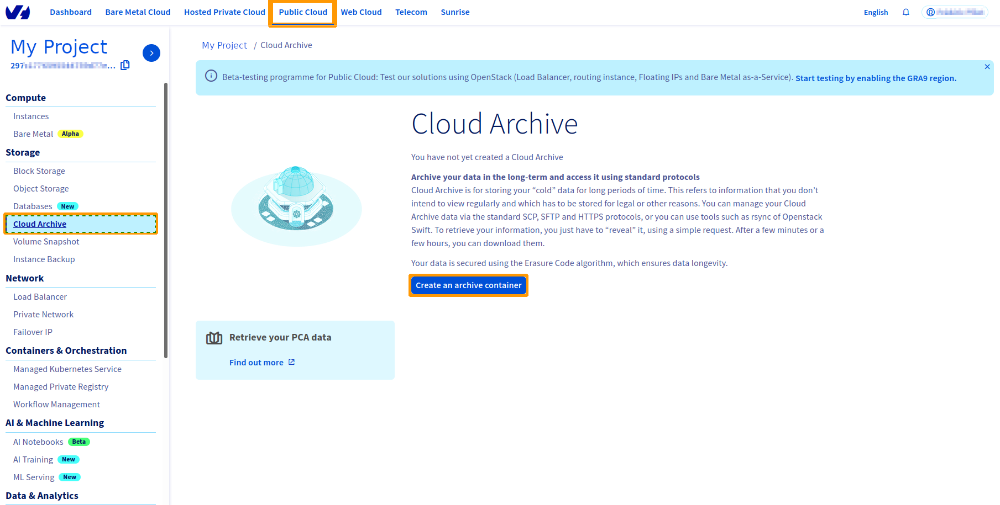
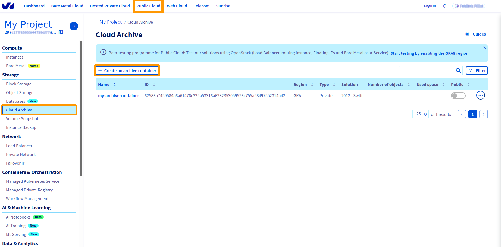
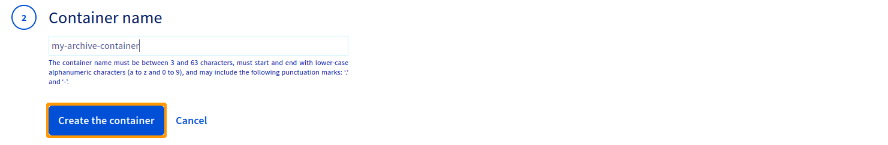

> [!primary]
> Esta tradução foi automaticamente gerada pelo nosso parceiro SYSTRAN. Em certos casos, poderão ocorrer formulações imprecisas, como por exemplo nomes de botões ou detalhes técnicos. Recomendamos que consulte a versão inglesa ou francesa do manual, caso tenha alguma dúvida. Se nos quiser ajudar a melhorar esta tradução, clique em "Contribuir" nesta página.
>

**Última atualização: 27/10/2021**

## Objetivo

A oferta Public Cloud Archive é uma solução de armazenamento ilimitada com uma faturação simples e adaptada às suas necessidades. Existem vários tipos de containers de objetos:

- alojamento estático (website estático);
- para alojamento privado (exemplo: armazenamento de dados pessoais);
- alojamento público (para armazenar tudo o que é acessível ao público);
- para armazenamento a frio (arquivo).

O primeiro passo é a criação de um container que irá agrupar os seus ficheiros. 

**Este guia explica como criar um container a partir da Área de Cliente OVHcloud.**

## Requisitos

- Estar ligado à [Área de Cliente OVHcloud](https://www.ovh.com/auth/?action=gotomanager&from=https://www.ovh.pt/&ovhSubsidiary=pt){.external}.

## Instruções

### Criação de um container Public Cloud Archive a partir da Área de Cliente OVHcloud

Ligue-se à sua [Área de Cliente](https://www.ovh.com/auth/?action=gotomanager&from=https://www.ovh.pt/&ovhSubsidiary=pt){.external}, aceda à secção `Public Cloud`{.action} e selecione o projeto Public Cloud em causa. A seguir, clique em `Cloud Archive`{.action} na barra de navegação à esquerda, na secção `Storage`.

Se se tratar do seu primeiro container:

Se já criou um(s) container(s):

Selecione a região do seu container e clique em `Seguinte`{.action}:

Dê um nome ao seu container e clique em `Adicionar o container`{.action}:

> [!warning]
>
> Se deseja associar o seu container a um nome de domínio, o nome do seu container de dados não deve conter os seguintes caracteres:
> 
> - [ . ]
> - [ _ ]
> - e não deve utilizar maiúsculas.
>
> Para mais informações, consulte o nosso guia "[Associar um container a um nome de domínio](https://docs.ovh.com/gb/en/storage/pcs/link-domain/) (EN)".
>

O seu container é criado:

## Saiba mais

Fale com a nossa comunidade de utilizadores em <https://community.ovh.com/en/>.
