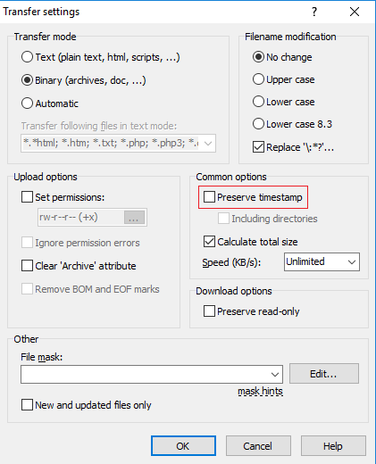

> [!primary]
> Esta traducción ha sido generada de forma automática por nuestro partner SYSTRAN. En algunos casos puede contener términos imprecisos, como en las etiquetas de los botones o los detalles técnicos. En caso de duda, le recomendamos que consulte la versión inglesa o francesa de la guía. Si quiere ayudarnos a mejorar esta traducción, por favor, utilice el botón «Contribuir» de esta página.
> 

**Última actualización: 13/05/2022**

## Objetivo

Public Cloud Archive es una solución de almacenamiento que puede utilizarse con las API de OpenStack. Sin embargo, es posible que no esté familiarizado con esta forma de gestionar un espacio de almacenamiento. Hemos desarrollado una pasarela que permite acceder a su PCA a través de un cliente SFTP.

## Requisitos

- Cliente SFTP: [WinSCP](https://winscp.net/eng/download.php){.external}
- Login & Password OpenStack
- TenantName del proyecto

## Procedimiento

### Cliente SFTP

En este ejemplo utilizamos WinSCP como cliente SFTP. Existen otras soluciones, cuya configuración es similar a la que vamos a presentar.

### Identificador OpenStack

Puede generar su login y password OpenStack siguiendo esta [guía](https://docs.ovh.com/us/es/public-cloud/crear-y-eliminar-un-usuario-de-openstack/).

### El tenantName

El TenantName corresponde al nombre de su proyecto en Horizon. Para obtener el TenantName, conéctese al manager OpenStack utilizando los accesos generados anteriormente: [https://horizon.cloud.ovh.net/](https://horizon.cloud.ovh.net/){.external}. Una vez conectado, podrá acceder al TenantName en la parte superior de la página.

{.thumbnail}

### Conexión

- Host Name: gateways.storage. < region > .cloud.ovh.net
- User Name: pca
- Password : < TenantName > . < Username_Openstack > . < Password_Openstack >

{.thumbnail}

### Caso práctico

Si ha creado un contenedor PCA en SBG:

- Host Name: gateways.storage.sbg.cloud.ovh.net
- User Name: pca
- Password : 971891XXXX1214.f6nBXXXXXAmcv.SfPeASYfuWeqBZgXXXXX2XhF3DY12RkD

{.thumbnail}

### Configuración WinSCP
En esta sección vamos a desactivar dos opciones de WinSCP:

**Transfer Resume / Transfer to Temporary Filename:** Deberá desactivar esta opción, ya que la recuperación no es posible con PCA, y WinSCP puede reenviarle un error. Por favor, consulte la captura de pantalla de abajo.

- En la sección `Duración`{.action}, seleccione `Desactivar`{.action}.

{.thumbnail}

**Preserve Timestamp:** TimeStamp es la fecha de modificación del archivo, lo desactivamos porque en PCA lo reemplazamos por la fecha de subida del archivo. Por favor, consulte las capturas de pantalla que se muestran a continuación.

- En la categoría `Transfer`{.action}, haga clic en `Edit...`{.action}.

{.thumbnail}

- Desmarque `Preserve timestamp`{.action}.

{.thumbnail}

### Obtención de datos
La recuperación de datos está sujeta a la deslocalización previa del objeto. Es necesaria una consulta GET sobre el objeto en cuestión. Si esta operación no se realiza previamente, el cliente SFTP devolverá un mensaje de error al intentar descargar un archivo. Consulte nuestra guía sobre el desbloqueo de sus objetos [aquí](https://docs.ovh.com/us/es/storage/pca/unlock/).

## Más información

Interactúe con nuestra comunidad de usuarios en <https://community.ovh.com/en/>.