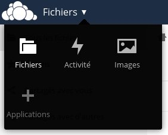
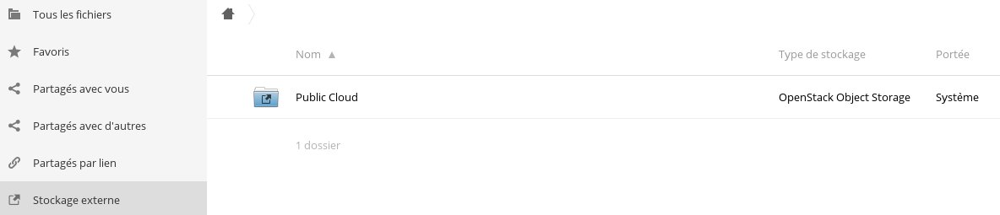

##
[ownCloud](https://owncloud.org/) es una aplicación de almacenamiento online y gestión de archivos, que ofrece funcionalidades como la sincronización entre varios dispositivos. También permite añadir espacios de almacenamiento externo, como el Object Storage de OpenStack.

Esta guía explica cómo configurar su ownCloud con el Object Storage.


## Requisitos
Para seguir todos los pasos de esta guía, es necesario:


- descargar el archivo OpenRC desde el área de cliente de OVHxloud u Horizon;
- [añadir un espacio de almacenamiento](https://docs.ovh.com/es/public-cloud/anadir_espacios_de_almacenamiento/) específico para ownCloud.


## Instalación
Para comenzar, instale ownCloud:


```
root@instance:~$ apt-get install owncloud
```


## Atención:
Compruebe que utilice los repositorios correctos para que se instale la última versión de ownCloud.
A continuación, instale MySQL para tener una base de datos, necesaria para ownCloud:


```
root@instance:~$ apt-get install mysql-server
```


## Configuración
Una vez haya finalizado el procedimiento de instalación, es necesario configurar la base de datos que utilizará ownCloud.

Conéctese a nuestro servidor MySQL con la contraseña «root» configurada al instalarlo:


```
root@instance:~$ mysql -u root -p
```


A continuación podrá crear un nuevo usuario y una base de datos específica para ownCloud:


```
***** Creación del usuario *****
mysql> CREATE USER 'owncloud'@'localhost' IDENTIFIED BY 'P@ssw0rd';

***** Creación de la base de datos *****
mysql> CREATE DATABASE `owncloud` ;

***** Asignación de todos los permisos al usuario «owncloud» en la base de datos «owncloud» *****
mysql> GRANT ALL PRIVILEGES ON `owncloud` . * TO 'owncloud'@'localhost';
```


A continuación, podrá conectarse a la interfaz de ownCloud desde un navegador escribiendo en la barra de direcciones http://I.P.del.servidor/owncloud.

{.thumbnail}
Desde esta interfaz, realice las acciones que se indican a continuación.

Cree una cuenta de administrador.

Introduzca el directorio de los datos (opcional si solo quiere utilizar el Object Storage, en cuyo caso puede dejarlo por defecto).

Introduzca las claves de su base de datos.

Después de aceptar, podrá acceder a su interfaz de ownCloud, desde donde podrá activar la aplicación que permite añadir un soporte de almacenamiento externo.

Para ello, haga clic en el botón «Archivos» en la esquina superior izquierda y seleccione «Aplicaciones».

{.thumbnail}

A continuación, en el menú de las aplicaciones no habilitadas, active la aplicación «External storage support».

{.thumbnail}

Configure la aplicación. Para ello, haga clic en su nombre de usuario en la esquina superior derecha y seleccione «Administración».

{.thumbnail}

En la sección «Almacenamiento externo», añada un almacenamiento de tipo «Almacenamiento de objeto OpenStack».

{.thumbnail}

Introduzca los datos, que encontrará en el archivo OpenRC:


- nombre de usuario Horizon, correspondiente al campo OS_USERNAME en el archivo OpenRC;
- nombre del contenedor previamente creado para ownCloud;
- nombre de la región en la que se encuentra el contenedor, correspondiente al campo OS_REGION_NAME;
- nombre del inquilino, correspondiente al campo OS_TENANT_NAME;
- contraseña del usuario Horizon;
- nombre del servicio: swift;
- URL de identidad de punto final, correspondiente al campo «OS_AUTH_URL», es decir, https://auth.cloud.ovh.net/v3.


La «Clave API» y el «Tiempo de espera de solicitudes HTTP» son opcionales.

## Recordatorio:
El contenedor que ha creado previamente deberá estar dedicado a ownCloud, ya que este configurará metadatos específicos en dicho contenedor.
Cuando haya introducido todos los datos, y si son correctos, el cuadrado rojo situado a la izquierda del nombre pasará a verde.

Entonces podrá verlo en la página principal, en la sección «Almacenamiento externo».

{.thumbnail}
