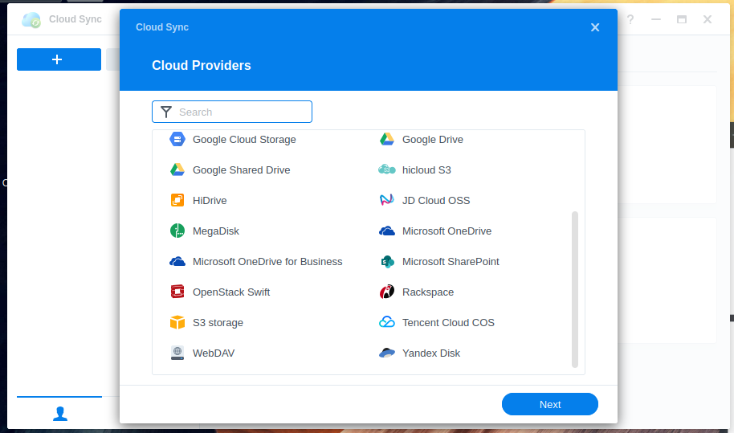

> [!primary]
> Tłumaczenie zostało wygenerowane automatycznie przez system naszego partnera SYSTRAN. W niektórych przypadkach mogą wystąpić nieprecyzyjne sformułowania, na przykład w tłumaczeniu nazw przycisków lub szczegółów technicznych. W przypadku jakichkolwiek wątpliwości zalecamy zapoznanie się z angielską/francuską wersją przewodnika. Jeśli chcesz przyczynić się do ulepszenia tłumaczenia, kliknij przycisk "Zgłóś propozycję modyfikacji" na tej stronie.
>

**Ostatnia aktualizacja z dnia 22-05-2023**

## Wprowadzenie

DiskStation Manager 7.0 Synology oferuje narzędzie synchronizacji z różnymi rozwiązaniami Cloud.

Jest on kompatybilny z Object Storage w Public Cloud OVHcloud, dzięki czemu będziesz mógł wykonywać kopie zapasowe danych i udostępniać je w dowolnym miejscu.

**Niniejszy przewodnik wyjaśnia, jak skonfigurować DiskStation Manager 7.0 w celu synchronizacji plików z serwerem NAS do Object Storage.**

> [!primary]
>
> DiskStation Manager 6 nie jest kompatybilny z Object Storage Public Cloud OVHcloud.
>

## Wymagania początkowe

- [Utwórz kontenera Object Storage](/pages/cloud/storage/object_storage/pcs_create_container)
- [Zapewnienie dostępu do interfejsu Horizon](/pages/platform/public-cloud/create_and_delete_a_user#tworzenie-uzytkownika-openstack)

## W praktyce

### Konfiguracja DiskStation Manager 7.0

> [!warning]
>
> Rozwiązania Synology, takie jak DiskStation lub Hyperbackup, nie są kompatybilne z ofertą Public Cloud Archive
>

#### Pobranie identyfikatorów Openstack

Aby skonfigurować synchronizację usługi NAS Synology, należy posiadać identyfikatory użytkownika OpenStack.

Możesz je pobrać pobierając plik OpenRC z pierwszej części przewodnika:

- [Pobranie zmiennych środowiskowych OpenStack](/pages/platform/public-cloud/loading_openstack_environment_variables#etap-1-zgromadzenie-zmiennych){.ref}

#### Konfiguracja punktu synchronizacji z Cloud Sync

Po uzyskaniu danych dostępowych możesz zalogować się na serwerze NAS i wykonać następujące operacje:

- Uruchom aplikację Cloud Sync

- Wybierz OpenStack Swift jako Cloud Providers

{.thumbnail}

- Wpisz dane użytkownika OpenStack:

{.thumbnail}

Wszystkie te informacje można znaleźć w pliku OpenRC, który pobrałeś podczas poprzedniego etapu.

- Skonfiguruj lokalizację i nazwę kontenera:

{.thumbnail}

- Skonfiguruj folder do synchronizacji:

{.thumbnail}

## Sprawdź również

Jeśli potrzebujesz szkolenia lub pomocy technicznej w celu wdrożenia naszych rozwiązań, skontaktuj się z przedstawicielem handlowym lub kliknij [ten link](https://www.ovhcloud.com/pl/professional-services/), aby uzyskać wycenę i poprosić o spersonalizowaną analizę projektu od naszych ekspertów z zespołu Professional Services.

Dołącz do społeczności naszych użytkowników na stronie <https://community.ovh.com/en/>.