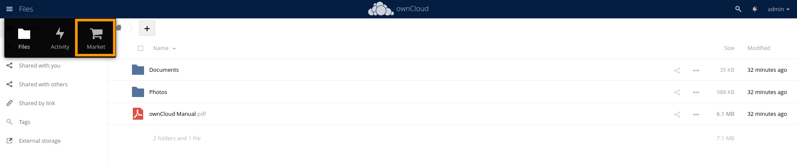
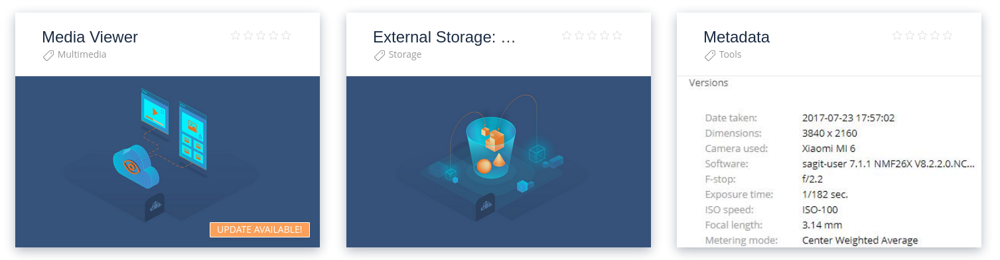
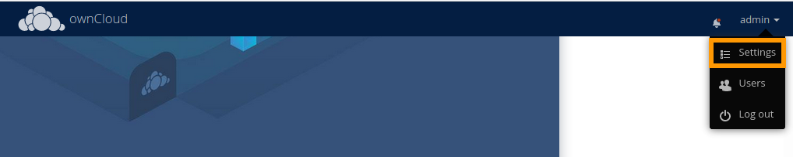
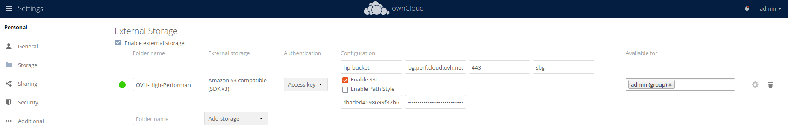
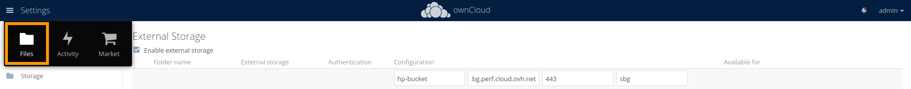

**Last updated on 3rd January 2022**

## Objective

Owncloud is a suite of client-server software for creating and using file hosting services.

**This guide explains how to set up storage in Owncloud to use a S3 Object Storage bucket.**

> [!warning]
>
> OVHcloud provides services which you are responsible for with regard to their configuration and management. You are therefore responsible for ensuring they function correctly.
>
> This guide is designed to assist you in common tasks as much as possible. If you encounter any difficulties performing these actions, please contact a [specialist service provider](https://partner.ovhcloud.com/en/directory/) and/or discuss the issue with our community on https://community.ovh.com/en/. OVHcloud cannot provide you with technical support in this regard.
>

## Requirements

- A bucket
- A user with the required access rights on the bucket
- Your S3 credentials (access_key and secret_access_key)

See our [Getting started with S3 Object Storage](https://docs.ovh.com/us/en/storage/s3/getting-started-with-s3/) guide.

## Instructions

If needed, install the `External Storage: S3` plugin from the `Market`{.action}.

{.thumbnail}

Search for the `External Storage: S3` plugin.

{.thumbnail}

And `install`{.action} it.

{.thumbnail}

Go to the `Settings`{.action}.

{.thumbnail}

Then :

1. in `Storage`{.action}
2. enable `Enable external storage`{.action}
3. name your folder
4. add an `Amazon S3 compatible storage (SDK v3)`{.action}

{.thumbnail}

Fill in the following information:

1. Enter the name of your bucket
2. Set the host as: `s3.<region_in_lowercase>.perf.cloud.ovh.net`
3. Set the port to 443
4. Specify the region
5. Activate SSL
6. Enter your access key
7. Enter your secret key

{.thumbnail}

Go to `Files`{.action}.

{.thumbnail}

Then in `External storage`{.action}.

{.thumbnail}

The result should be similar to this:

{.thumbnail}

## Go further

Join our community of users on [https://community.ovh.com/en/](https://community.ovh.com/en/){.external}.
