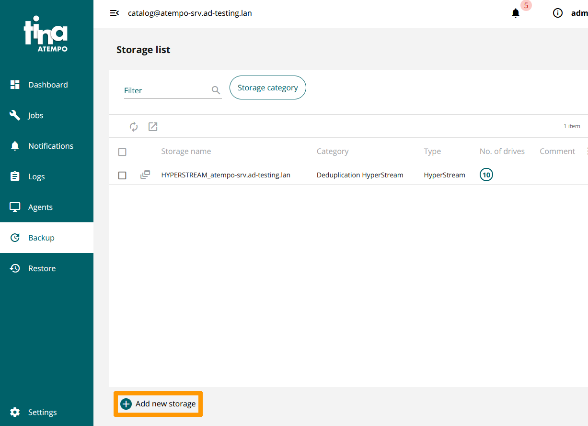
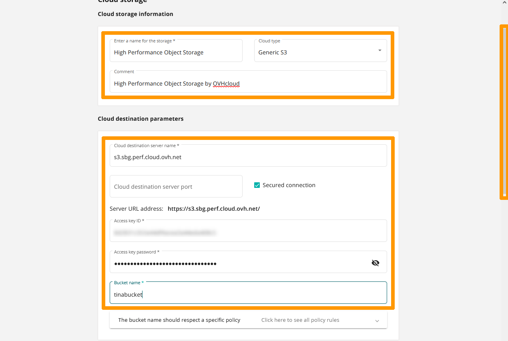
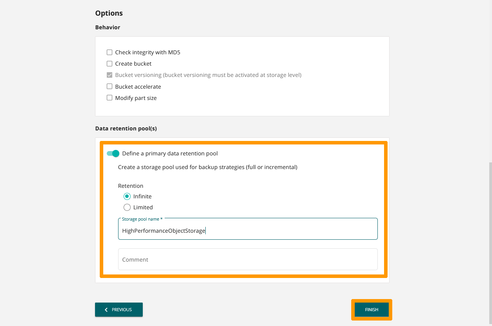
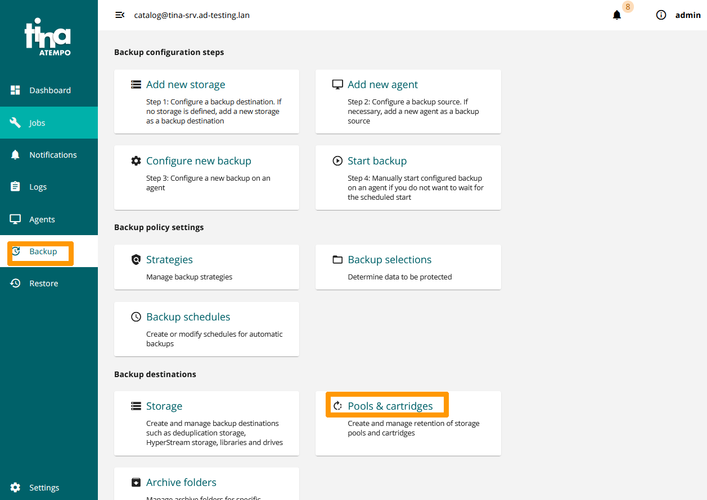
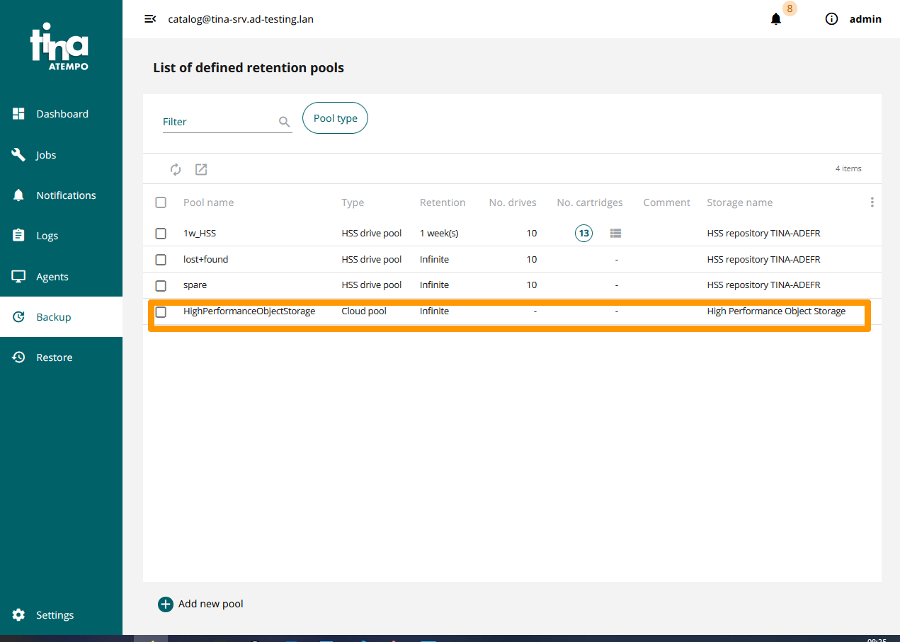

**Last updated on 31th January 2023**

## Objective

**This guide will show you how to configure Tina backup software to use your S3 Object Storage space**.

> [!warning]
>
> OVHcloud provides services which you are responsible for with regard to their configuration and management. You are therefore responsible for ensuring they function correctly.
>
> This guide is designed to assist you in common tasks as much as possible. If you encounter any difficulties performing these actions, please contact a [specialist service provider](https://partner.ovhcloud.com/en-gb/directory/) and/or discuss the issue with our community on <https://community.ovh.com/en/>. OVHcloud cannot provide you with technical support in this regard.
>
> Tina licences are not provided by OVHcloud. For more information, contact Atempo Sales.
>

## Requirements

- A bucket
- A user with the required access rights on the bucket
- Your S3 credentials (access_key and secret_access_key).
- Use a backup solution [Tina](https://www.atempo.com/fr/produits/tina-atempo-time-navigator-sauvegarde-d-entreprise-complete/).

See our [Getting started with S3 Object Storage](https://docs.ovh.com/gb/en/storage/object-storage/s3/getting-started-with-object-storage/) guide.

## Instructions

Nous allons utiliser une solution **High Performance Object Storage** comme dépôt du logiciel de sauvegarde **Tina**.


### Enable version management on the S3 bucket

You must activate version management on the *bucket* that will serve as a repository.

Use this command, which is part of the **Awscli** tools, to enable version management on the **tinabucket** bucket in Strasbourg:

```bash
aws s3api put-bucket-versioning --bucket tinabucket --versioning-configuration Status=Enabled --endpoint=https://s3.sbg.perf.cloud.ovh.net
```

### Add **High Performance Object** Storage to the server **Tina**

Go to the **Tina** administration console, select `Backup`{.action} on the left and click `Storage`{.action}.

{.thumbnail}

Click `Add new storage`{.action}.

{.thumbnail}

Choose `cloud storage`{.action} and click `Next`{.action}.

{.thumbnail}

Enter these values for **Cloud storage information**:

- **Enter a name for storage** : `High Performance Object Storage`.
- **Cloud type** : `Generic S3`.
- **Comment** : `High Performance Object Storage by OVHcloud`.

Then modify the information concerning **Cloud destination parameters*:

- **Cloud destination server name** : `s3.sbg.perf.cloud.ovh.net`.
- **Secured connection** : `coché`.
- **Access key ID** : `clé du bucket`.
- **Access key password** : `mot de passe correspondant à la clé`.
- **Bucket name** : `tinabucket`.

Scroll through the `window`{.action}.

{.thumbnail}

Enable `Define a primary data retention pool`{.action} and choose these options:

- **Retention** : `Infinite`.
- **Storage pool name** : `HighPerformanceObjectStorage`.

Click `FINISH`{.action}

{.thumbnail}

The new storage appears.

{.thumbnail}

Click `Backup`{.action}, then click `Pools & cartridges`{.action}.

{.thumbnail}

The retention pool is created and can be used as a destination when configuring a backup agent.

{.thumbnail}


## Go further

Join our community of users on [https://community.ovh.com/en/](https://community.ovh.com/en/){.external}.

[Atempo home page](https://www.atempo.com)

[Tina 2022 Compatibility Guide](https://www.atempo.com/wp-content/uploads/2022/01/COMPATIBILITY-GUIDE_en_Tina_469_24-01-2022.pdf)