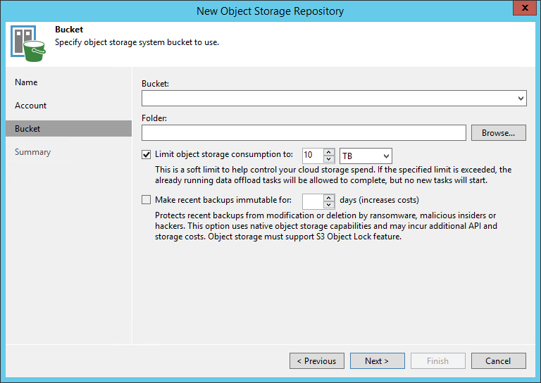

**Last updated on 3rd January 2022**

## Objective

This guide is intended to show you how to configure Veeam to use your S3 Object Storage.

> [!warning]
>
> OVHcloud provides services which you are responsible for with regard to their configuration and management. You are therefore responsible for ensuring they function correctly.
>
> This guide is designed to assist you in common tasks as much as possible. If you encounter any difficulties performing these actions, please contact a [specialist service provider](https://partner.ovhcloud.com/en/directory/) and/or discuss the issue with our community on https://community.ovh.com/en/. OVHcloud cannot provide you with technical support in this regard.
>

## Requirements

- A bucket
- A user with the required access rights on the bucket
- Your S3 credentials (access_key and secret_access_key).

See our [Getting started with S3 Object Storage](https://docs.ovh.com/pl/storage/object-storage/s3/getting-started-with-object-storage/) guide.

## Instructions

### Adding S3 Compatible Object Storage

#### Step 1 - Launch New Object Repository Wizard

To launch the New Object Repository wizard, do one of the following:

- Open the **Backup Infrastructure** view. In the inventory pane, select the **Backup Repositories** node and click `Add Repository`{.action} on the ribbon. In the **Add Backup Repository** dialog, select `Object Storage`{.action} > `S3 Compatible`{.action}.

- Open the **Backup Infrastructure** view. In the inventory pane, right-click the **Backup Repositories** node and select **Add Backup Repository**. In the **Add Backup Repository** dialog, select `Object Storage`{.action} > `S3 Compatible`{.action}.

{.thumbnail}

#### Step 2 - Specify Object Storage Name

At the **Name** step of the wizard, specify a name and description for the object storage repository:

- In the **Name** field, specify a name for the new object storage repository.
- In the **Description** field, enter an optional description. The default description contains information about the user who added the object storage repository, date and time when the object storage repository was added.

If you wish to limit the maximum number of tasks that can be processed at once, select the **Limit concurrent tasks to N** check box.

{.thumbnail}

#### Step 3 - Specify Object Storage Account

At the **Account** step of the wizard, specify the connection settings:

- In the **Service point** field, specify an endpoint address of your S3 Compatible object storage: `https://s3.<region_in_lowercase>.perf.cloud.ovh.net`.
- In the **Region** field, specify a region: `<region_in_lowercase>`.
- From the **Credentials** drop-down list, select user credentials to access your S3 Compatible object storage.

If you already have a credentials record that was configured in advance, select it from the drop-down list. Otherwise, click `Add`{.action} and provide your access and secret keys. You can also click the `Manage cloud accounts`{.action} link to add, edit or remove a credentials record.

To use a gateway server, select the **Use the following gateway server** check box and choose an appropriate server from the list. You may want to use a gateway server, for example, if your organization has NAT or different types of firewalls and your access to the internet is limited.

You can select any Microsoft Windows or Linux server that is added to your backup infrastructure and has internet connection. By default, the role of a gateway server is assigned to the machine where Veeam Backup & Replication is installed.

If you choose not to use a gateway server, make sure that all scale-out repository extents have direct internet access.

{.thumbnail}

#### Step 4 - Specify Object Storage Settings

At the **Bucket** step of the wizard, specify the bucket and folder that will be used to store data:

1. From the **Bucket** drop-down list, select a bucket. Make sure that the bucket where you want to store your backup data was created in advance.
2. In the **Select Folder** field, select a cloud folder to which you want to map your object storage repository.

To select a folder, click `Browse`{.action} and either select an existing folder or create a new one by clicking `New Folder`{.action}.

To define a soft limit that can be exceeded temporarily for your object storage consumption, select the **Limit object storage consumption to** check box and provide the value in TB or PB.

{.thumbnail}

#### Step 5 - Finish working with the wizard

At the **Summary** step of the wizard, complete the object storage repository configuration:

- Review details of the object storage repository.
- Click `Finish`{.action} to exit the wizard.

{.thumbnail}

## Go further

Join our community of users on [https://community.ovh.com/en/](https://community.ovh.com/en/){.external}.
