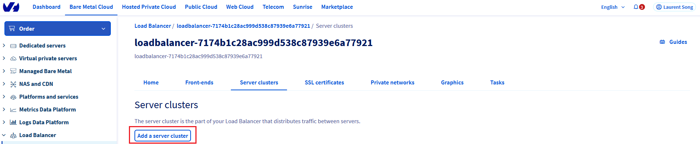
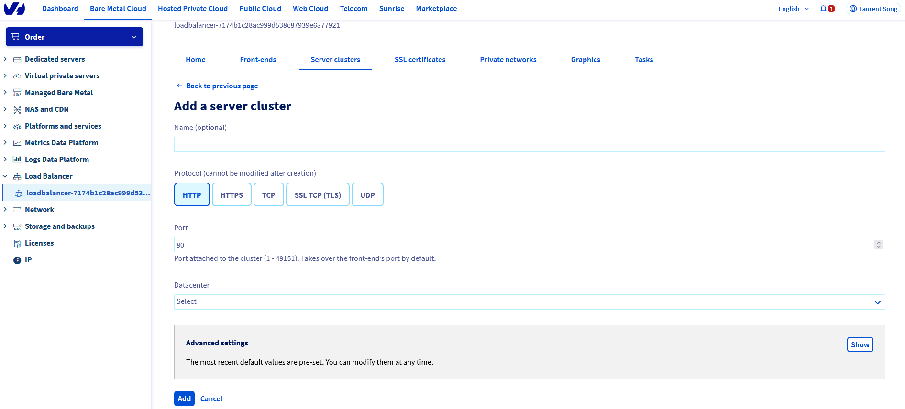
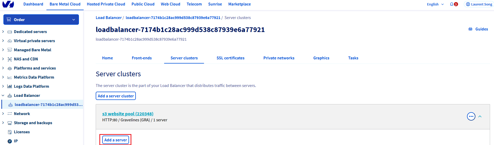
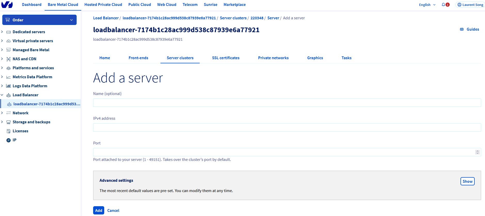
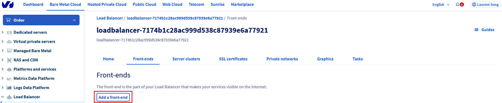
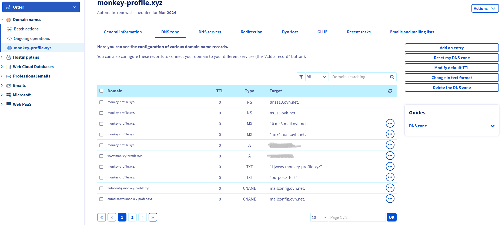
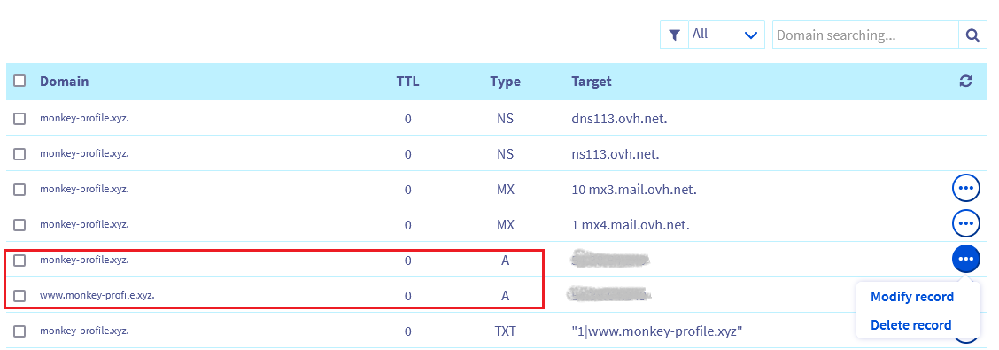
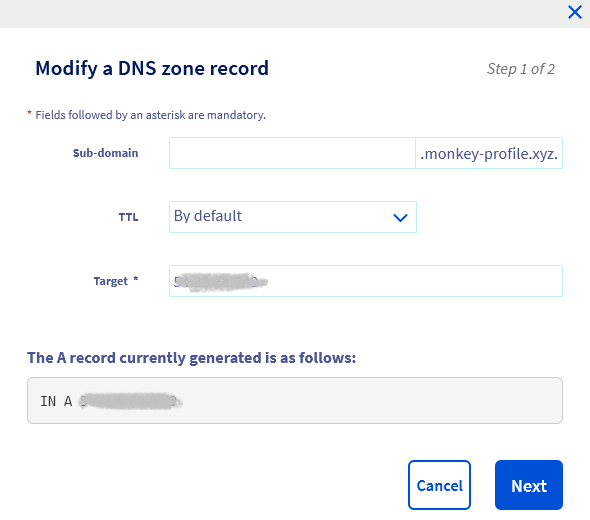
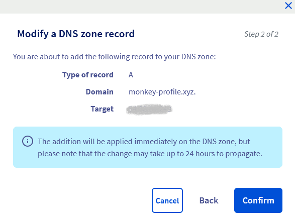
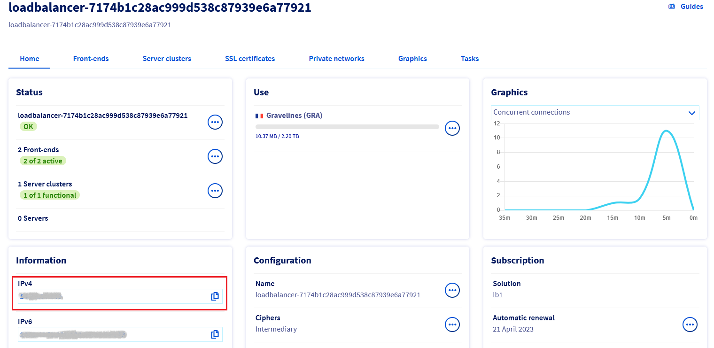

**Last updated on 9th March 2023**


# Introduction

OVHCloud Object Storage can be used to host a static website inside a S3 bucket.

> [!primary]
> A static website contains only static content (html pages, images, videos, client side scripts) wheras a dynamic website relies on server-side processing to process data and help render content.

However, OVHCloud Object Storage S3 static website hosting does not support HTTPS. If you want to use HTTPS, you can use OVH Load Balancer to serve a static website hosted on OVHCLoud Object Storage S3 and act as a SSL gateway.

The following document will explain how to configure your website and the OVHCloud Load Balancer to enable https.


# Prerequisites

The following are the prerequisites to have in order to enable https:
* order a Load Balancer here : the OVHCLoud Load Balancer will serve the role of SSL gateway and can offer protection against DDOS attacks.
* register a domain name (optional if you already have a domain name) [here](https://www.ovhcloud.com/fr/domains/)
* order a TLS certificate associated with your domain name at OVHCloud (optional if you already have a trusted TLS certificate associated with your domain name)
* enable web hosting on your S3 bucket : you can follow [this guide](/pages/cloud/storage/object_storage/s3_website)


# Instructions
  
## Step 1: Configure the load balancer

### Step 1.1: Add your certificate

Go to your load balancer management page and go to the SSL certificates page to add your certificate.
{.thumbnail}


{.thumbnail}


> [!primary]
> Optionally, you can also order a free Let's Encrypt certificate via the "Order an SSL certificate" button.


### Step 1.2: Configure a server cluster

Next step is to configure a server cluster and add it to your load balancer. A server cluster is a pool of backend machines that will handle the workload.

In the load balancer management page, go to Server clusters to create a new server cluster.

{.thumbnail}

Enter the configuration of the new server cluster:
* name (optional)
* Protocol: http
* Port: 80
* Datacenter: choose the region in which you have hosted your website

{.thumbnail}

Then add servers to your server cluster.

{.thumbnail}

Enter the configuration informations of your server:
* name (optional)
* IPVv4 address:
   * enter the public IP associated with your static website default url in the form of {bucket}.s3-website.{region}.io.cloud.ovh.net
   * you can retrieve this IP address by doing a dig command on the url
    
**Example**:
    
 ```sh
 lxxxx@LWI1XXXXXX:~$ dig s3-website.gra.io.cloud.ovh.net
 
; <<>> DiG 9.16.1-Ubuntu <<>> s3-website.gra.io.cloud.ovh.net
;; global options: +cmd
;; Got answer:
;; ->>HEADER<<- opcode: QUERY, status: NOERROR, id: 36134
;; flags: qr rd ra; QUERY: 1, ANSWER: 0, AUTHORITY: 1, ADDITIONAL: 1
 
;; OPT PSEUDOSECTION:
; EDNS: version: 0, flags:; udp: 4096
;; QUESTION SECTION:
;s3-website.gra.io.cloud.ovh.net. IN    A
 
;; AUTHORITY SECTION:
cloud.ovh.net.          33      IN      SOA     dns111.ovh.net. tech.ovh.net. 2023040507 86400 3600 3600000 60
 
;; Query time: 19 msec
;; SERVER: 10.15.25.129#53(10.15.25.129)
;; WHEN: Thu Apr 06 16:06:51 CEST 2023
;; MSG SIZE  rcvd: 108
```
    
{.thumbnail}
    

### Step 1.3: Configure your frontends

Next is to add frontends to your load balancer. A frontend will be the internet facing element of your load balancer and is responsible of handling and routing incoming requests.

In the load balancer management page, go to the Front-ends page to add frontends.
    
{.thumbnail}
    
Add 2 frontends:
* one frontend whose sole purpose is to handle all incoming http requests and redirect them to your domain name in https
   * name (optional)
   * protocol: http
   * port: 80
   * datacenter: all
   * default server cluster: none
   * advanced settings > HTTP Redirection : https://<your_domain_name>
* one frontend that will handle all incoming https requests and perform the role of the SSL gateway
   * name (optional)
   * protocol: https
   * port: 443
   * datacenter: the region where your bucket sits
   * default server cluster: the server cluster previously created
   * certificate: the certificate that you created
   * advanced settings > HTTP Header: Host <default_website_url> in the form <bucket>.s3-website.<region>.io.cloud.ovh.net
    
{.thumbnail}

### Step 1.4: Apply changes    
    
Once you created and configured all the ressources, do not forget to apply all the changes to the load balancer.
    
{.thumbnail}
    
    
## Step 2: Configure your DNS
    
> [!warning]
> This section is relevent only if you have suscribed your domain name at OVHCloud, if you already have a domain name, please check with your provider.
    
If you have suscribed your domain name at OVHCloud, go to your domain name management page and go to DNS zone.
    
{.thumbnail}
    
Then edit, the 2 A records by using the public IP address of your load balancer.
    
{.thumbnail}
    
{.thumbnail}
    
{.thumbnail}
    
    
> [!warning]
> You can find the public IP address of your load balancer in the Home page of the load balancer UI
> {.thumbnail}

    
## Step 3: Test your website

Check that the website and the redirect work properly. Open a private browser to ensure that you do have a clean cache and type your domain.
    
**Example**: you can check the [https://monkey-profile.xyz](https://monkey-profile.xyz) website that is entirely hosted on a S3 bucket with https enabled and a **self-signed certificate**   
{.thumbnail}

    
    
# Go further
To learn more about how to configure your OVHCloud Load Balancer, you can check the guide [here](/pages/cloud/load_balancer/use_presentation).
    
To learn more about how to configure your DNS zone, you can check the guide [here](/pages/web/domains/dns_zone_edit).
