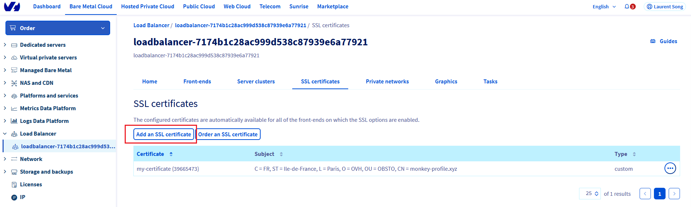
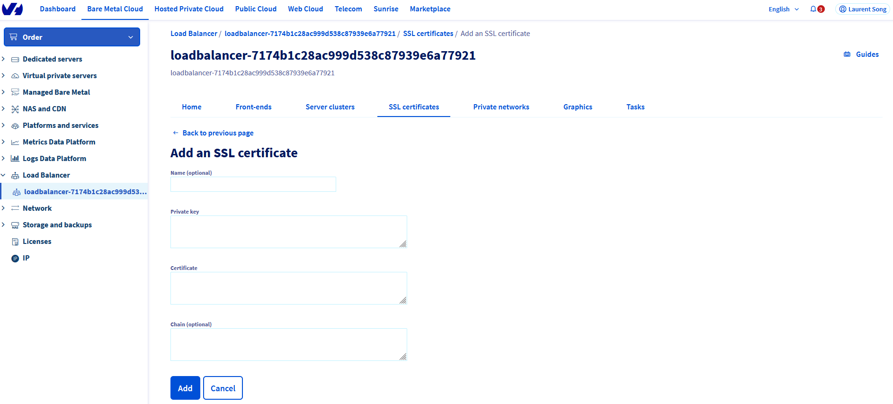

# Introduction

OVHCloud Object Storage can be used to host a static website inside a S3 bucket.

> [!primary]
> A static website contains only static content (html pages, images, videos, client side scripts) wheras a dynamic website relies on server-side processing to process data and help render content.

However, OVHCloud Object Storage S3 static website hosting does not support HTTPS. If you want to use HTTPS, you can use OVH Load Balancer to serve a static website hosted on OVHCLoud Object Storage S3 and act as a SSL gateway.

The following document will explain how to configure your website and the OVHCloud Load Balancer to enable https.

# Prerequisites

The following are the prerequisites to have in order to enable https:
* order a Load Balancer here : the OVHCLoud Load Balancer will serve the role of SSL gateway and can offer protection against DDOS attacks.
* register a domain name (optional if you already have a domain name) [here](https://www.ovhcloud.com/fr/domains/)
* order a TLS certificate associated with your domain name at OVHCloud (optional if you already have a trusted TLS certificate associated with your domain name)
* enable web hosting on your S3 bucket : you can follow [this guide](/pages/cloud/storage/object_storage/s3_website)

## Instructions
  
## Step 1: Configure the load balancer

### Step 1.1: Add your certificate

Got to your load balancer management page and go to the SSL certificates page to add your certificate.
{.thumbnail}

{.thumbnail}

> [!primary]
> Optionally, you can also order a free Let's Encrypt certificate via the "Order an SSL certificate" button.

### Step 1.2: Configure a server cluster

Next step is to configure a server cluster and add it to your load balancer. A server cluster is a pool of backend machines that will handle the workload.

In the load balancer management page, go to Server clusters to create a new server cluster.

