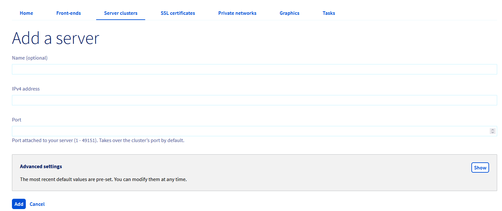
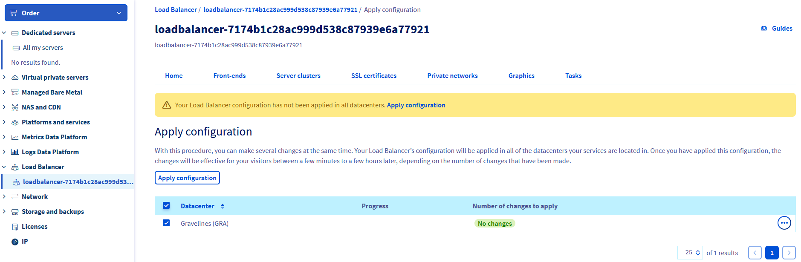
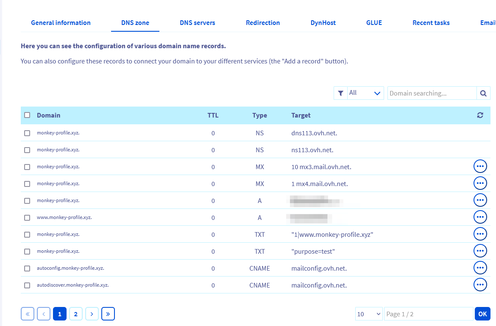
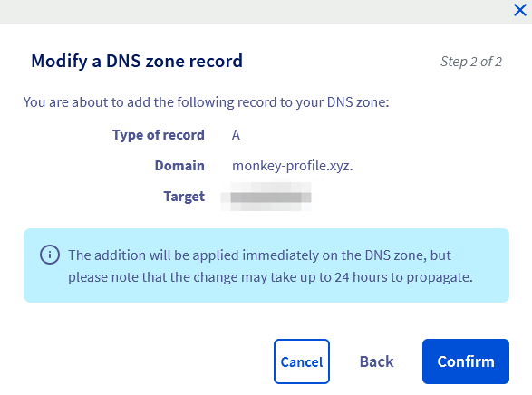
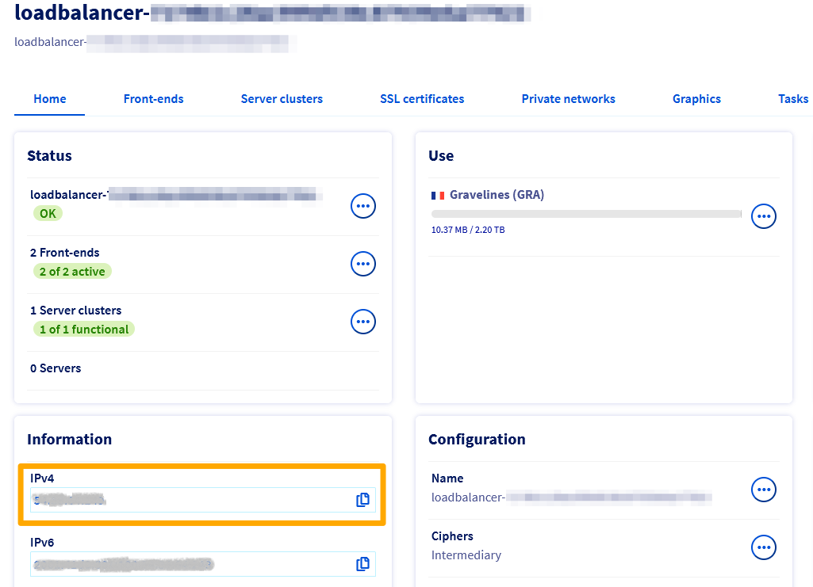

## Objective

OVHcloud Object Storage can be used to host a static website inside an S3 bucket.

> [!primary]
> A static website contains only static content (HTML pages, images, videos, client side scripts) whereas a dynamic website relies on server-side processing to process data and help render content.

However, OVHcloud Object Storage S3 static website hosting does not support HTTPS. If you want to use HTTPS, you can use OVHcloud Load Balancer to serve a static website hosted on OVHcloud Object Storage S3 and act as an SSL gateway.

**The following document will explain how to configure your website and the OVHcloud Load Balancer to enable HTTPS.**

## Requirements

The following are the prerequisites to have in order to enable https:

- An [OVHcloud Load Balancer](https://www.ovhcloud.com/en-sg/network/load-balancer/) which will serve the role of an SSL gateway and can offer protection against DDOS attacks.
- A registered [domain name](https://www.ovhcloud.com/en-sg/domains/).
- You need to order a TLS certificate associated with your domain name at OVHcloud (optional if you already have a trusted TLS certificate associated with your domain name).
- You have to [enable web hosting on your S3 bucket](/pages/cloud/storage/object_storage/s3_website).
- Access to the [OVHcloud Control Panel](https://ca.ovh.com/auth/?action=gotomanager&from=https://www.ovh.com/sg/&ovhSubsidiary=sg).

## Instructions

### Step 1 - Configuring the Load Balancer

#### Step 1.1 - Add your certificate

Log in to the [OVHcloud Control Panel](https://ca.ovh.com/auth/?action=gotomanager&from=https://www.ovh.com/sg/&ovhSubsidiary=sg), go to the `Bare Metal Cloud`{.action} section and click `Load Balancer`{.action}.

Select your Load Balancer from the list, click the `SSL certificates`{.action} tab then click `Add an SSL certificate`{.action}.

{.thumbnail}

{.thumbnail}

> [!primary]
> Optionally, you can also order a free Let's Encrypt certificate via the "Order an SSL certificate" button.

#### Step 1.2 - Configure a server cluster

You now need to configure a server cluster and add it to your Load Balancer. A server cluster is a pool of backend machines that will handle the workload.

Still from the Load Balancer section of the OVHcloud Control Panel, click the `Server clusters`{.action} tab then click `Add a server cluster`{.action}.

{.thumbnail}

Enter the configuration of the new server cluster:

- Name (optional)
- Protocol: HTTP
- Port: 80
- Datacenter: Choose the region in which you have hosted your website

{.thumbnail}

You now need to add servers to your server cluster. Click the `Add a server`{.action} button.

{.thumbnail}

Enter the configuration information of your server:

- Name (optional)
- IPv4 address: Enter the public IP associated with your static website default URL in the form of `{bucket}.s3-website.{region}.io.cloud.ovh.net`

*You can retrieve this IP address by doing a dig command on the URL.*

**Example**:

```sh
lxxxx@LWI1XXXXXX:~$ dig s3-website.gra.io.cloud.ovh.net

; <<>> DiG 9.16.1-Ubuntu <<>> s3-website.gra.io.cloud.ovh.net
;; global options: +cmd
;; Got answer:
;; ->>HEADER<<- opcode: QUERY, status: NOERROR, id: 36134
;; flags: qr rd ra; QUERY: 1, ANSWER: 0, AUTHORITY: 1, ADDITIONAL: 1
 
;; OPT PSEUDOSECTION:
; EDNS: version: 0, flags:; udp: 4096
;; QUESTION SECTION:
;s3-website.gra.io.cloud.ovh.net. IN    A
 
;; AUTHORITY SECTION:
cloud.ovh.net.          33      IN      SOA     dns111.ovh.net. tech.ovh.net. 2023040507 86400 3600 3600000 60
 
;; Query time: 19 msec
;; SERVER: 10.15.25.129#53(10.15.25.129)
;; WHEN: Thu Apr 06 16:06:51 CEST 2023
;; MSG SIZE  rcvd: 108
```

{.thumbnail}

#### Step 1.3 - Configure your front-ends

The next steps consists in adding front-ends to your Load Balancer. A front-end will be the internet facing element of your Load Balancer and is responsible for handling and routing incoming requests.

In the Load Balancer section of the OVHcloud Control Panel, click the `Front-ends`{.action} tab then click `Add a front-end`{.action}.

{.thumbnail}

Add 2 frontends:

- One frontend whose sole purpose is to handle all incoming HTTP requests and redirect them to your domain name in HTTPS
    * name (optional)
    * protocol: HTTP
    * port: 80
    * datacenter: all
    * default server cluster: none
    * advanced settings > HTTP Redirection: `https://<your_domain_name>`
- One frontend that will handle all incoming HTTPS requests and perform the role of the SSL gateway
    * name (optional)
    * protocol: HTTPS
    * port: 443
    * datacenter: the region where your bucket sits
    * default server cluster: the server cluster previously created
    * certificate: the certificate that you created
    * advanced settings > HTTP Header: Host `<default_website_url>` in the form `<bucket>.s3-website.<region>.io.cloud.ovh.net`

{.thumbnail}

#### Step 1.4 - Apply changes

Once you created and configured all the ressources, do not forget to click the `Apply configuration`{.action} button to apply all the changes to the Load Balancer.

{.thumbnail}

### Step 2: Configure your DNS

> [!warning]
> This section is relevant only if your your domain name is registered at OVHcloud. If you have an external domain name, please check with your provider.

CLick the `Web Cloud`{.action} tab of your OVHcloud Control Panel and select your domain name from the `Domain names`{.action} section. 

Open the `DNS zone`{.action} tab.

{.thumbnail}

Edit the two A records to add the public IP address of your Load Balancer.

{.thumbnail}

{.thumbnail}

{.thumbnail}

> [!primary]
> You can find the public IP address of your Load Balancer on the home page of the `Load Balancer`{.action} section in the OVHcloud Control Panel.
>
> {.thumbnail}

### Step 3: Test your website

Check that the website and the redirect work properly. Open a private browser to ensure that you do have a clean cache and type your domain name.

**Example**: You can check the [https://monkey-profile.xyz](https://monkey-profile.xyz) website that is entirely hosted on an S3 bucket with HTTPS enabled and a **self-signed certificate**.

{.thumbnail}

## Go further

[How to configure your OVHcloud Load Balancer](/pages/cloud/load_balancer/use_presentation)

[How to configure your DNS zone](/pages/web/domains/dns_zone_edit)

Join our community of users on <https://community.ovh.com/en/>.
