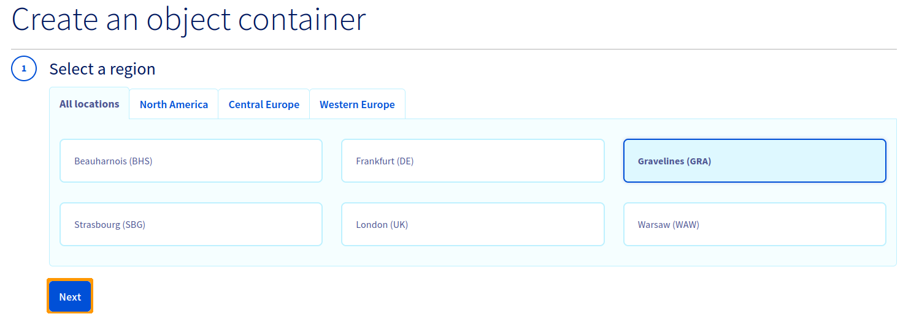

**Dernière mise à jour le 27/10/2021**

## Objectif

L'offre Public Cloud Archive est une solution de stockage illimitée avec une facturation simple et adaptée à vos besoins. Il existe de nombreux types de conteneurs d'objets :

- pour de l'hébergement statique (site web statique);
- pour de l'hébergement privé (Exemple : stockage de données personnelles);
- pour de l'hébergement public (pour stocker tout ce qui est accessible au public);
- pour du stockage à froid (archivage).

La première étape est la création d’un conteneur qui regroupera vos fichiers. 

**Ce guide explique comment créer un conteneur depuis l'espace client OVHcloud.**

## Prérequis

- Être connecté à votre [espace client OVHcloud](https://www.ovh.com/auth/?action=gotomanager&from=https://www.ovh.com/fr/&ovhSubsidiary=fr){.external}

## En pratique

### Création d'un conteneur Public Cloud Archive depuis l'espace client OVHcloud

Connectez-vous à votre [espace client](https://www.ovh.com/auth/?action=gotomanager&from=https://www.ovh.com/fr/&ovhSubsidiary=fr){.external}, accédez à la section `Public Cloud`{.action} et sélectionnez le projet Public Cloud concerné. Cliquez ensuite sur `Cloud Archive`{.action} dans la barre de navigation de gauche sous `Storage`.

S'il s'agit de votre premier conteneur :

Si vous avez déjà créé un/des conteneur(s) :

Sélectionnez la région de votre conteneur puis cliquez sur `Suivant`{.action} :

Nommez votre conteneur puis cliquez sur `Ajouter le conteneur`{.action} :

> [!warning]
>
> Si vous souhaitez lier votre conteneur à un nom de domaine, le nom de votre conteneur de doit pas contenir les caractères suivants : 
>
> - [ . ] 
> - [ _ ]
> - et vous ne devez pas utiliser de majuscules.
>
> Pour plus d'informations, consultez notre guide « [Lier un conteneur à un nom de domaine](https://docs.ovh.com/fr/storage/pcs/link-domain/) ».
>

Votre conteneur est créé :

## Aller plus loin

Échangez avec notre communauté d’utilisateurs sur <https://community.ovh.com>.
