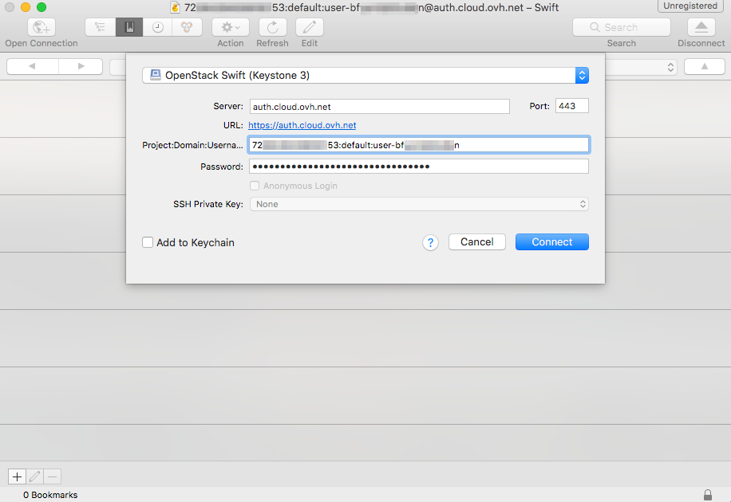

**Letzte Aktualisierung am 18.06.2021**

## Ziel

Public Cloud Archive ist eine Speicherlösung, die mit OpenStack-APIs verwendet werden kann. Es ist jedoch möglich, dass Sie mit der Verwaltung eines Speicherplatzes nicht vertraut sind.

Es gibt also grafische Lösungen, die für Sie unsichtbar OpenStack-APIs verwenden. CyberDuck gehört zu diesen Lösungen und ist einfach konfigurierbar.

Es sind auch andere Interfaces verfügbar, deren Konfiguration der entspricht, die wir Ihnen zeigen werden.

**In dieser Anleitung erfahren Sie, wie Sie Cyberduck konfigurieren, um Ihr Public Cloud Archive über ein grafisches Interface auf Basis der OpenStack-APIs verwalten zu können.**

## Voraussetzungen

- Cyberduck [herunterladen und installieren](https://cyberduck.io/).
- Sie verfügen über Ihre Benutzer- (*OS_USERNAME*) und Projekt-Kennungen (*OS_PROJECT_NAME* oder *OS_TENANT_NAME*), die Sie erhalten können, indem Sie die Datei "OpenRC" im Menü [Ihres](https://docs.ovh.com/de/public-cloud/die-variablen-der-umgebung-openstack-laden/#schritt-nr-1-die-variablen-wieder-erhalten)Kundencenters herunterladen [OVHcloud Public Cloud](https://www.ovh.com/auth/?action=gotomanager&from=https://www.ovh.de/&ovhSubsidiary=de).
- Sie haben Ihr OpenStack-Benutzerpasswort.

Wenn Sie Ihr OpenStack-Benutzerpasswort nicht mehr kennen, können Sie es in dieser Anleitung [ändern](https://docs.ovh.com/de/public-cloud/openstack-benutzerpasswort-aendern/).

## In der praktischen Anwendung

**Diese Anleitung wurde auf der Grundlage der Version 7.9.2 von Cyberduck für MacOS aktualisiert.**

> [!primary]
>
> Je nach Quelle, aus der Ihre OpenRC-Datei heruntergeladen wird (über Horizon oder über Ihr OVHcloud Kundencenter), kann Ihre Projektkennung als *OS_PROJECT_NAME* oder *OS_TENANT_NAME* bezeichnet werden.
>

Öffnen Sie in Cyberduck eine "OpenStack Swift (Keystone 3)" Verbindung.

{.thumbnail}

Geben Sie die folgenden Informationen an:

- Server: auth.cloud.ovh.net
- Project:Domain:Username: OS_PROJECT_NAME:default:OS_USERNAME
- Password: das Passwort Ihres OpenStack-Benutzers

Klicken Sie dann auf `Anmelden`{.action}. Sobald Sie eingeloggt sind, haben Sie Zugriff auf die Ordnerstruktur Ihrer Ordner und Dateien.

{.thumbnail}

> [!primary]
>
> Bei Verbindungsschwierigkeiten können Sie das Cyberduck Verbindungsprofil für OpenStack Swift (Keystone 3) herunterladen und es mit Cyberduck öffnen.
>   Klicken Sie hier mit <a href="https://trac.cyberduck.io/browser/shelves/02.2020/profiles/default/Openstack%20Swift%20(Keystone%203).cyberduckprofile?rev=48724&order=name" download>der rechten Maustaste und klicken Sie auf "Das Ziel des Links speichern"</a>, um das Profil herunterzuladen.
>

## Weiterführende Informationen

[Cyberduck Dokumentation](https://trac.cyberduck.io/wiki/help/en){.external}

[Erste Schritte mit der Swift API](https://docs.ovh.com/de/public-cloud/die_ersten_schritte_mit_der_swift_api/)

Für den Austausch mit unserer Community gehen Sie auf <https://community.ovh.com/en/>.
