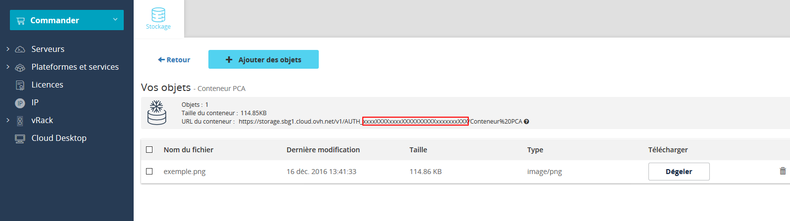

## Preambule
Public Cloud Archive est une solution de stockage qui peut s'utiliser à l'aide des APIs OpenStack. Cependant, il est possible que vous ne soyez pas familier avec cette façon de gérer un espace de stockage.

Il existe donc des solutions graphiques, qui utilisent de manière invisible des APIs OpenStack pour vous. CyberDuck fait partie de ces solutions et est facilement configurable.

D'autres interfaces sont elles aussi disponibles et trouvables directement sur Internet, leurs configurations se dérouleront de manière similaire à celle que nous allons vous présenter.

Ce guide vous expliquera comment configurer Cyberduck afin de pouvoir gérer votre Public Cloud Archive a l'aide d'une interface graphique se basant sur les APIs Openstack.

### Prérequis

- Un utilisateur Horizon configuré : voir le [guide](../../horizon){.ref}
- Le Tenant identifiant de votre project, l'identifiant utilisateur. Cette information est récupérable en naviguant dans un conteneur dans l’espace client
- Le mote pass de votre utilisateur

{.thumbnail}

## Configuration de Cyberduck
- Télécharger [Cyberduck](https://cyberduck.io/){.external}
- Se connecter sur un compte de type "Swift - OpenStack Object Storage"

{.thumbnail}

Différentes informations sont à renseigner dans le formulaire :

- Server : auth.cloud.ovh.net (Serveur d'authentification)
- Project:Domain:Username : OS_TENANT_NAME:default:OS_USERNAME
- Password : le mot de passe de votre utilisateur Horizon
- Se connecter

{.thumbnail}