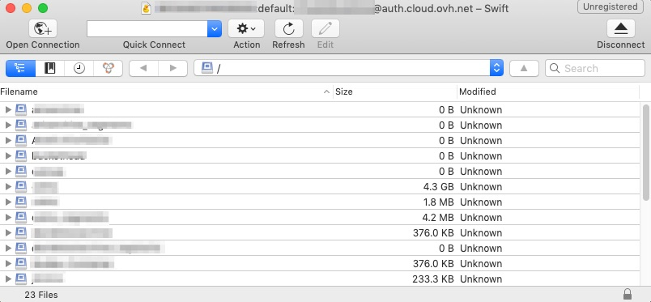

## Wstep

Object Storage to rozwiązanie do przechowywania danych zarządzane głównie przez API OpenStack.

Jeśli nie chcesz zarządzać przestrzenią dyskową za pomocą linii poleceń, możesz korzystać z graficznego interfejsu opartego na API OpenStack. Cyberduck to program Swift.

W Internecie można odnaleźć inne interfejsy. Konfiguracja jest podobna do tej przedstawionej w tym przewodniku.

**Przewodnik ten wyjaśnia, jak skonfigurować program Cyberduck, aby zarządzać usługą Object Storage za pomocą graficznego interfejsu opartego na API Openstack.**

## Wymagania

- Skonfigurowany użytkownik Horizon:  sprawdź [przewodnik](../../public-cloud/tworzenie_dostepu_do_interfejsu_horizon/){.external}
- ID Twojego projektu i Twojego użytkownika widoczny w menu Access & Security w interfejsie Horizon.

{.thumbnail}

## W praktyce

### Konfiguracja oprogramowania Cyberduck

- Pobierz oprogramowanie [Cyberduck](https://cyberduck.io/){.external}
- Zaloguj się do konta typu  "Swift - OpenStack Object Storage"

{.thumbnail}

Wypełnij formularz podając kilka informacji:

- Server: auth.cloud.ovh.net (Serwer uwierzytelniania)
- Tenant ID:Access Key: jest to ID Projektu: ID Użytkownika Horizon
- Secret Key: Hasło użytkownika Horizon
- More Options / Path: v2.0
- Connect

{.thumbnail}

## Sprawdź również

Przyłącz się do społeczności naszych użytkowników na stronie <https://community.ovh.com/en/>
