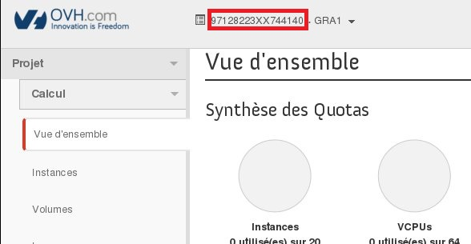

## Preamble
Object Storage is a storage solution that is managed primarily through the OpenStack API. However, we have developed a gateway which makes it possible to connect to your PCA container with rsync.


### Requirements
- [rsync](https://rsync.samba.org/)
- OpenStack Login & Password
- TenantName of the project


## Rsync
Rsync is an open source utility that provides fast incremental file transfer.
Precompiled binaries are available in most modern OS distributions, so you should first check if you can install an rsync package via your standard package-install tools for your OS.


## OpenStack ID
You can generate your OpenStack login & password using this [Guide](https://docs.ovh.com/gb/en/public-cloud/configure_user_access_to_horizon/)


## TenantName
The TenantName corresponds to the name of your Horizon Project. To get the TenantName, you need to connect to the OpenStack web interface: [https://horizon.cloud.ovh.net/](https://horizon.cloud.ovh.net/){.external}. Once logged in, the TenantName is visible at the top of page.


{.thumbnail}


## Connection
- Host Name : gateways.storage.{region}.cloud.ovh.net
- User Name : pca
- Password  : {TenantName}.{Username_Openstack}.{Password_Openstack}
- Port      : 22


## Upload data
If you created a PCA container in GRA region :

```bash
user@host:~$ rsync -a /path/to/my/dir pca@gateways.storage.gra.cloud.ovh.net:/container
pca@gateways.storage.gra.cloud.ovh.net's password:
user@host:~$
```


## Download data
OVH Public Cloud Archive stores data so that cost is optimal at the expense of some latency in the retrieval process. To access your archive, an unsealing request must be received with the container and archive names it relates to.
Once you archive has been unsealed in OVH Public Cloud Archive, you can download it during 24 hours with unlimited throughput and access frequency. At the end of the retrieval span, the archive will be sealed again.

```bash
user@host:~$ rsync -a pca@gateways.storage.gra.cloud.ovh.net:/container .
pca@gateways.storage.gra.cloud.ovh.net's password:
user@host:~$
```


## Rsync options
Since rsync server has been patched to work with Swift API, those options will be enforced on server side to match object storage backend behavior :
> --inplace : Instead of the default method of creating a new copy of the file and moving it into place when it is complete, rsync instead writes the updated data directly to the destination file
> -W, --whole-file : Disable rsync's delta-transfer algorithm and the whole file is sent as-is instead

Additionally, only a subset of options are allowed on client side :
> -a, --archive : Archive mode
> -r, --recursive : Copy directories recursively
> -v, --verbose : Increases the amount of information you are given during the transfer.
> --del, --delete : Delete extraneous files from dest dir
> -P, --progress : Print information showing the progress of the transfer


## Go further
- OVH Cloud Archive API doc [here](https://docs.ovh.com/gb/en/storage/pca/api/)
- Rsync man page [here](https://linux.die.net/man/1/rsync)
