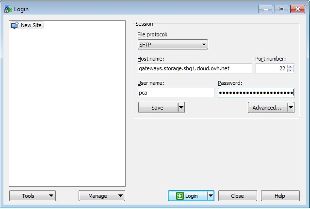

## Preamble
Object Storage is a storage solution that is managed primarily through the OpenStack API. However, you might not be familiar with managing storage space via command line. Therefore, we have developed a gateway which makes it possible to connect to your PCA container with an SFTP client.

### Requirements
- SFTP Client : [WinSCP](https://winscp.net/eng/download.php){.external}
- OpenStack Login & Password
- TenantName of the project

## SFTP Client
In this example, we use WinSCP but you can use any SFTP client. Configuration of each SFTP client is similar as explained here regardless of client.

## OpenStack ID
You can generate your OpenStack login & password using this [Guide](https://www.ovh.co.uk/g1773.configure_user_access_to_horizon){.external}

## TenantName
The TenantName corresponds to the name of your Horizon Project. To get the TenantName, you need to connect to the OpenStack web interface: [https://horizon.cloud.ovh.net/](https://horizon.cloud.ovh.net/){.external}. Once logged in, the TenantName is visible at the top of page.

{.thumbnail}

## Connection
- Host Name : gateways.storage.{region}.cloud.ovh.net
- User Name : pca
- Password  : {TenantName}.{Username_Openstack}.{Password_Openstack}
- Port      : 22

{.thumbnail}

## Example
If you created a PCA container in sbg1 :

- Host Name : gateways.storage.sbg1.cloud.ovh.net
- User Name : pca
- Password : 971891XXXX1214.f6nBXXXXXAmcv.SfPeASYfuWeqBZgXXXXX2XhF3DY12RkD

{.thumbnail}

## WinSCP Setting
In this part we will disable two WinSCP options :

**Transfer Resume / Transfer to Temporary Filename :** This option will have to be disable because recovery is not possible with PCA and WinSCP can return you an error.

- In the "Endurance" section, select "Disable".

{.thumbnail}

**Preserve Timestamp :** TimeStamp corresponds to the date of modification of the file, we disable it because on PCA we replace this data by the date of upload of the file.

- In the "Transfer" section, click on "Edit...".

{.thumbnail}

- Uncheck "Preserve timestamp".

{.thumbnail}

## Data Recovery
Data recovery requires that the object be unlocked first. A GET request must be made on the object in question. If this command is not made beforehand, your SFTP client will return an error message when attempting to download a file. Consult our guide to learn how to unlock your object [here](../guide.en-gb.md){.ref}.
