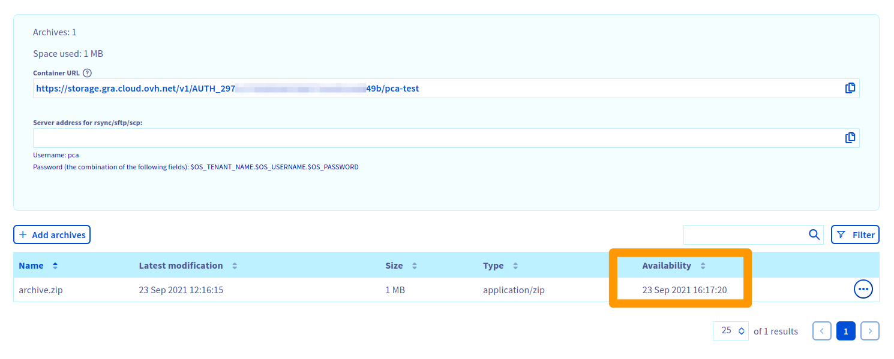

**Dernière mise à jour le 12/04/2022**

## Preamble
Public Cloud Archive is a cold storage offer designed to host large volumes of data without any size limit at a very attractive price. Intended for data that is not accessed often, a request must be made in advance and there is a delay prior to recovering data. The time delay will vary depending on the age of data and the frequency of data access.

## Prerequisite

- Unfreeze via the manager OVHcloud :
    - Be connected to your [manager OVHcloud](https://www.ovh.com/auth/?action=gotomanager&from=https://www.ovh.com/en/&ovhSubsidiary=en){.external}.
- Unfreeze via python-swiftclient :
    - [Prepare the environement to set Openstack API](https://docs.ovh.com/us/en/public-cloud/prepare_the_environment_for_using_the_openstack_api/){.external} installing python-swiftclient.
    - [Change OpenStack environment variables](https://docs.ovh.com/us/en/public-cloud/set-openstack-environment-variables/){.external}.

## Practical case

### Unfreeze your object from your manager

In the [manager](https://www.ovh.com/auth/?action=gotomanager&from=https://www.ovh.com/en/&ovhSubsidiary=en){.external}, click on the tag `Public Cloud`{.action}, select your public cloud project and click on `Cloud Archive`{.action} in the left menu.

To unfreeze the archive, click on the button `...`{.action} on the right of your archive, then `Unfreeze`{.action} to start the process of retrieve.

{.thumbnail}

Once the process is finished, time and hours of availability is dispaly in the column "Availability".

{.thumbnail}

Your file will be available for upload at this time. You can start your upload directly via yiour browser or via a [Swift/SFTP/SCP client](https://docs.ovh.com/en/storage/pca/sftp/).


### Unfreeze your object via python-swiftclient

Check the state of your object to download :

```bash
swift stat <conteneur_pca> <objet>
```

```
               Account: AUTH_702xxxxxxxxxxxxxxxxxxxxxxxxxxdaf
             Container: <conteneur_pca>
                Object: <objet>
          Content Type: text/plain
        Content Length: 746
         Last Modified: Tue, 10 Aug 2021 08:39:41 GMT
                  ETag: 51f122f524c46cafcf9628305db99144
            Meta Mtime: 1627974571.298786
         Accept-Ranges: bytes
 X-Ovh-Retrieval-State: sealed
           X-Timestamp: 1628584780.95458
            X-Trans-Id: txbb0eff9ebf9442eab0d02-0061123b5a
X-Openstack-Request-Id: txbb0eff9ebf9442eab0d02-0061123b5a
     X-Iplb-Request-Id: 6DBEFE1E:942A_3626E64B:01BB_61123B59_649EACF:8F28
       X-Iplb-Instance: 12308
```

The following line shows if the object is unfreeze:

```
X-Ovh-Retrieval-State: sealed
```

Consequently, the`swift download` command get back an 429 error 

```bash
swift download <conteneur_pca> <objet>
```

```
Error downloading object '<conteneur_pca>/<objet>': Object GET failed: https://storage.gra.cloud.ovh.net/v1/AUTH_702xxxxxxxxxxxxxxxxxxxxxxxxxxdaf/<conteneur_pca>/<objet> 429 Too Many Requests
```

Launching back the `swift stat` command :

```bash
swift stat <conteneur_pca> <objet>
```

```
               Account: AUTH_702xxxxxxxxxxxxxxxxxxxxxxxxxxdaf
             Container: <conteneur_pca>
                Object: <objet>
          Content Type: text/plain
        Content Length: 746
         Last Modified: Tue, 10 Aug 2021 08:39:41 GMT
                  ETag: 51f122f524c46cafcf9628305db99144
            Meta Mtime: 1627974571.298786
         Accept-Ranges: bytes
 X-Ovh-Retrieval-State: unsealing
           X-Timestamp: 1628584780.95458
 X-Ovh-Retrieval-Delay: 14313
            X-Trans-Id: tx9012d12434a447bd81528-0061123c54
X-Openstack-Request-Id: tx9012d12434a447bd81528-0061123c54
     X-Iplb-Request-Id: 6DBEFE1E:94D0_3626E64B:01BB_61123C54_6823B54:10ABF
       X-Iplb-Instance: 12309
```

The following line indicates if the object is being unfreezed:

```
X-Ovh-Retrieval-State: unsealing
```

The following line indicates indicates the delay (in seconds) to wait before retrieving the object :

```
X-Ovh-Retrieval-Delay: 14313
```

Once the delay over :

```bash
swift stat <conteneur_pca> <objet>
```

```
               Account: AUTH_702xxxxxxxxxxxxxxxxxxxxxxxxxxdaf
             Container: <conteneur_pca>
                Object: <objet>
          Content Type: text/plain
        Content Length: 746
         Last Modified: Tue, 10 Aug 2021 08:39:41 GMT
                  ETag: 51f122f524c46cafcf9628305db99144
            Meta Mtime: 1627974571.298786
         Accept-Ranges: bytes
 X-Ovh-Retrieval-State: unsealed
           X-Timestamp: 1628584780.95458
            X-Trans-Id: txaf1eac9ceb8a45efb36e1-0061127482
X-Openstack-Request-Id: txaf1eac9ceb8a45efb36e1-0061127482
     X-Iplb-Request-Id: 6DBEFE1E:ACCC_3626E64B:01BB_61127482_E75B0:1B979
       X-Iplb-Instance: 38343
```

The following line indicates if the object is unfreezed

```
X-Ovh-Retrieval-State: unsealed
```

Upload of object is working : 

```bash
swift download <conteneur_pca> <objet>
```

```
swift download <conteneur_pca> <objet>
<objet> [auth 0.961s, headers 1.767s, total 1.768s, 0.001 MB/s]
```

#### Automate tj-he object download

> [!primary]
>
> this feature require the package `at`.
>

```bash
swift download <conteneur_pca> <objet>
```

```
Error downloading object '<conteneur_pca>/<objet>': Object GET failed: https://storage.gra.cloud.ovh.net/v1/AUTH_702xxxxxxxxxxxxxxxxxxxxxxxxxxdaf/<conteneur_pca>/<objet> 429 Too Many Requests
```

```bash
X_OVH_RETRIEVAL_DELAY=$(swift download <conteneur_pca> <objet> | awk -F ": " '/X-Ovh-Retrieval-Delay/ {print $2}'
RETRIEVAL_DELAY=$((${X_OVH_RETRIEVAL_DELAY} / 60 + 2))
swift download <conteneur_pca> <objet> | at now + ${RETRIEVAL_DELAY} minutes
```


