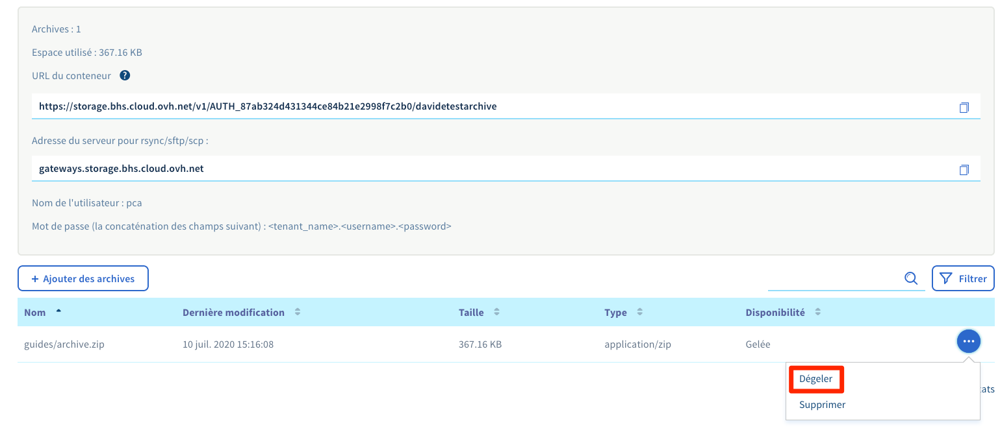

## Preambule
Public Cloud Archive est une offre de stockage froid destinée à héberger de gros volumes de données et cela sans limite de taille avec une tarification très attractive. Destinée aux données rarement consultées, une requête de déblocage est nécessaire impliquant un délai avant récupération. Ce délai est variable en fonction de l'ancienneté et de la fréquence d'accès à vos données.


## Degeler vos objets depuis l'espace client
Lorsque vous stockez des données sur PCA, celles-ci sont directement gelées et ainsi ne peuvent pas être récupérées. Il vous faudra alors cliquer sur le bouton "Dégeler" afin d'entamer le processus de récupération.


{.thumbnail}

Une fois que le procédé débuté, un délai apparaîtra à la place du bouton "dégeler". Votre fichier sera alors disponible au téléchargement à l'issue de ce délai. Enfin votre fichier est accessible à l'issue du délai. Vous pouvez ainsi entammer le téléchargement directement par le navigateur ou via un[client Swift/SFTP/SCP](../pca_sftp/guide.fr-fr.md){.ref}


{.thumbnail}


## Degeler vos objets depuis python-swiftclient

### Prérequis

- [Préparer l’environnement pour utiliser l’API OpenStack](https://docs.ovh.com/fr/public-cloud/preparer-lenvironnement-pour-utiliser-lapi-openstack/){.external} en installant python-swiftclient
- [Charger les variables d’environnement OpenStack](https://docs.ovh.com/fr/public-cloud/charger-les-variables-denvironnement-openstack/){.external}

Vérifier l'état de l'objet à télécharger:

```bash
swift stat <conteneur_pca> <objet>
```
```
               Account: AUTH_702xxxxxxxxxxxxxxxxxxxxxxxxxxdaf
             Container: <conteneur_pca>
                Object: <objet>
          Content Type: text/plain
        Content Length: 746
         Last Modified: Tue, 10 Aug 2021 08:39:41 GMT
                  ETag: 51f122f524c46cafcf9628305db99144
            Meta Mtime: 1627974571.298786
         Accept-Ranges: bytes
 X-Ovh-Retrieval-State: sealed
           X-Timestamp: 1628584780.95458
            X-Trans-Id: txbb0eff9ebf9442eab0d02-0061123b5a
X-Openstack-Request-Id: txbb0eff9ebf9442eab0d02-0061123b5a
     X-Iplb-Request-Id: 6DBEFE1E:942A_3626E64B:01BB_61123B59_649EACF:8F28
       X-Iplb-Instance: 12308
```

La ligne suivante indique que l'objet est gelé:
```
X-Ovh-Retrieval-State: sealed
```

donc la commande `swift download` renverra une erreur 429:
```bash
swift download <conteneur_pca> <objet>
```
```
Error downloading object '<conteneur_pca>/<objet>': Object GET failed: https://storage.gra.cloud.ovh.net/v1/AUTH_702xxxxxxxxxxxxxxxxxxxxxxxxxxdaf/<conteneur_pca>/<objet> 429 Too Many Requests
```

En relançant la commande `swift stat` :

```bash
swift stat <conteneur_pca> <objet>
```
```
               Account: AUTH_702xxxxxxxxxxxxxxxxxxxxxxxxxxdaf
             Container: <conteneur_pca>
                Object: <objet>
          Content Type: text/plain
        Content Length: 746
         Last Modified: Tue, 10 Aug 2021 08:39:41 GMT
                  ETag: 51f122f524c46cafcf9628305db99144
            Meta Mtime: 1627974571.298786
         Accept-Ranges: bytes
 X-Ovh-Retrieval-State: unsealing
           X-Timestamp: 1628584780.95458
 X-Ovh-Retrieval-Delay: 14313
            X-Trans-Id: tx9012d12434a447bd81528-0061123c54
X-Openstack-Request-Id: tx9012d12434a447bd81528-0061123c54
     X-Iplb-Request-Id: 6DBEFE1E:94D0_3626E64B:01BB_61123C54_6823B54:10ABF
       X-Iplb-Instance: 12309
```

La ligne suivante indique que l'objet est en cours de dégèle:
```
X-Ovh-Retrieval-State: unsealing
```

Et la ligne suivante indique le délai (en secondes) à attendre avant de pouvoir télécharger l'objet:
```
X-Ovh-Retrieval-Delay: 14313
```

Une fois le délai passé:

```bash
swift stat <conteneur_pca> <objet>
```
```
               Account: AUTH_702xxxxxxxxxxxxxxxxxxxxxxxxxxdaf
             Container: <conteneur_pca>
                Object: <objet>
          Content Type: text/plain
        Content Length: 746
         Last Modified: Tue, 10 Aug 2021 08:39:41 GMT
                  ETag: 51f122f524c46cafcf9628305db99144
            Meta Mtime: 1627974571.298786
         Accept-Ranges: bytes
 X-Ovh-Retrieval-State: unsealed
           X-Timestamp: 1628584780.95458
            X-Trans-Id: txaf1eac9ceb8a45efb36e1-0061127482
X-Openstack-Request-Id: txaf1eac9ceb8a45efb36e1-0061127482
     X-Iplb-Request-Id: 6DBEFE1E:ACCC_3626E64B:01BB_61127482_E75B0:1B979
       X-Iplb-Instance: 38343
```

La ligne suivante indique que l'objet est dégelé:
```
X-Ovh-Retrieval-State: unsealed
```

Le téléchargement de l'objet fonctionne:

```bash
swift download <conteneur_pca> <objet>
```
```
swift download <conteneur_pca> <objet>
<objet> [auth 0.961s, headers 1.767s, total 1.768s, 0.001 MB/s]
```

#### Automatiser le téléchargement de l'objet:

> [!primary]
>
> Requiert le package `at`
>

```bash
swift download <conteneur_pca> <objet>
```
```
Error downloading object '<conteneur_pca>/<objet>': Object GET failed: https://storage.gra.cloud.ovh.net/v1/AUTH_702xxxxxxxxxxxxxxxxxxxxxxxxxxdaf/<conteneur_pca>/<objet> 429 Too Many Requests
```
```bash
X_OVH_RETRIEVAL_DELAY=$(swift download <conteneur_pca> <objet> | awk -F ": " '/X-Ovh-Retrieval-Delay/ {print $2}'
RETRIEVAL_DELAY=$((${X_OVH_RETRIEVAL_DELAY} / 60 + 2))
swift download <conteneur_pca> <objet> | at now + ${RETRIEVAL_DELAY} minutes
```
