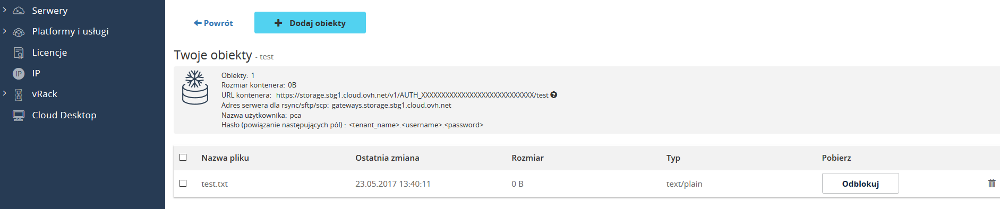

## Wstep
Public Cloud Archive to oferta przestrzeni dyskowej przeznaczona do przechowywania dużych ilości danych bez limitu rozmiaru w bardzo atrakcyjnej cenie. Usługa ta jest przeznaczona do przechowywania danych, do których nie ma częstego dostępu. Zlecenie dostępu do danych należy wykonać z wyprzedzeniem. Odzyskiwanie danych może trwać długo. Czas ten zależy od wieku danych oraz od częstotliwości dostępu do nich.

## Odblokuj dane
Dane przechowywane w ramach usługi PCA są zamrożone i nie mogą zostać bezpośrednio odzyskane. Należy kliknąć na przycisk do odblokowania danych, aby rozpocząć proces ich odzyskiwania.

{.thumbnail}

Po rozpoczęciu procesu w miejscu przycisku odblokowywania pojawi się timer. Plik będzie dostępny do pobrania po zatrzymaniu się timera.

{.thumbnail}

Możesz rozpocząć pobieranie za pomocą przeglądarki lub za pomocą programu Swift/SFTP/SCP.

{.thumbnail}