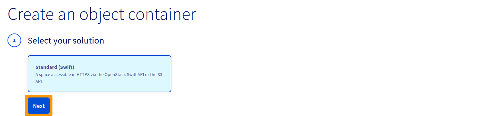
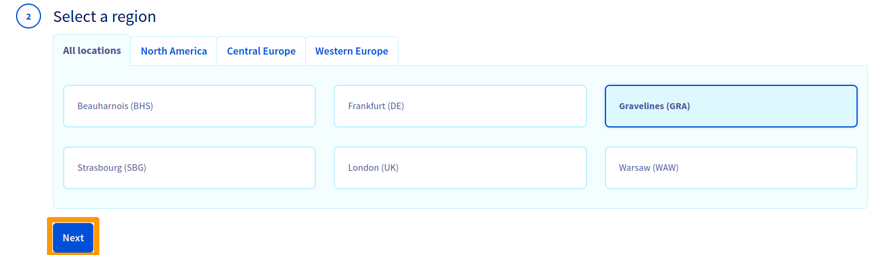
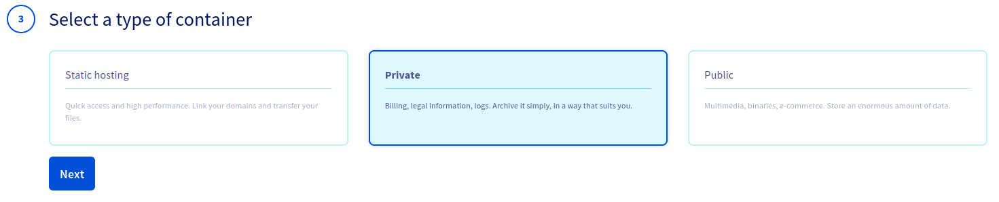
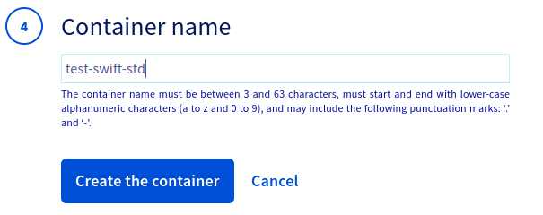
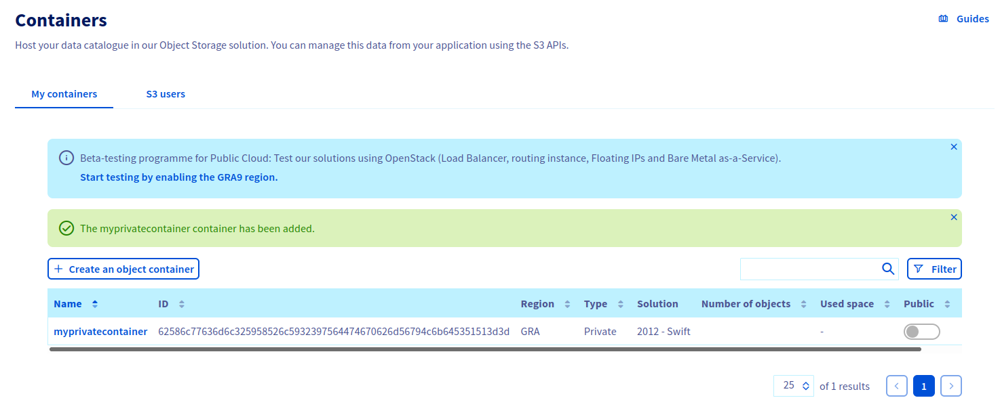
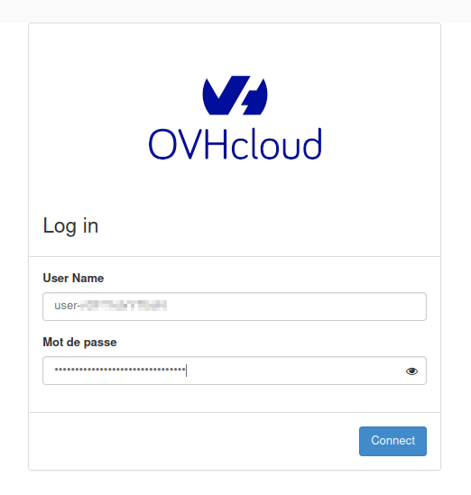
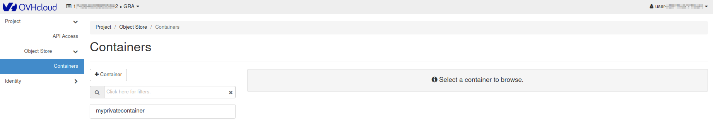
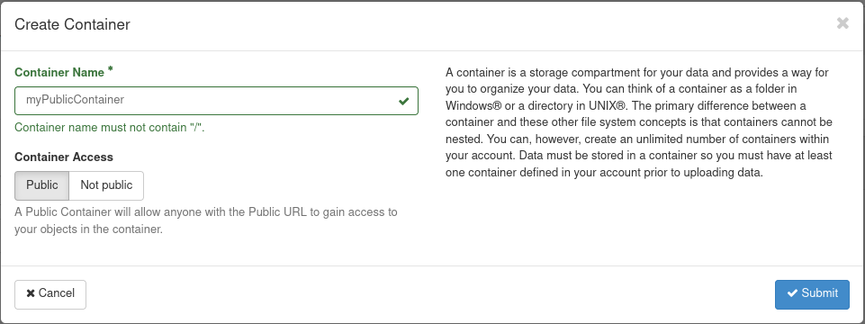
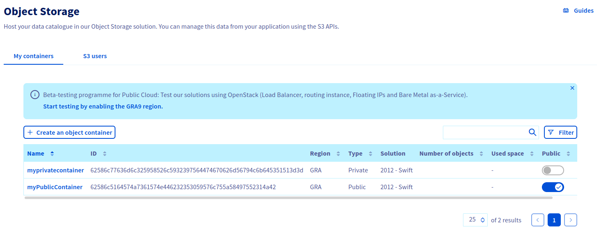

**Dernière mise à jour le 27/10/2021**

## Objectif

L'offre Object Storage pour Public Cloud propose une solution de stockage illimité avec une facturation simple et adaptée à vos besoins. Il existe de nombreux types de conteneurs d'objets :

- pour de l'hébergement statique (site web statique);
- pour de l'hébergement privé (Exemple : stockage de données personnelles);
- pour de l'hébergement public (pour stocker tout ce qui est accessible au public);
- pour du stockage à froid (archivage).

La première étape est la création d’un conteneur qui regroupera vos fichiers. 

**Ce guide explique comment le créer depuis l'espace client OVHcloud et depuis l’interface Horizon d’Openstack.**

## Prérequis

- Être connecté à votre [espace client OVHcloud](https://www.ovh.com/auth/?action=gotomanager&from=https://www.ovh.com/fr/&ovhSubsidiary=fr){.external}

Si vous utilisez Horizon :

- Avoir créé un [utilisateur OpenStack](https://docs.ovh.com/fr/public-cloud/creation-et-suppression-dun-utilisateur-openstack/).

## En pratique

### Création d'un conteneur Object Storage depuis l'espace client OVHcloud

Connectez-vous à votre [espace client](https://www.ovh.com/auth/?action=gotomanager&from=https://www.ovh.com/fr/&ovhSubsidiary=fr){.external}, accédez à la section `Public Cloud`{.action} et sélectionnez le projet Public Cloud concerné. Cliquez ensuite sur `Object Storage`{.action} dans la barre de navigation de gauche sous `Storage`.

Cliquez ensuite sur `Create an object container`{.action}.

S'il s'agit de votre premier conteneur :

Si vous avez déjà créé un/des conteneur(s) :

Sélectionnez votre solution puis cliquez sur `Next`{.action} :

Sélectionnez la région de votre conteneur, puis cliquez sur `Next`{.action} :

Sélectionnez le type de conteneur, puis cliquez sur `Next`{.action} :

Nommez votre conteneur, puis cliquez sur `Create the container`{.action} :

> [!warning]
>
> Si vous souhaitez lier votre conteneur à un nom de domaine, le nom de votre conteneur de doit pas contenir les caractères suivants : - [ . ] - [ _ ] et vous ne devez pas utiliser de majuscules.
> Pour plus d'informations, consultez notre guide « [Lier un conteneur a un nom de domaine](https://docs.ovh.com/fr/storage/pcs/link-domain/) ».
>

Votre conteneur est créé :

### Création d'un conteneur Object Storage depuis Horizon

> [!primary]
>
> Il n'est pas possible de créer un conteneur Public Cloud Archive depuis Horizon
>

Connectez-vous à votre [espace Horizon](https://horizon.cloud.ovh.net){.external} :

Développez le menu `Object Store`{.action}, cliquez sur `Containers`{.action} puis sur `+ Container`{.action}

Nommez votre conteneur.

  > [!warning]
  >
  > Si vous souhaitez lier votre conteneur à un nom de domaine, le nom de votre   conteneur de doit pas contenir les caractères suivants :
  > - [ . ]
  > - [ _ ]
  > - Et vous ne devez pas utiliser de majuscules.
  > Pour plus d'informations, consultez notre guide « [Lier un conteneur a un nom de domaine](https://docs.ovh.com/fr/storage/pcs/link-domain/) ».
  >

Sélectionnez la politique d'accès de votre conteneur puis cliquez sur `Suivant`{.action}

Votre conteneur est créé.

Vous pouvez également le voir dans votre espace client OVHcloud :

## Aller plus loin

Échangez avec notre communauté d’utilisateurs sur [https://community.ovh.com](https://community.ovh.com).
