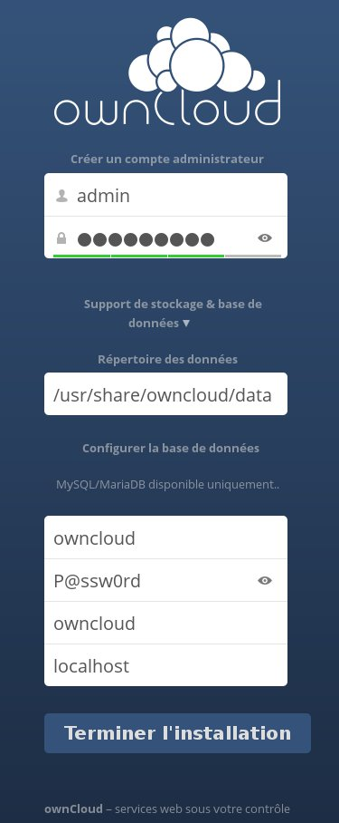
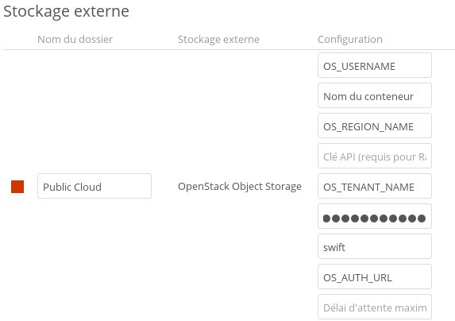

## 
[ownCloud](https://owncloud.org/) is an online storage and file management application. 
This solution offers several features, including synchronisation between multiple devices. You can also add external storage such as OpenStack Object Storage.

This guide shows you how to configure your ownCloud with object storage


## Prerequisites

- Download the OpenRC file from the OVH Control Panel or Horizon
- [Add dedicated storage space]({legacy}1790) to ownCloud


## Installation
Firstly you have to install ownCloud:


```
root@instance:~$ apt-get install owncloud
```


## Please note!
Make sure that the repository you use contains the latest version of ownCloud.
To function, OwnCloud must have a MySQL database. If you do not already have one, install it by running this command:


```
root@instance:~$ apt-get install mysql-server
```


## Configuration
To configure the database that will be used by ownCloud, log in to your MySQL server with the root password defined when the server was installed:


```
root@instance:~$ mysql -u root -p
```


At this point, you can create a new user and a database dedicated to ownCloud:


```
**** Create user *****
mysql> CREATE USER 'owncloud'@'localhost' IDENTIFIED BY 'P@ssw0rd';

***** create database *****
mysql> CREATE DATABASE `owncloud` ;

***** Grant all privileges on "ownCloud" to the "owncloud" database
mysql> GRANT ALL PRIVILEGES ON `owncloud` . * TO 'owncloud'@'localhost';
```


Log in to ownCloud on your browser by entering: http://I.P.du.serveur/owncloud :

{.thumbnail}
In this interface:

- Create an administrator account
- Enter the data directory (optional: if you just want to use the Object Storage, you can leave the default one)
- Enter your database credentials


After confirming the operation, you can access your OwnCloud interface and activate the application that allows you to add an external storage support.
To do so, click on File on the top left and select Applications:

{.thumbnail}
Then enable the "External storage support" application from the "Disabled" applications menu.

{.thumbnail}
Having done so, configure this application by clicking on your username at the top right and selecting Admin:

{.thumbnail}
In External storage menu select Add storage and OpenStack Object Storage:

{.thumbnail}
Enter details from your "OpenRC" file:

- Your Horizon username which corresponds to the  "OS_USERNAME" field in the "OpenRC" file
- The name of your container which you previously created for ownCloud
- The region that your container is in - the "OS_REGION_NAME"
- The tenant name, corresponding to the "OS_TENANT_NAME" field
- Your Horizon password
- The service name corresponding to "Swift"
- The endpoint address, corresponding to the "OS_AUTH_URL" field or "https://auth.cloud.ovh.net/v2.0"


The "API key" and the "Maximum waiting time" are optional.

## Important
The container that you have created must be entirely dedicated to ownCloud because the application will use metadata.
Once you've entered all the information and checked that it is correct, the red box in front of your folder name will turn green and will be available in the External Storage section of your homepage:

{.thumbnail}


## 
 

