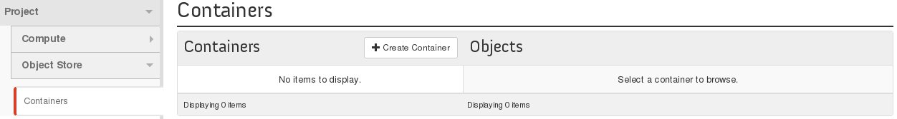
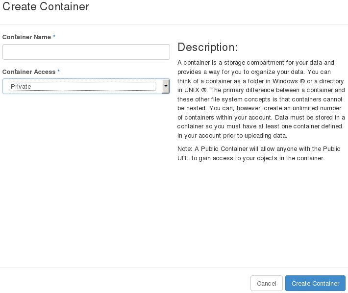
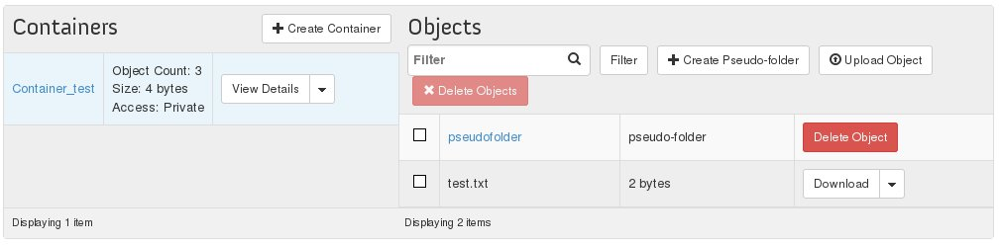

## 
The first step to using the Public Cloud storage solution is creating a container for your files. 
This guide explains how to create one from OpenStack Horizon.

## Prerequisites

- [Configure user access to Horizon]({legacy}1773)

## 

- Log in to Horizon
- Select "Object Store" on the left

{.thumbnail}

- Click on "Create Container"

A new window will open:

{.thumbnail}
From here you can:

- Name your container
- Select the type of container

|Public|Accessible to everyone|
|---|
|Public|Accessible to everyone|
|Private|Only accessible with authentication|

After this, your container will appear and new options will become available:

{.thumbnail}
You can:

- See the details of your container
- Make it public or private
- Delete it 

If you click on the name of your container you can also:

- Create a pseudo-folder

In fact, the data placed in the Object Storage is not stored in a traditional hierarchical system (Folder > Subfolder and so on...)
Data is all stored at the same level, which makes files quicker to access.
Pseudo-folders are organised by a common prefix on the object's name which means that you can organise your data in a different way.

- Upload your files
- Delete your files and pseudo-folders
- Download your files
- Copy your files
- See file details

## 
 

