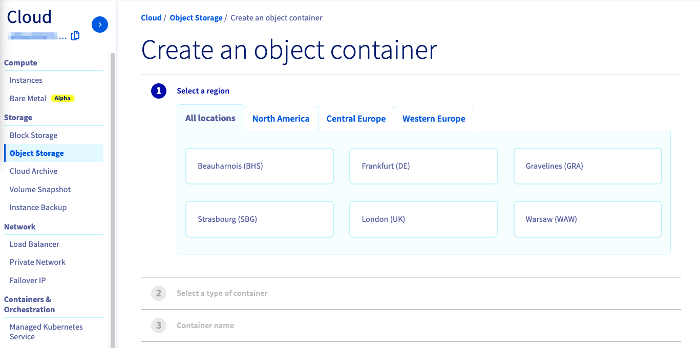
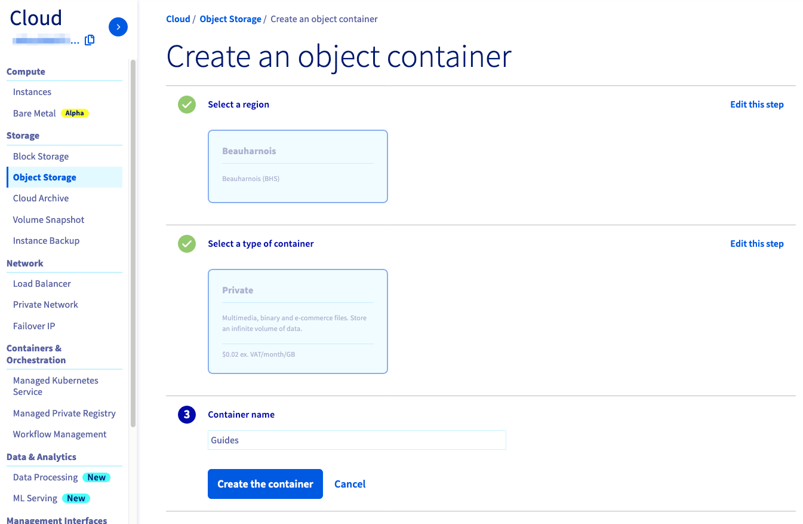
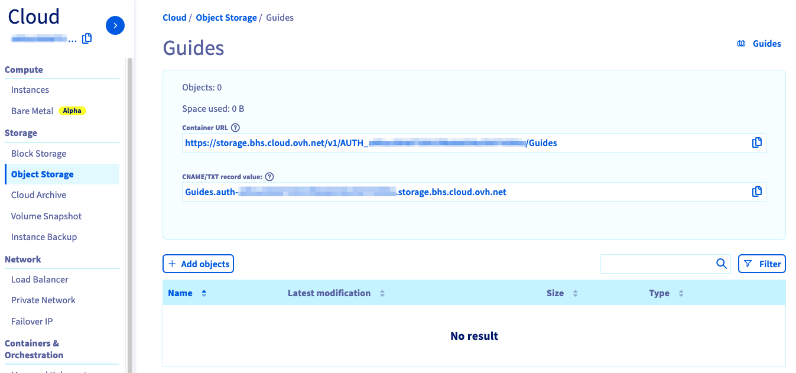
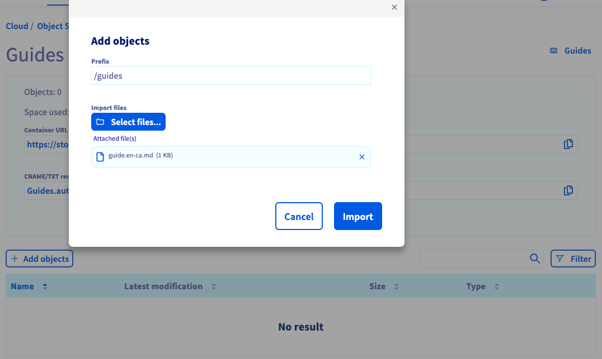

## 
The first step to using the Public Cloud storage solution is creating a container for your files. This guide explains how to create one from the OVHcloud control panel.

## Prerequisites

- A Public Cloud project

## 

- Log in to the [OVHcloud control panel](https://ca.ovh.com/manager/public-cloud/#/)
- Select "Object Storage" on the left

{.thumbnail}

- Click on "Create an object Container"

A new window will open:

{.thumbnail}

From here you can:

- The region of the container
- The type of container 
- The name your container
- Select the type of container

{.thumbnail}

After this, your container will appear and new options will become available:

{.thumbnail}
You can:

- See the details of your container
- Delete and add contents 

{.thumbnail}

## 
 

