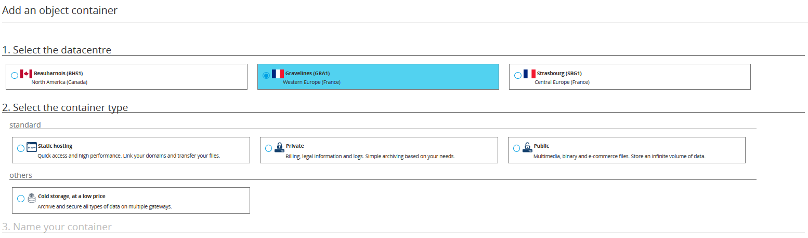

## Preamble
Public Cloud is an unlimited storage solution with simple billing adapted to your needs. There are lots of types of object containers :

- For static hosting (static website)
- For private hosting (Example : storage of personal data)
- For public hosting (for storing anything that is publicly accessible)
- For cold storage (archiving)

## Add a container
- Login to the [Manager](https://www.ovh.com/manager/cloud){.external}
- Click on your Public Cloud project
- Click Storage
- Click Create a Container
- Select the datacentre

You can then choose the container type you need.

{.thumbnail}

### For static hosting
Do you want to host a static website ?

- Choose "static hoting"
- Name your container
- Click Create the Container
- The static storage will now appear in the list of storage

> [!success]
>
> OVH has set up standard pages, you can delete them before putting your html elements in
> 

### For private storage
Do you want to host confidential data ?

- Choose "Private"
- Name the container
- Click Create the Container
- The static storage will now appear in the list of storage

### For public storage
Do you want to host publicly accessible data  ?

- Choose "Public"
- Name the container
- Click Create the container
- The public storage will now appear in the list of storage

### For cold storage (Public Cloud Archive)
Do you want to archive your date ?

- Choose "Cold Storage"
- Name the container
- Click Create the container
- The cold storage will now appear in the list of storage

For more information about cold storage, [click here.](https://www.ovh.com/fr/public-cloud/storage/cloud-archive/){.external}

### Add files
- Click on the container name
- To add files click Add objects

> [!success]
>
> In the Prefix field enter the file location :
> - 
> The / folder corresponds to the root
> - 
> If you want to upload files to the mysite folder at the root, you have to use the /mysite prefix.
> 
> 

- Click Import files
- Select the files to import, then confirm
- The files will be uploaded