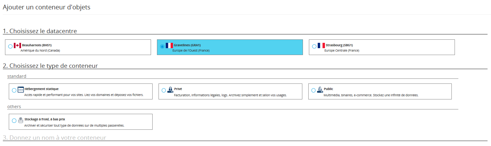

## Preambule
Le Public Cloud vous propose une solution de stockage sans limite avec une facturation adaptée à vos besoins. On peut distinguer plusieurs types de conteneur pour vos objets :

- Pour de l'hébergement statique (site web statique).
- Pour du stockage privé (par exemple, stockage de données personnelles).
- Pour du stockage public (pour tout besoin de stockage accessible publiquement).
- Pour du stockage à froid (Archivage).

## Ajout d'un conteneur
- Connectez-vous à [l'espace client cloud](https://www.ovh.com/manager/cloud){.external}
- Cliquez sur votre projet Public Cloud
- Cliquez sur "Stockage"
- Cliquez sur "Créer un conteneur"
- Choisissez le datacentre

Vous pouvez ensuite choisir le type de conteneur selon vos besoins.

{.thumbnail}

### Pour de l'hebergement statique
Vous souhaitez héberger un site statique, une vitrine ?

- Sélectionnez "hébergement statique"
- Nommez le conteneur
- Cliquez sur "Créer le conteneur"
- Le stockage statique apparaît alors dans la liste des stockages

> [!success]
>
> OVH a mis en place des pages standards sur l'hébergement, vous pouvez les en retirer avant d'y déposer vos éléments html
> 

### Pour du stockage prive
Vous souhaitez héberger des données confidentielles ?

- Sélectionnez "Privé"
- Nommez le conteneur
- Cliquez sur "Créer le conteneur"
- Le stockage privé apparaît alors dans la liste des stockages

### Pour du stockage public
Vous souhaitez héberger des données accessibles publiquement ?

- Sélectionnez "Public"
- Nommez le conteneur
- Cliquez sur "Créer le conteneur"
- Le stockage publique apparaît alors dans la liste des stockages

### Pour du stockage a froid (Public Cloud Archive)
Vous souhaitez archiver des données à long terme ?

- Sélectionnez "Stockage à froid"
- Nommez le conteneur
- Cliquez sur "Créer le conteneur"
- Le stockage à froid apparaît alors dans la liste des stockages

Pour plus d’informations sur le stockage à froid, [cliquez ici.](https://www.ovh.com/fr/public-cloud/storage/cloud-archive/){.external}

### Ajouter des fichiers
- Cliquez sur le nom du conteneur
- Pour ajouter des fichiers, cliquez sur "Ajouter des objets"

> [!success]
>
> Dans le champ  Préfixe  indiquez le chemin sous lequel déposer les fichiers :
> - 
> Le dossier / correspond à la racine de l'hébergement
> - 
> Si vous souhaitez déposer les fichiers dans le dossier mondossier situé à la racine, vous indiquerez le préfixe /mondossier
> 
> 

- Cliquez sur Importer des fichiers
- Sélectionnez les fichiers à importer, puis validez
- L'upload des fichiers s'effectue