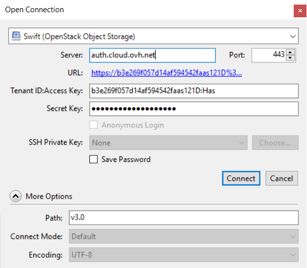

**Última actualización: 08/01/2020**

## 
El Object Storage es una solución de almacenamiento qui se gestiona principalmente mediante la API de OpenStack. 

Es posible que usted no esté familiarizado con esta forma de gestionar un espacio de almacenamiento a través de líneas de comandos. Por ese motivo, existen soluciones gráficas que utilizan de manera invisible las API de OpenStack por usted.

Cyberduck es una de esas soluciones, y es fácil de configurar. En internet podrá encontrar otras interfaces disponibles cuya configuración se realiza de manera similar a la que vamos a mostrar.

Esta guía explica cómo configurar Cyberduck para gestionar el Object Storage desde una interfaz gráfica basada en las API de OpenStack.

## Requisitos
Para seguir todos los pasos de esta guía es necesario disponer de:

- un usuario de Horizon configurado ([cómo crear un acceso a Horizon](../acceder-a-la-console-dune-instance-dans-horizon){.ref};
- el identificador de su proyecto y su usuario, que puede obtener en el menú [«Acceso y seguridad»](../acces-et-securite-dans-horizon){.ref} de Horizon, descargando el archivo OpenRC.

## 
Descargue [Cyberduck](https://cyberduck.io/) en su equipo.

Conéctese a una cuenta de tipo «Swift (OpenStack Object Storage)».

{.thumbnail}
Cumplimente el formulario:

- Servidor: El servidor de autenticación auth.cloud.ovh.net
- Tenant ID:Access Key: ID_del_proyecto:ID_del_usuario_Horizon
- Secret Key: La contraseña de su usuario de Horizon

Despligue las opciones haciendo clic en «More Options»:

- Carpeta: v3.0

Haga clic en el botón «Conectar».

{.thumbnail}