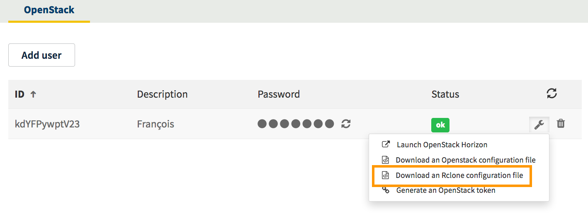

**Last updated 19th December 2017**

## Objective

OVH Object Storage can be synchronised using Rclone.

**This guide explains how to sync object storage via your OVH Control Panel.**

Rclone is an external synchronisation program - you can find further details for its use in its [official documentation](https://Rclone.org/).


## Requirements

- You need to have created an *Object Storage* container (you can create one from the Control Panel or from [Horizon](https://docs.ovh.com/gb/en/storage/create_an_object_container/){.external})
- You need to have created an OpenStack user account


## Instructions

Once you have created your container and OpenStack account, you only need to do two things:

- Retrieve the Rclone config file:

Once your OpenStack user account has been created, you can retrieve the config file you need for Rclone from your Control Panel.

To do this, when you are on the OpenStack user page in your Control Panel, click the wrench symbol on the right, then on `Download an Rclone config file`{.external}.

{.thumbnail}


- Configure Rclone:

Once the file has been downloaded, you can launch the following command to add your new storage space:

```sh 
Rclone config
```

You will be asked to insert the config data that appears in your file.

> [!primary]
>
> You can also copy-paste the contents of your file in the Rclone config area *.config/Rclone/Rclone.conf*).
> 

Once the configuration is complete, you can test it by listing your containers, for example:

```sh
Rclone lsd BackupStorage
```

(Where *BackupStorage* is the name given to your storage space.)

You can find more detailed instructions on how to synchronise your object storage and Rclone on the official Rclone website: [Official Rclone documentation](https://Rclone.org/swift/){.external}.


## Go further

Join our user community at <https://community.ovh.com/en/>.