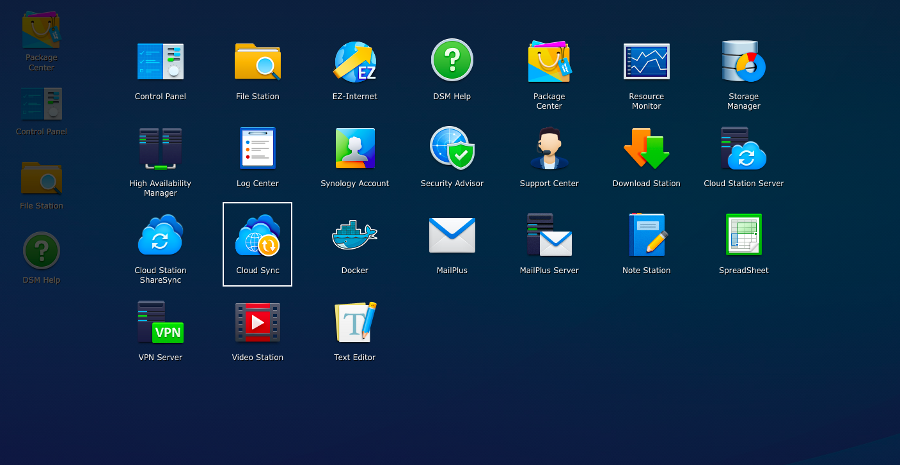

## Preamble
[Synology DiskStation Manager 6.0](https://www.synology.com/en-global/dsm/6.0beta){.external} provides a tool for synchronisation with different cloud solutions.

This is compatible with OVH Public Cloud Object Storage and lets you back up your data and access it from any location. This guide explains how to configure DiskStation Manager 6.0 so that you can synchronise your NAS files and your Object Storage.

### Prerequisites
- [Add storage space](../guide.en-gb.md){.ref}
- [Configure user access to Horizon](https://www.ovh.com/fr/publiccloud/guides/g1773.creer_un_acces_a_horizon){.external}

## DiskStation Manager 6.0 configuration

### Retrieve your OpenStack credentials
To sync your NAS Synology, you need your OpenStack credentials.

You can retrieve these by downloading the OpenRC file in OpenStack Horizon.

### Configuring the synchronisation point with Cloud Sync
Once you have your credentials, you can log in to your NAS and take the following steps :

- Launch the Cloud Sync application :

{.thumbnail}

- Select OpenStack Swift as a Cloud Provider

{.thumbnail}

- Enter your OpenStack credentials :

{.thumbnail}

You can find this information in the OpenRC file which you downloaded in the previous step.

- Configure the folder to synchronise

{.thumbnail}

> [!alert]
>
> This guide is based on DiskStation Manager 6.0 Beta, the configuration process may change.
> 