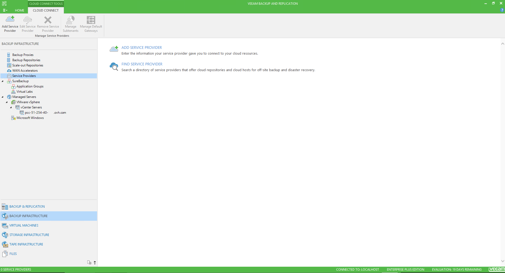
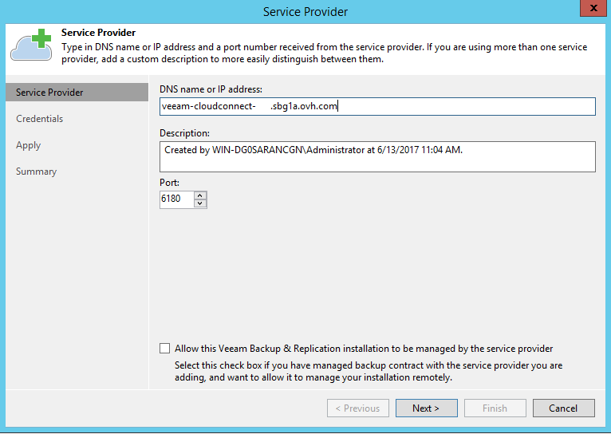
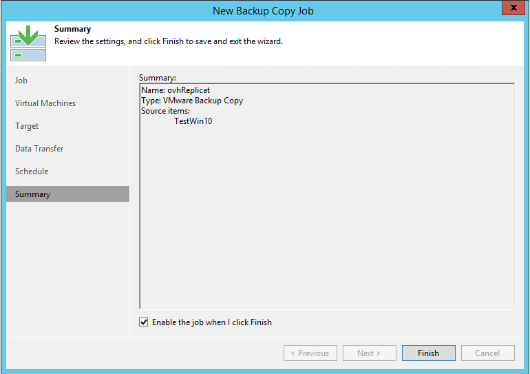
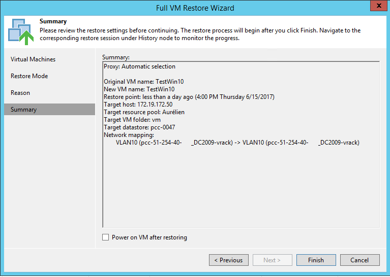
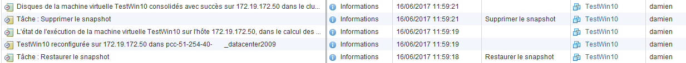

**Dernière mise à jour le 22/07/2020**

## Objectif

Veeam Cloud Connect est une solution proposée par l'éditeur Veeam. Elle permet de disposer d'une sauvegarde hors site et ce, sans avoir à gérer une infrastructure sur un second site. L'idée de Veeam Cloud Connect est de fournir un moyen facile et sécurisé de réaliser des backups et de restaurer vos données à partir du cloud.

**Découvrez comment configurer votre offre Veeam Cloud Connect**

## Prérequis

- Avoir souscrit à l'offre [Veeam Cloud Connect](https://www.ovh.com/fr/storage-solutions/veeam-cloud-connect/){.external}.

## En pratique

### Produits compatibles

Le principal intérêt de Veeam Cloud Connect, en dehors de sa simplicité, est que cette solution fonctionne peu importe où est hébergée votre infrastructure d'exploitation. Celle-ci peut être hébergée chez OVHcloud (un Hosted Private Cloud, ou encore un serveur dédié sur lequel vous réalisez vous-même de la virtualisation avec un hyperviseur VMware ou Microsoft), chez un autre fournisseur, ou encore dans vos locaux.

Liste des produits OVHcloud compatibles :

- [Hosted Private Cloud](https://www.ovhcloud.com/fr/enterprise/products/hosted-private-cloud/){.external}
- Machines virtuelles hébergées sur nos [Serveurs dédiés](https://www.ovh.com/fr/serveurs_dedies/){.external} et administrées via Microsoft Hyper-V ou VMware ESXi.

### Commande de l'offre

L'offre peut être commandée depuis le site [OVH.com](https://www.ovh.com/fr/storage-solutions/veeam-cloud-connect/){.external}

Une fois le paiement effectué, vous recevrez un mail avec :

- L'adresse IP/nom de votre service.
- L'utilisateur et le mot de passe.

### Espace client OVHcloud

Dans votre espace client OVHcloud, rendez-vous dans la partie `Server` puis `Plateformes et Services`.

{.thumbnail}

Vous arriverez ensuite sur cette page reprenant la configuration de votre offre, votre abonnement, le lieu de stockage.

{.thumbnail}

Dans le second onglet `Espace de stockage`, vous retrouverez le nom de votre espace de stockage, son utilisation, le quota, et le datacentre de réplication.

{.thumbnail}

Au bout de cette ligne, vous pouvez apercevoir un bouton.

Celui-ci sert à augmenter ou diminuer le quota de stockage.

{.thumbnail}

Lorsque vous avez modifié la valeur, ce message apparaîtra :

{.thumbnail}

### Installation

Afin de mettre en place votre Veeam Cloud Connect, vous devez au préalable avoir votre propre serveur de sauvegarde Veeam.

La mise en place du Veeam Cloud Connect se fait dans la même interface, la console Veeam Backup & Replication, téléchargeable sur le site de [Veeam](https://www.veeam.com/){.external}.

> [!success]
>
> Vous pouvez retrouver l'installation de la console sur cette page.
> 

Dans un premier temps, ajoutez le service dans votre console, en cliquant sur "ADD SERVICE PROVIDER"

{.thumbnail}

Renseignez l'IP/nom de votre offre, qui vous a été transmis par e-mail.

{.thumbnail}

Ajoutez l'utilsateur et le mot de passe, puis appliquez pour valider.

{.thumbnail}

Le résumé des resssources disponibles sur cette offre apparaîtra.

{.thumbnail}

Et un dernier récapitulatif sera présent.

{.thumbnail}

En cliquant sur `terminer`{.action}, vous retrouvez votre service sur la console.

{.thumbnail}

### Configuration

Afin de réaliser une réplication d'une de vos sauvegardes, rendez-vous dans l'onglet `Backup & Replication` situé en bas à gauche de la console.

Vous retrouverez vos tâches de sauvegarde et vous devrez cliquer sur `Backup Copy`{.action}, situé sur la barre d'action en haut de la console, pour commencer la configuration.

{.thumbnail}

Dans un premier temps, donnez un nom à cette nouvelle tâche. Vous pouvez également choisir la fréquence de cette dernière.

{.thumbnail}

En cliquant sur le bouton `Ajouter`{.action} vous aurez trois choix, détaillés sur [cette page](https://helpcenter.veeam.com/docs/backup/vsphere/backup_copy_vms.html?ver=95){.external}.

Ici, nous allons répliquer une sauvegarde.

{.thumbnail}

Choisissez ensuite le répértoire de stockage vu précédemment.

{.thumbnail}

Afin de transférer votre sauvegarde de votre serveur à notre infrastructure, à travers la solution Veaam Cloud Connect, vous pouvez soit laisser la communication en direct, soit utiliser le WAN accelerator.

Voici une page expliquant le fonctionnement du [WAN accelerator](https://helpcenter.veeam.com/docs/backup/vsphere/wan_hiw.html?ver=95){.external}.

{.thumbnail}

Vous pourrez également programmer les périodes durant lesquelles cette tâche s'éxécutera.

{.thumbnail}

Un résumé vous sera proposé, et il vous restera à cliquer sur `Terminer`{.action} pour finaliser l'ajout de cette tâche.

{.thumbnail}

La case démarrant la tâche une fois validée étant resté cochée, la tâche est en cours.

Vous retrouverez la page du début avec votre nouvelle tâche.

{.thumbnail}

### Restauration

Afin de restaurer votre backup, il vous suffira de faire un clic droit sur la tâche.

Vous pourrez choisir de restaurer la machine virtuelle entière, ou certains fichiers.

{.thumbnail}

Choisissez la VM et la sauvegarde à restaurer.

{.thumbnail}

Choisissez ensuite le lieu de restauration (inital ou différent).

{.thumbnail}

Vous pourrez indiquer une raison si vous le souhaitez, et un résumé de l'opération s'affichera.

{.thumbnail}

Une fenêtre s'ouvrira dans votre console Veeam, indiquant les tâches en cours.

Vous constaterez, dans votre vSphere, différentes opérations lors de la restauration.

{.thumbnail}

## Aller plus loin

Échangez avec notre communauté d’utilisateurs sur [https://community.ovh.com/](https://community.ovh.com/){.external}.
