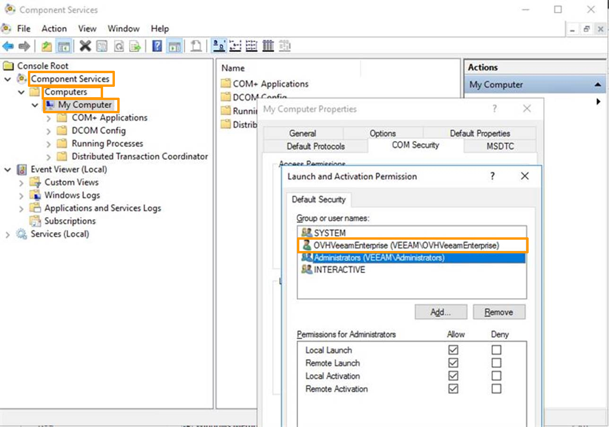

**Letzte Aktualisierung am 22.09.2021**

## Einleitung

Veeam Backup & Replication ist eine Software für Datensicherung. Sie bietet zahlreiche Möglichkeiten, um Daten zu sichern, zu replizieren und wiederherzustellen.

**In dieser Anleitung erfahren Sie, wie Sie einen Veeam Backup & Replication Server installieren und diesen auf dem Veeam Enterprise Lizenz-Server von OVH registrieren.**


## Voraussetzungen

* Sie besitzen ein Veeam Enterprise Angebot.
* Sie haben einen Windows Server 2012 oder 2016.

> [!primary]
>
> Unsere Veeam Angebote sind ausschließlich mit der neuesten von Veeam angebotenen Version (10) kompatibel. Bitte beachten Sie diesen Punkt bei der Veeam-Konfiguration Ihrer Dienstleistungen.
>

## Beschreibung

### Veeam Backup & Replication installieren

Laden Sie **Veeam Backup & Replication** über die Website von Veeam herunter. Sollten Sie bei Veeam noch nicht als Benutzer registriert sein, erstellen Sie zunächst einen kostenlosen Kunden-Account.

Die heruntergeladene Datei ist ein Festplatten-Image im ISO-Format. Nachdem Sie die Datei auf Ihren Server transferiert haben, wählen Sie das CD-Laufwerk des Servers und dann das Image aus.

Auf dem Server kann die Installation nun über den Installationsassistenten gestartet werden. Klicken Sie auf `Veeam Backup & Replication Install`{.action}.

{.thumbnail}

Wenn Sie den Lizenzvertrag gelesen haben, akzeptieren Sie diesen mit `Next`{.action}.

{.thumbnail}

Überspringen Sie die Auswahl der Lizenzdatei mit `Next`{.action}.

{.thumbnail}

Ändern Sie bei der Auswahl der Komponenten nichts. Bei Bedarf können Sie jedoch den Zielpfad für die Installationsdateien anpassen. Bestätigen Sie anschließend mit `Next`{.action}.

{.thumbnail}

Der Installationsassistent überprüft nun Ihre Systemvoraussetzungen. Bei einer reinen Windows-Installation werden einige Komponenten noch fehlen. Der Installationsassistent wird diese automatisch herunterladen und installieren. Bestätigen Sie anschließend mit `Next`{.action}.

{.thumbnail}

Warten Sie die Installation der fehlenden Komponenten ab.

{.thumbnail}

Bestätigen Sie nach diesem Schritt die Installation von **Veeam Backup & Replication** mit `Next`{.action}.

{.thumbnail}

Im Schritt zur Anpassung der Installation bestätigen Sie diese mit einem Klick auf `Install`{.action}.

{.thumbnail}

Warten Sie, während Veeam Backup & Replication installiert wird.

{.thumbnail}

Klicken Sie nach erfolgreicher Installation auf `Finish`{.action}, um den Assistenten zu schließen.

{.thumbnail}

Der Installationsassistent wird Sie nach einem Windows-Neustart fragen, um den Vorgang abzuschließen. Wählen Sie bitte `Yes`{.action}.

{.thumbnail}

### Veeam Enterprise Service-Account erstellen

#### Service-Account erstellen

Generieren Sie zunächst ein **komplexes** Passwort.

Erstellen Sie dann den Service-Account, indem Sie als Administrator folgende Befehle eingeben:

```powershell
New-LocalUser "OVHVeeamEnterprise" -Password (ConvertTo-SecureString -AsPlainText "P@ssword01" -Force) -Description "OVH Service Account for Veeam Enterprise" -PasswordNeverExpires:$true -UserMayNotChangePassword:$true -AccountNeverExpires:$true
```

Beachten Sie, dass der Name des Accounts und das Passwort hier nur ein Beispiel sind. Ersetzen Sie beide Angaben mit Ihren eigenen Daten.

 * Account-Name: OVHVeeamEnterprise
 * Passwort: P@ssword01

#### Berechtigungen für den Service-Account festlegen

Starten Sie die Veeam-Konsole.

{.thumbnail}

Überprüfen Sie in der rechten unteren Ecke, dass Sie sich im **Free Edition** Modus befinden.

{.thumbnail}

Klicken Sie im Menü auf `Users and Roles`{.action}.

{.thumbnail}

Im Fenster `Security`{.action}, klicken Sie auf `Add...`{.action}.

{.thumbnail}

Wählen Sie dann im Fenster `Add User`{.action} den soeben erstellten Service-Account aus. Wählen Sie die Rolle **Veeam Backup Administrator** aus und bestätigen Sie mit `OK`{.action}.

{.thumbnail}

Im Fenster **Security** können Sie nun überprüfen, ob Ihr Account korrekt definiert wurde.

{.thumbnail}

#### Durchführungs- und Aktivierungsgenehmigungen

Der Benutzer von OVHVeeamEnterprise ist ausschließlich lokal verfügbar. Um die Fernverbindung zu aktivieren, müssen die Berechtigungen in der grafischen Benutzerschnittstelle von Windows hinzugefügt werden.

Über das grafische Benutzerinterface:

1. Geben Sie in Ihrem Windows-Suchbalken `Component Services`{.action} und starten Sie den Dienst.
2. Klicken Sie im Menü links und im Ordnermenü auf `Component Services`{.action}, dann `Computers`{.action} und `My Computer`{.action}.
3. Klicken Sie rechts unter dem Tab `Actions`{.action} auf `More Actions`{.action} und dann auf `Properties`{.action}.
4. Gehen Sie `COM Security`{.action} Sicherheit und klicken Sie unter `Launch and Activation Permissions`{.action} auf `Edit Limits`{.action}.
5. Klicken Sie auf den Benutzer `OVHVeeamEnterprise`{.action} und aktivieren Sie alle Berechtigungen.

{.thumbnail}

6. Klicken Sie auf `OK`{.action}, um die Änderungen zu bestätigen, und auf `Apply`{.action}, um die Änderungen zu validieren.

Ihr OVHVeeamEnterprise Benutzer ist jetzt lokal und von Fernzugriff verfügbar.

### Veeam Backup Server registrieren

## Mit dem OVH Kundencenter

Gehen Sie im Kundencenter in den Bereich „Server“ (früher „Cloud“) und wählen Sie unter `Plattformen und Dienstleistungen`{.action} Ihren **backupserverenterprise**.

{.thumbnail}

Wählen Sie auf der Hauptseite des Servers `Enable the license`{.action} aus.

{.thumbnail}

Geben Sie im daraufhin geöffneten Fenster folgende Informationen ein:

* die öffentliche IP-Adresse, über die mit Ihrem **Veeam Backup & Replication** Server kommuniziert werden kann
* den Port Ihres **Veeam Backup & Replication** Servers (normalerweise **9392/TCP**)
* den Login des zuvor erstellten Veeam-Service-Accounts
* das zugehörige Passwort

Bestätigen Sie anschließend mit `OK`{.action}.

Nach der Aktivierung finden Sie die Hauptinformationen auf der Seite des Dienstes.

{.thumbnail}

## Mit der OVH API

Ermitteln Sie zunächst Ihren serviceName:

> [!api]
>
> @api {GET} /veeam/veeamEnterprise
>

Nehmen Sie dann die Registrierung vor:

> [!api]
>
> @api {POST} /veeam/veeamEnterprise/{serviceName}/register
>

Sie benötigen folgende Informationen:

* die öffentliche IP-Adresse, über die mit Ihrem **Veeam Backup & Replication** Server kommuniziert werden kann
* den Port Ihres Veeam Backups (normalerweise **9392/TCP**)
* den Login des zuvor erstellten Veeam-Service-Accounts
* das Passwort des Service-Accounts

Die öffentliche IP-Adresse, die von Veeam Enterprise zur Kommunikation mit Ihrem **Veeam Backup & Replication** Server verwendet wird, erhalten Sie mit folgendem Befehl:

> [!api]
>
> @api {GET} /veeam/veeamEnterprise/{serviceName}
>

### Registrierung überprüfen

Starten Sie die Veeam-Konsole.

{.thumbnail}

Klicken Sie links im Menü auf `License`{.action}.

{.thumbnail}

Überprüfen Sie, dass es sich bei den Angaben um Ihre OVH Lizenz handelt.

{.thumbnail}

## Weiterführende Informationen

Für den Austausch mit unserer User Community gehen Sie auf <https://community.ovh.com/en/>.