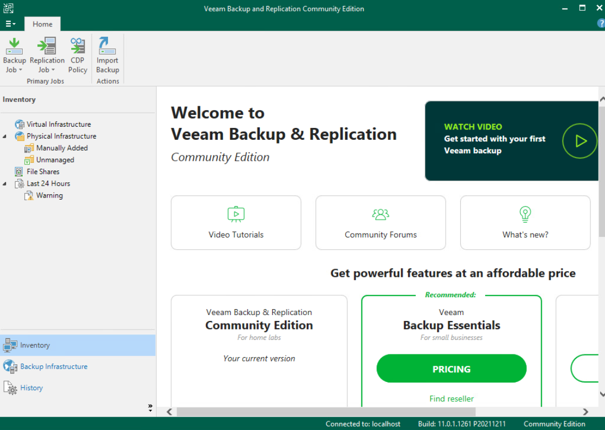
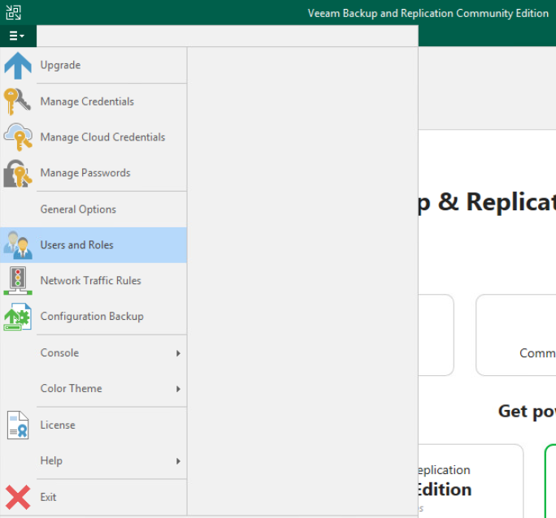
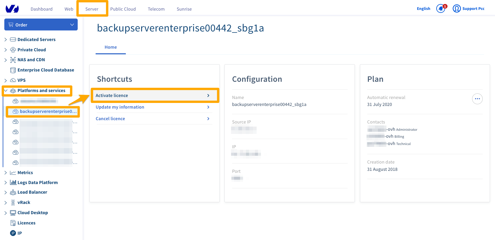
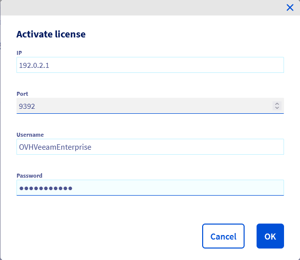
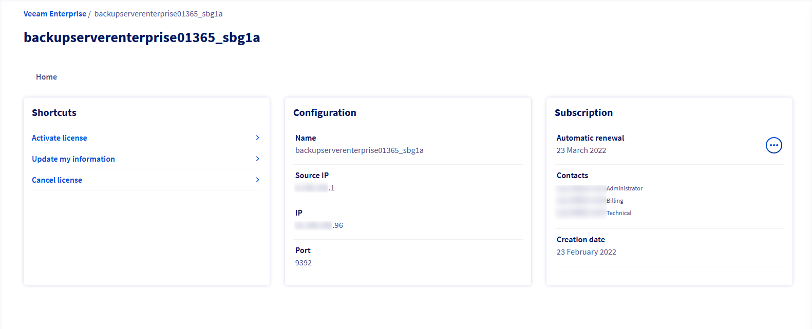

**Last updated 9th July 2020**

## Objective

Veeam Backup & Replication is a data protection software. It offers its users a wide range of options for backing up, replicating and restoring their data.

**Find out how to set up a Veeam Backup & Replication server, then register it with an OVHcloud Veeam Enterprise licence server.**


## Requirements

- a Veeam Enterprise solution
- Windows Server 2012 or newer

## Instructions

### Setting up Veeam Backup & Replication

Download the **Veeam Backup & Replication** solution from the official [Veeam website](https://www.veeam.com). You will need to create an account if you do not have one already (account setup is free).

The file is in the *ISO* disk image format. Once you have transferred it onto your server, select the server’s CD drive, then open the image.

You can then launch the installation wizard on the server. Select `Veeam Backup & Replication (Install)`{.action}.

{.thumbnail}

After you have read the licence agreement, accept the terms and click `Next`{.action}.

{.thumbnail}

In this step you can specify a licence file. Click `Next`{.action}.

{.thumbnail}

In the step where you select components to install, leave everything unchanged. However, depending on your requirements, you can change the destination path. Confirm by clicking `Next`{.action}.

{.thumbnail}

The installation wizard will then carry out a requirement check. If you are working from a clean Windows installation, some components will be missing, but the installation wizard can download and install them automatically. Confirm by clicking `Next`{.action}.

{.thumbnail}

If missing components have to be installed, wait for the wizard to finish.

{.thumbnail}

Once the system check is successful, click `Next`{.action} to view the final configuration.

{.thumbnail}

Confirm the setup configuration by clicking `Install`{.action}.

{.thumbnail}

Next, wait for the installation to complete.

{.thumbnail}

Once the installation process is complete, exit the installation wizard by clicking `Finish`{.action}.

{.thumbnail}

The installation wizard will prompt you to reboot Windows in order to finalise the changes. Click `Yes`{.action} to restart immediately.

{.thumbnail}

### Creating a Veeam Enterprise service account

#### Step 1: Launch a service account

First you will need to generate a **complex** password.

Next, create a service account by entering this command as administrator:

```sh
New-LocalUser "OVHVeeamEnterprise" -Password (ConvertTo-SecureString -AsPlainText "P@ssword01" -Force) -Description "OVHcloud Service Account for Veeam Enterprise" -PasswordNeverExpires:$true -UserMayNotChangePassword:$true -AccountNeverExpires:$true
```

Please note that the account name and password used here are for demonstration purposes, and must be replaced with your own credentials:

- Account name: OVHVeeamEnterprise
- Password: P@ssword01

#### Step 2: Define the service account authorisations

Launch the Veeam console.

{.thumbnail}

Verify that it is in **Free Edition** mode, in the bottom right-hand corner.

{.thumbnail}

Open the main menu, and click `Users and Roles`{.action}.

{.thumbnail}

In the `Security`{.action} window, click on `Add...`{.action}.

{.thumbnail}

Then, in the "Add User" window, enter the service account name you have created. Select the **Veeam Backup Administrator** role and confirm by clicking `OK`{.action}.

{.thumbnail}

If you go back to the "Security" window, you can check that the account has been properly added.

{.thumbnail}

#### Step 3: Register the Veeam Backup & Replication server

##### **Using the OVHcloud Control Panel**

In your OVHcloud Control Panel, open the `Server` section, then select your service labelled **backupserverenterprise** under `Platforms and services`{.action} in the left-hand navigation bar. On this page, click on `Activate licence`{.action} in the `Shortcuts` box.

{.thumbnail}

In the new window, enter the following information:

- The public IP address through which your **Veeam Backup & Replication** server can be reached.
- The port of your **Veeam Backup & Replication** server (usually **9392/TCP**).
- The login credentials you have created previously (user name and password).

Validate by clicking `OK`{.action}.

{.thumbnail}

Once the activation is complete, you will find the main information on the service page.

{.thumbnail}


##### **Using the OVHcloud API**

First, retrieve your serviceName:

> [!api]
>
> @api {GET} /veeam/veeamEnterprise
>

Then register it:

> [!api]
>
> @api {POST} /veeam/veeamEnterprise/{serviceName}/register
>

You will need the following information:

- The public IP address through which your **Veeam Backup & Replication** server can be reached.
- The port of your **Veeam Backup & Replication** server (usually **9392/TCP**).
- The login credentials you have created previously (user name and password).

You can obtain the public IP address used by Veeam Enterprise to contact your **Veeam Backup & Replication** server via:

> [!api]
>
> @api {GET} /veeam/veeamEnterprise/{serviceName}
>

#### Step 4: Verify the registration

Launch the Veeam console.

{.thumbnail}

Open the main menu and click `License`{.action}.

{.thumbnail}

Check that the information displayed here matches your OVHcloud licence.

{.thumbnail}

## Go further

Join our community of users on <https://community.ovh.com/en/>.
