**Last updated 8th November 2018**

## Objective

Veeam Backup & Replication is a form of data protection software. It offers its users a wide range of options for backing up, replicating and restoring data.

**Find out how to set up a Veeam Backup & Replication server, then register it with an OVH Veeam Enterprise licence server.**


## Requirements

* a Veeam Enterprise solution
* a Windows 2012 or 2016 server

## Instructions

### Set up Veeam Backup & Replication.

Download the **Veeam Backup & Replication** solution from the Veeam website. If you do not have an account, you will need to set one up (account setup is free).

The file will appear in ISO disk image format. Once you have transferred it onto your server, select the server’s CD reader, then select the image.

In the server, you can then launch the installation wizard. Select `Veeam Backup & Replication (Install)`{.action}.

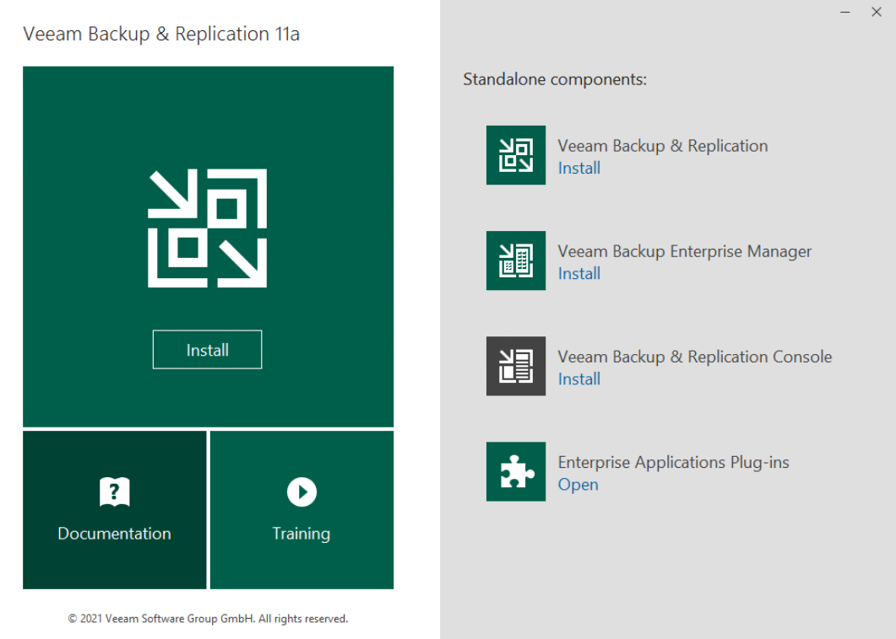{.thumbnail}

After you have read the licence agreement, accept the terms and click `Next`{.action}.

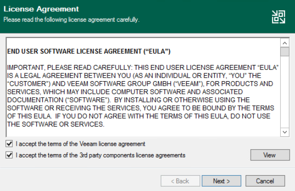{.thumbnail}

Click `Next`{.action} to proceed to the next stage, where you can save the licence file.

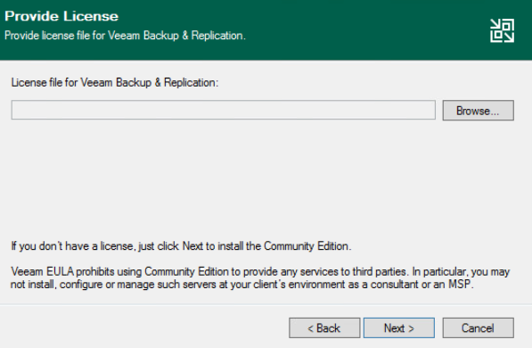{.thumbnail}

In the step where you select components to install, leave everything unchanged. However, depending on your requirements, you can change the destination path. Confirm by clicking `Next`{.action}.

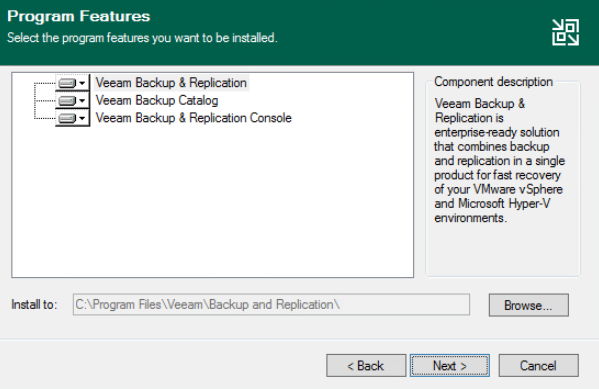{.thumbnail}

The installation wizard will then carry out a requirement check. If you are working from a clean Windows installation, some components will be missing, but the installation wizard will download and install them automatically. Confirm by clicking `Next`{.action}.

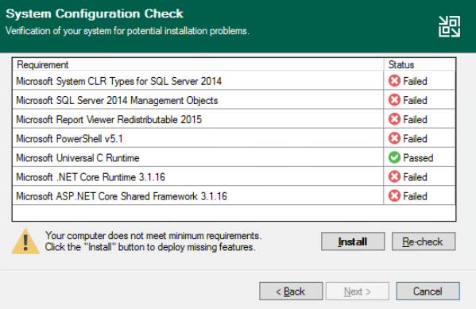{.thumbnail}

Next, wait for the missing components to be installed.

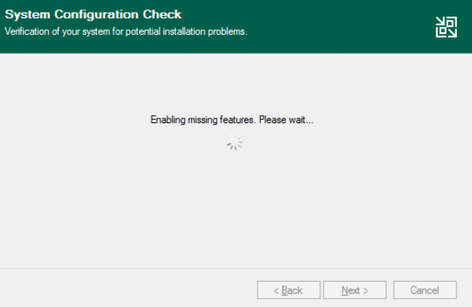{.thumbnail}

Once the installations are complete, confirm the **Veeam Backup & Replication** setup by clicking `Next`{.action}.

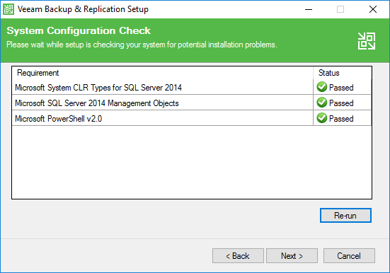{.thumbnail}

During the customisation stage of the setup, confirm the operation by clicking `Install`{.action}.

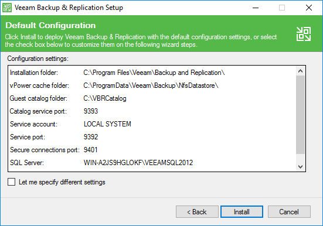{.thumbnail}

Next, wait for the installation to complete.

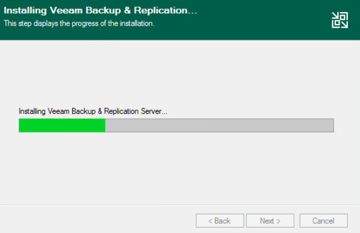{.thumbnail}

Once it is complete, exit the installation wizard by clicking `Finish`{.action}.

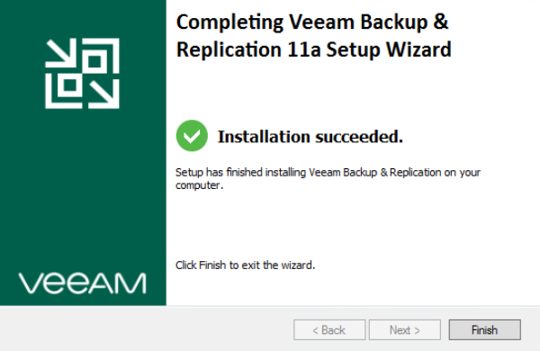{.thumbnail}

The installation wizard will prompt you to reboot Windows in order to finalise the operation. At this point, click `Yes`{.action}.

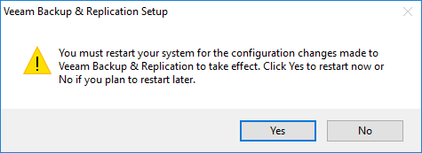{.thumbnail}

### Create a Veeam Enterprise service account.

#### Launch a service account.

You will need to generate a **complex** password.

Next, create a service account, entering these lines of command as an admin:

```powershell
New-LocalUser "OVHVeeamEnterprise" -Password (ConvertTo-SecureString -AsPlainText "P@ssword01" -Force) -Description "OVH Service Account for Veeam Enterprise" -PasswordNeverExpires:$true -UserMayNotChangePassword:$true -AccountNeverExpires:$true
```

Please note that the account name and password shown here are examples, and must be replaced with your own details:

 * Account name: OVHVeeamEnterprise
 * Password: P@ssword01

#### Define the service account authorisations.

Launch the Veeam console.

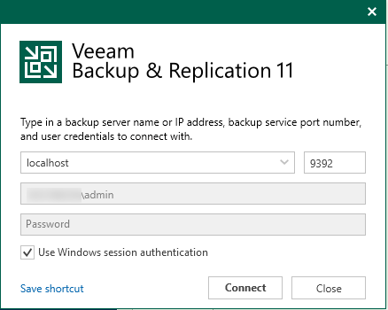{.thumbnail}

Check that it is in **Free Edition** mode, in the bottom right-hand corner.

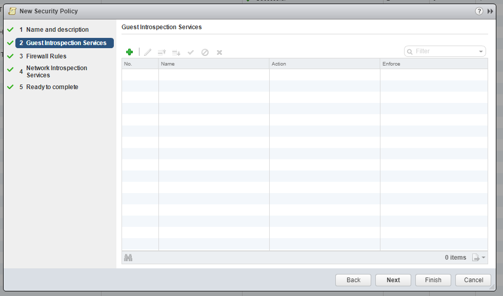{.thumbnail}

Go to the menu, and click `Users and Roles`{.action}.

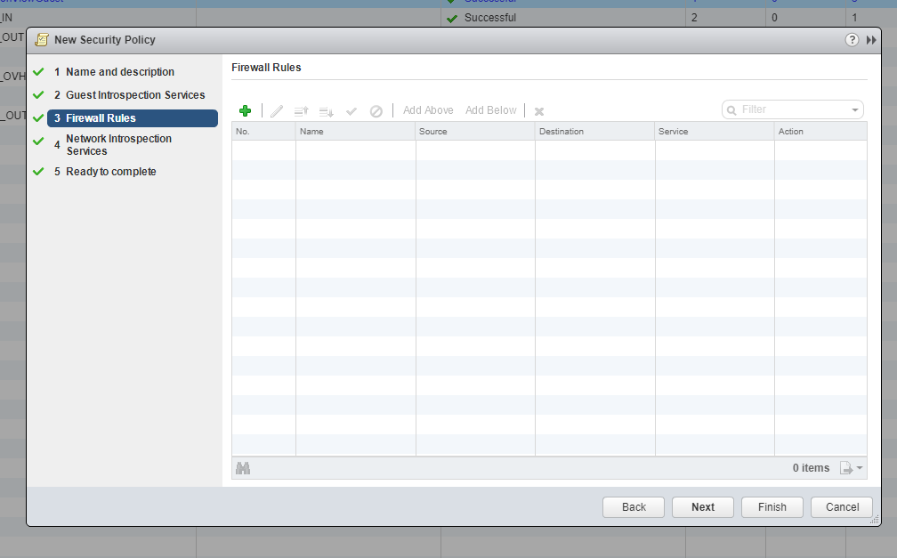{.thumbnail}

In the `Security`{.action} window, select `Add...`{.action}.

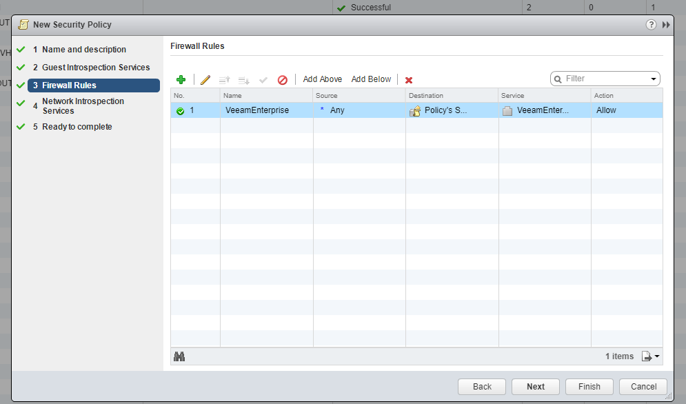{.thumbnail}

Then, in the `Add User`{.action} window, enter the service account you have created. Select the **Veeam Backup Administrator** role, then confirm by clicking `OK`{.action}.

{.thumbnail}

If you go back to the **Security** window, you can check that the account has been defined properly.

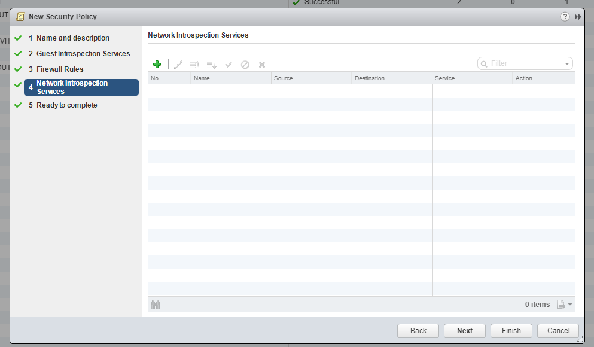{.thumbnail}

#### Register the Veeam Backup & Replication server.

You will need to do this via the OVH API.

First, retrieve your serviceName:

> [!api]
>
> @api {GET} /veeam/veeamEnterprise
>

Then register it:

> [!api]
>
> @api {POST} /veeam/veeamEnterprise/{serviceName}/register
>

You will need the following information:

 * the public IP address that can be used to contact your **Veeam Backup & Replication** server
 * your server’s **Veeam Backup & Replication** port (usually **9392/TCP**)
 * the login for the account you have just created
 * the password for your service account

You can retrieve the public IP used by Veeam Enterprise to contact your **Veeam Backup & Replication** server via:

> [!api]
>
> @api {GET} /veeam/veeamEnterprise/{serviceName}
>

#### Check the registration.

Launch the Veeam console.

{.thumbnail}

Go to the menu, then click `License`{.action}.

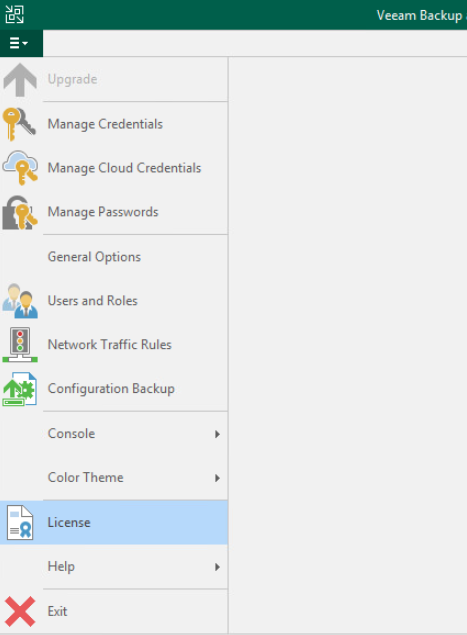{.thumbnail}

Check that the information displayed is definitely for your OVH licence.

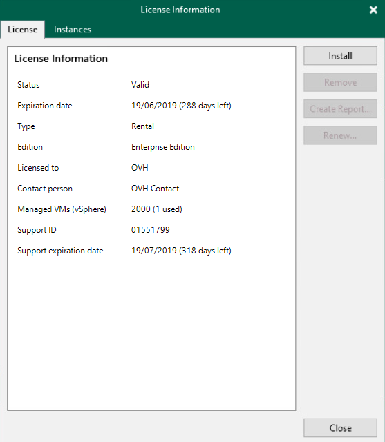{.thumbnail}

## Go further

Join our community of users on <https://community.ovh.com/en/>.
