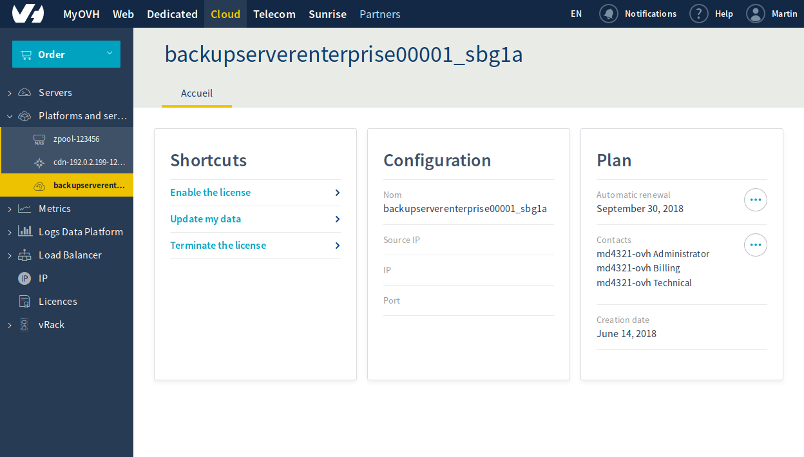
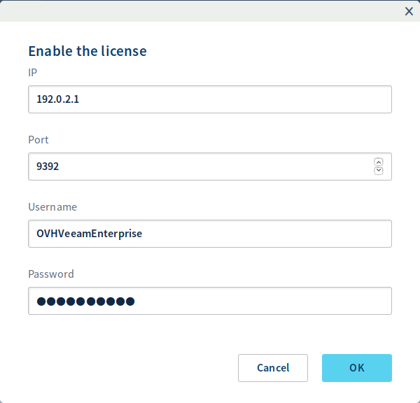
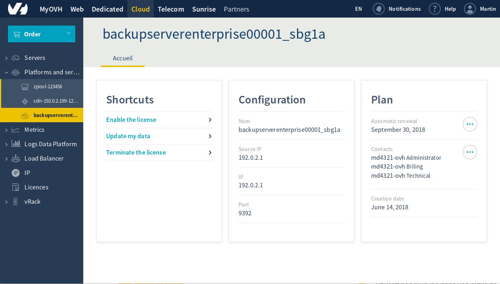

**Dernière mise à jour le 24/09/2018**

## Objectif

Veeam Backup & Replication est un logiciel de protection des données. Il offre diverses possibilités de sauvegarde, de réplication et de restauration.

**Apprenez à installer un serveur Veeam Backup & Replication, puis à l'enregistrer auprès du serveur de licences Veeam Enterprise d'OVH.**


## Prérequis

* Posséder une offre Veeam Enterprise.
* Avoir à disposition une machine Windows Server 2012 ou 2016.

## En pratique

### Installer Veeam Backup & Replication

Téléchargez la solution **Veeam Backup & Replication** depuis le site de Veeam. Si vous n'avez pas de compte, il sera nécessaire d'en créer un (celui est gratuit).

Le fichier se présente sous la forme d'une image disque au format ISO. Après l'avoir transférée sur votre serveur, sélectionnez le lecteur CD de la machine puis choisissez l'image.

Dans la machine, vous pouvez désormais lancer l'installeur. Sélectionnez alors `Veeam Backup & Replication Install`{.action}.

{.thumbnail}

Après l'avoir lu, acceptez le contrat de licence en choisissant `Next`{.action}.

{.thumbnail}

Passez l'étape de renseignement du fichier de licence avec `Next`{.action}.

{.thumbnail}

Dans l'étape de sélection des composants à installer, ne modifiez rien. Selon vos besoins, vous pouvez cependant changer le chemin de destination de l'installation. Validez ensuite avec `Next`{.action}.

{.thumbnail}

L'installateur va maintenant effectuer un contrôle des prérequis. Si vous partez d'une installation brute de Windows, certains composants seront absents. Mais pas de panique : l'installeur téléchargera et installera ceux-ci automatiquement. Validez ensuite avec `Next`{.action}.

{.thumbnail}

Patientez pendant l'installation des prérequis.

{.thumbnail}

Après cette étape, validez l'installation de **Veeam Backup & Replication** avec `Next`{.action}.

{.thumbnail}

Lors de l'étape de personnalisation de l'installation, validez l'opération en choisissant `Install`{.action}.

{.thumbnail}

Patientez pendant l'installation.

{.thumbnail}

Une fois celle-ci terminée, quittez l'installateur en cliquant sur `Finish`{.action}.

{.thumbnail}

L'installateur vous demande de redémarrer Windows afin de finaliser l'opération. Choisissez alors `Yes`{.action}.

{.thumbnail}

### Créer un compte de service Veeam Enterprise

#### Lancer un compte de service

Au préalable, il est nécessaire de générer un mot de passe **complexe**.

Créez ensuite un compte de service, en entrant ces lignes de commande depuis un accès administrateur :

```powershell
New-LocalUser "OVHVeeamEnterprise" -Password (ConvertTo-SecureString -AsPlainText "P@ssword01" -Force) -Description "OVH Service Account for Veeam Enterprise" -PasswordNeverExpires:$true -UserMayNotChangePassword:$true -AccountNeverExpires:$true
```

Notez que le nom du compte et le mot de passe correspondent à un exemple et doivent être remplacés :

 * Nom du compte : OVHVeeamEnterprise
 * Mot de passe : P@ssword01

#### Définir les autorisations du compte de service

Lancez la console Veeam.

{.thumbnail}

Vérifiez que vous êtes en mode **Free Edition**, dans le coin en bas à droite.

{.thumbnail}

Allez dans le menu, puis cliquez sur `Users and Roles`{.action}.

{.thumbnail}

Dans la fenêtre `Security`{.action}, choisissez `Add...`{.action}.

{.thumbnail}

Puis dans la fenêtre `Add User`{.action}, saisissez le compte de service précédemment créé. Sélectionnez le rôle **Veeam Backup Administrator** et validez enfin avec `OK`{.action}.

{.thumbnail}

De retour dans la fenêtre **Security**, vous pouvez vérifier que le compte est bien défini.

{.thumbnail}

### Enregistrer le serveur Veeam Backup

## Avec le Manager OVH

Dans le manager, ouvrir l'univers Cloud puis dans la section `Plateforms and services`{.action}, sélectionner votre service **backupserverenterprise**.

{.thumbnail}

Depuis la page principale du service, choisir `Enable the license`{.action}.

{.thumbnail}

Dans la nouvelle fenêtre, saisir les informations suivantes :

* L'adresse IP publique par laquelle votre serveur **Veeam Backup & Replication** peut être contacté.
* Le port de votre serveur **Veeam Backup & Replication** (usuellement **9392/TCP**).
* le login du compte de service précédemment créé.
* le mot de passe du compte de service.

Puis valider avec `OK`{.action}.

Lorsque l'activation est faite, vous retrouvez les informations principales sur la page du service.

{.thumbnail}

## Avec l'API OVH

D'abord, récupérez votre serviceName :

> [!api]
>
> @api {GET} /veeam/veeamEnterprise
>

Puis effectuez l'enregistrement :

> [!api]
>
> @api {POST} /veeam/veeamEnterprise/{serviceName}/register
>

Vous devez vous munir des informations suivantes :

* L'adresse IP publique par laquelle votre serveur **Veeam Backup & Replication** peut-etre contacté.
* Le port de votre veeam backup (usuellement **9392/TCP**)
* le login du compte de service précédemment crée
* le mot de passe du compte de service

Vous pouvez obtenir l'adresse IP publique utilisée par Veeam Enterprise pour contacter votre serveur **Veeam Backup & Replication** via :

> [!api]
>
> @api {GET} /veeam/veeamEnterprise/{serviceName}
>

### Vérifier l'enregistrement

Lancez la console Veeam.

{.thumbnail}

Allez dans le menu, puis cliquez sur `Licence`{.action}.

{.thumbnail}

Dans les informations, vérifiez qu'il s'agit bien de votre licence OVH.

{.thumbnail}

## Aller plus loin

Échangez avec notre communauté d’utilisateurs sur <https://community.ovh.com/>.
