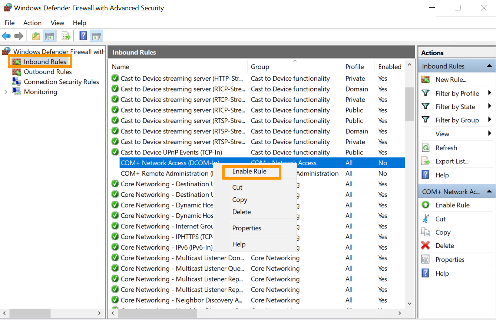
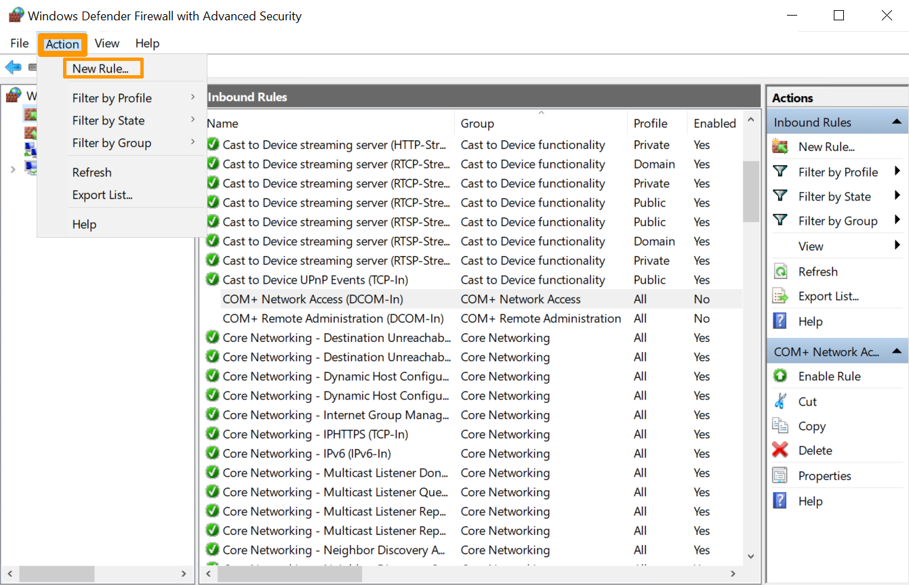
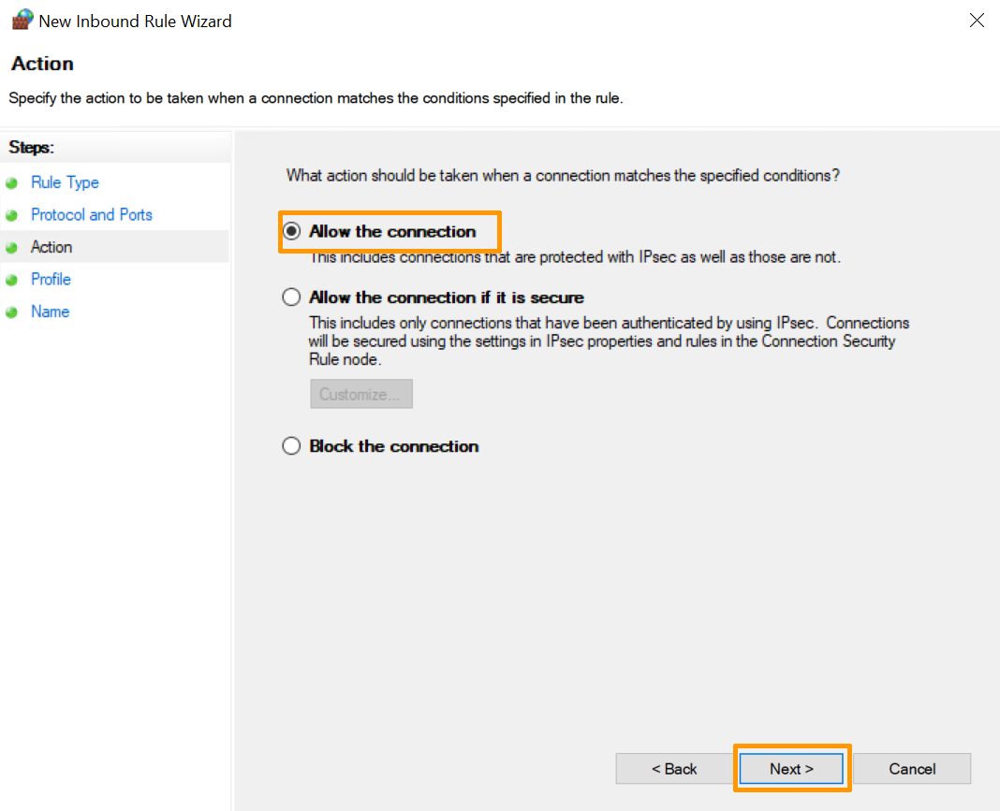

> [!primary]
> Esta traducción ha sido generada de forma automática por nuestro partner SYSTRAN. En algunos casos puede contener términos imprecisos, como en las etiquetas de los botones o los detalles técnicos. En caso de duda, le recomendamos que consulte la versión inglesa o francesa de la guía. Si quiere ayudarnos a mejorar esta traducción, por favor, utilice el botón "Contribuir" de esta página.
>

**Última actualización: 17/02/2023**

## Objetivo

Para proteger de forma óptima su sistema, su servidor con Windows Server dispone de su propio firewall integrado. Su configuración permite aumentar los niveles de seguridad y garantizar así la disponibilidad e integridad de todos los elementos alojados en el servidor, como los roles, los servicios o las carpetas compartidas.

**Esta guía explica cómo aplicar las reglas del firewall de Windows.**

> [!warning]
>
> La responsabilidad sobre los servicios que OVHcloud pone a su disposición recae íntegramente en usted. Nuestros técnicos no son los administradores de las máquinas, ya que no tienen acceso a ellas. Por lo tanto, la gestión del software y la seguridad le corresponde a usted.
>
> Esta guía le ayudará a realizar las operaciones más habituales. No obstante, si tiene dificultades o dudas con respecto a la administración, el uso o la seguridad de un servidor, le recomendamos que contacte con un proveedor de servicios especializado. Para más información, consulte el apartado «Más información» de esta guía.
>

## Requisitos

- Un servidor [VPS](https://www.ovhcloud.com/es-es/vps/) con Windows en su cuenta de OVHcloud.
- Tener acceso de administrador al servidor a través de un escritorio remoto con Windows. 

## Procedimiento

### Paso 1: acceder al firewall de Windows

Para acceder al firewall de Windows, puede seguir el siguiente orden:

- Haga clic en `Iniciar`{.action}.
- Haga clic en `Buscar`{.action}.
- Busque "Firewall Windows" en la barra de búsqueda.
- Haga clic en `Cortafuegos Windows`{.action}.

A continuación, haga clic en la línea `Configuración avanzada`{.action}.

{.thumbnail}

### Paso 2: activar una regla de tráfico entrante

En la ventana que se muestra, encontrará parámetros como:

- Reglas de entrada y salida
- Reglas de seguridad de la conexión
- Opciones de supervisión del firewall del servidor

Al seleccionar las `Reglas de tráfico entrante`{.action}, se mostrarán todas las reglas preconfiguradas de Windows Server asociadas a las conexiones de red y a los paquetes entrantes. Algunas de estas reglas no están activadas por defecto. Si desea activarlos, haga clic derecho en la regla y seleccione la opción `Activar regla`{.action}.

{.thumbnail}

### Paso 3: crear una nueva regla 

Para crear una nueva regla, acceda al menú `Acción`{.action} y seleccione `Nueva regla`{.action}.
Haga clic en la opción `Nueva regla`{.action} situada en el panel derecho.

{.thumbnail}

### Paso 4: establecer el tipo de regla a activar

Se mostrará un asistente que define el tipo de regla que se va a crear. Seleccione la casilla `Puerto`{.action}.

{.thumbnail}

### Paso 5: establecer el tipo de puerto a activar

A continuación, seleccione el tipo de puerto que desea activar:

{.thumbnail}

> [!primary]
>
>- TCP (protocolo de control de transmisión)
>Es un protocolo orientado a la conexión, es decir, que con TCP será posible crear conexiones entre ellas para enviar flujos de datos. Este protocolo garantiza que los datos se entregan al destinatario sin error y en el mismo orden en que fueron enviados.
>
>- UDP (User Datagram Protocol - Protocolo de Datagrama de Usuario)
>Es un protocolo no orientado a la conexión. Su desarrollo se basa en el intercambio de datagramas y facilita el envío de datagramas a través de la red. Es necesario haber establecido previamente una conexión con el destino.
>
>También puede seleccionar la casilla `Todos los puertos locales`{.action} para activar todos los puertos TCP o UDP en un servidor no seguro. También puede marcar la casilla `Puertos locales específicos`{.action} para determinar qué puerto debe permitirse. 
>

### Paso 6: autorizar o bloquear la conexión

Para determinar la acción que se va a ejecutar esta regla, dispondrá de las siguientes opciones: Seleccione la que desee.

- **Permitir la conexión**. Esta opción permite una comunicación completa a través de este puerto.
- **Permitir la conexión si está protegida**. Esta opción permite que los datos solo se transmitan si la conexión está autenticada a través de IPsec.
- **Bloquear la conexión**. Esta opción impide que los datos se envíen a través de este puerto.

Seleccione la opción `Autorizar la conexión`{.action} y haga clic en `Siguiente `{.action}. 

{.thumbnail}

### Paso 7: definir el perfil y el nombre del firewall que se aplicará

A continuación, elija los perfiles que debe utilizar la regla para los perfiles público, de dominio o privado.
Puede activarlos todos si lo desea.

{.thumbnail}

Asigne un nombre y una descripción a la nueva regla (opcional) para facilitar su uso:

{.thumbnail}

Haga clic en el botón `Finalizar`{.action} para finalizar el proceso y crear la nueva regla.

{.thumbnail}

A continuación, podrá realizar cambios en la seguridad de la nueva regla creada.

## Más información

Interactúe con nuestra comunidad de usuarios en <https://community.ovh.com/en/>.
