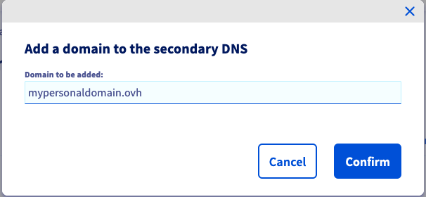
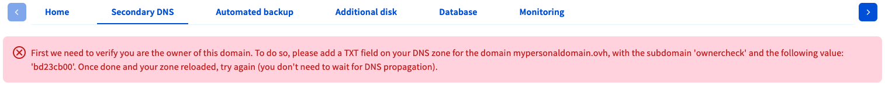

> [!primary]
> Diese Übersetzung wurde durch unseren Partner SYSTRAN automatisch erstellt. In manchen Fällen können ungenaue Formulierungen verwendet worden sein, z.B. bei der Beschriftung von Schaltflächen oder technischen Details. Bitte ziehen Sie beim geringsten Zweifel die englische oder französische Fassung der Anleitung zu Rate. Möchten Sie mithelfen, diese Übersetzung zu verbessern? Dann nutzen Sie dazu bitte den Button «Mitmachen» auf dieser Seite.
>

**Letzte Aktualisierung am 12.01.2022**

## Ziel

Wenn Sie Ihren VPS als DNS-Server konfigurieren, können Sie einen OVHcloud DNS-Server verwenden, um eine sekundäre Zone zu hosten. So bleibt das DNS Ihres Domainnamens auch dann verfügbar, wenn der primäre DNS-Server nicht mehr antwortet.

**Diese Anleitung erklärt, wie Sie Ihren Domainnamen zum OVHcloud Kundencenter hinzufügen, um einen sekundären DNS-Server zu verwenden.**

## Voraussetzungen

- Sie haben adminstrativen Zugriff auf einen Domainnamen.
- Sie haben einen [VPS](https://www.ovhcloud.com/de/vps/) in Ihrem Kunden-Account.
- Sie haben Zugriff auf Ihr [OVHcloud Kundencenter](https://www.ovh.com/auth/?action=gotomanager&from=https://www.ovh.de/&ovhSubsidiary=de).

> [!warning]
>
> OVHcloud stellt Ihnen Dienstleistungen zur Verfügung, für deren Konfiguration und Verwaltung Sie die alleinige Verantwortung tragen. Es liegt somit bei Ihnen, sicherzustellen, dass diese ordnungsgemäß funktionieren.
> 
> Wir stellen Ihnen diese Anleitung zur Verfügung, um Ihnen bei der Bewältigung alltäglicher Verwaltungsaufgaben zu helfen. Dennoch empfehlen wir Ihnen, einen spezialisierten Dienstleister zu kontaktieren, wenn Sie Schwierigkeiten oder Zweifel hinsichtlich der Verwaltung, Nutzung oder Implementierung der Dienste auf einem Server haben.
> 

## In der praktischen Anwendung

### Schritt 1: Abruf des Validierungscodes 

Loggen Sie sich in Ihr [OVHcloud Kundencenter](https://www.ovh.com/auth/?action=gotomanager&from=https://www.ovh.de/&ovhSubsidiary=de) ein, gehen Sie in den Bereich `Bare Metal Cloud`{.action} und wählen Sie dann Ihren Server unter **Virtual Private Server** aus.

Gehen Sie zum Tab `Sekundärer DNS`{.action} und klicken Sie auf den Button `Domain hinzufügen`{.action}.

{.thumbnail}

Geben Sie den Domainnamen ein, den Sie hinzufügen möchten, und klicken Sie dann auf `Bestätigen`{.action}.

{.thumbnail}

Eine Nachricht zum Validierungsprozess wird nun im Kundencenter angezeigt.

{.thumbnail}

Sie müssen Ihre Berechtigung zur Verwaltung des Domainnamens bestätigen, bevor er zum sekundären DNS von OVHcloud hinzugefügt werden kann. Dies erfolgt über eine automatisierte DNS-Abfrage auf die Subdomain *ownercheck.ihrdomainname*. Zu diesem Zweck wird eine individuelle Zeichenkette erzeugt und im roten Hinweisfeld angezeigt. Kopieren Sie diesen Validierungscode, um ihn im nächsten Schritt zu verwenden.

### Schritt 2: Bestätigung der Domainauthorisierung 

Die durchzuführende Aktion hängt davon ab, wo das DNS Ihres Domainnamens verwaltet wird.

- Wenn der Domainname derzeit von einem externen Registrar verwaltet wird **oder** externe DNS-Server verwendet, loggen Sie sich in die Verwaltungsoberfläche Ihres DNS-Anbieters ein und fügen Sie der DNS-Zone einen Eintrag des Typs TXT mit der Subdomain "ownercheck", sowie dem Wert aus [Schritt 1](#retrievecode) hinzu.

- Wenn der Domainname von OVHcloud als Registrar verwaltet wird **und** die DNS-Server von OVHcloud verwendet werden, fügen Sie den TXT-Eintrag im Bereich `Web Cloud`{.action} in Ihrem [OVHcloud Kundencenter](https://www.ovh.com/auth/?action=gotomanager&from=https://www.ovh.de/&ovhSubsidiary=de) hinzu. Folgen Sie den Anweisungen in unserer Anleitung zum [Bearbeiten der DNS Zone](../../domains/webhosting_bearbeiten_der_dns_zone/), falls Sie mit dieser Vorgehensweise nicht nicht vertraut sind.

{.thumbnail}

### Schritt 3: Hinzufügen des Domainnamens

Sobald der TXT-Eintrag in der DNS-Zone des Domainnamens vorhanden ist, wiederholen Sie die in [Teil 1 dieser Anleitung beschriebenen Schritte](#retrievecode) um den Domainnamen zum sekundären OVHcloud DNS-Server hinzuzufügen.

Wenn Sie nun auf `Bestätigen`{.action}, klicken, wird die automatische Überprüfung der Domainauthorisierung ausgelöst, indem der TXT-Eintrag abgefragt wird. Eine Nachricht in Ihrem Kundencenter bestätigt die erfolgreiche DNS-Validierung. Sie können den TXT-Eintrag anschließend löschen.

Die hinzugefügten Domainnamen erscheinen in diesem Tab mit dem **Namen des sekundären DNS-Servers**. (Aktualisieren Sie die Seite in Ihrem Browser, nachdem Sie einen Domainnamen hinzugefügt haben.)

{.thumbnail}

Sie können einen Domainnamen löschen, indem Sie auf den Button `...`{.action} in der Tabelle klicken.

> [!primary]
>
> Weitere für die Konfiguration Ihres eigenen DNS für Ihren Domainnamen erforderliche Aktionen sind üblicherweise:
>
> - Konfiguration eines DNS-Dienstes (z.B. *BIND*)
> - Konfiguration von GLUE-Einträgen
> - Genehmigung von Zonentransfers
>
> Konsultieren Sie die entsprechenden Anleitungen und sonstige externe Wissensressourcen, wenn Sie zusätzliche Informationen zu diesen administrativen Aufgaben benötigen.

## Weiterführende Informationen

Für den Austausch mit unserer User Community gehen Sie auf <https://community.ovh.com/en/>.