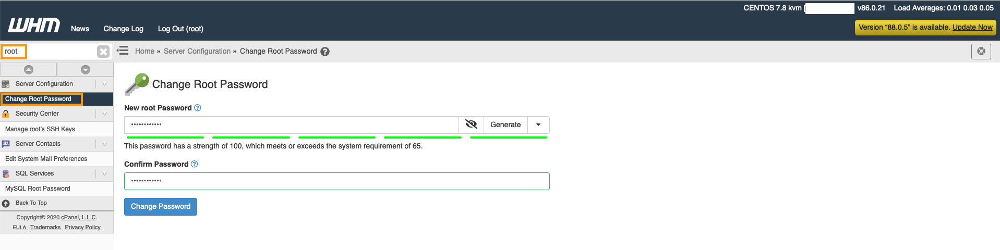

**Dernière mise à jour le 16/09/2021**

## Objectif

OVHcloud offre aux clients VPS des images d'applications préinstallées pour un déploiement rapide et facile en quelques clics.

**Découvrez comment déployer des applications préinstallées sur votre VPS.**

## Prérequis

- Disposer d'un [VPS](https://www.ovhcloud.com/fr/vps/) sur votre compte OVHcloud.

## En pratique

### Installer l'application préinstallée de votre choix

Depuis [l'espace client OVHcloud](https://www.ovh.com/auth/?action=gotomanager&from=https://www.ovh.com/fr/&ovhSubsidiary=fr) ou les API OVHcloud, installez l'application de votre choix. Vous pouvez également consulter notre guide [Débuter avec un VPS](../debuter-avec-vps/).

#### cPanel

Vous trouverez ci-dessous les premières étapes relatives à la mise en service de l'image préinstallée de cPanel. Les étapes marquées d'un « * » seront suivies d'une FAQ.

1. Ouvrez l'e-mail que vous avez reçu contenant les identifiants de connexion à l'application.
2. Cliquez sur l'URL de cPanel dans cet e-mail.

> [!primary]
>
> Si le lien a déjà expiré, connectez-vous en SSH au serveur à l'aide de l'utilisateur CentOS et exécutez la commande « sudo whmlogin » pour générer un nouveau lien. 
>

<ol start="3">
  <li>Lisez et acceptez les conditions particulières de cPanel.</li>
  <li>Saisissez vos serveurs de messagerie et serveurs DNS *.</li>
  <li>Définissez le mot de passe root que vous utiliserez la prochaine fois que vous vous connecterez à WHM *.</li>
</ol>

{.thumbnail}

Aucune autre étape n'est nécessaire pour terminer la première configuration de cette application.

> [!faq]
>
> Puis-je utiliser mes propres serveurs DNS ?
>> Oui, vous le pouvez. Assurez-vous de créer des enregistrements « GLUE » avec votre bureau d'enregistrement de domaine. Par exemple, si vous voulez « ns1.mydomain.com » et « ns2.mydomain.com », vous devez configurer des enregistrements « GLUE » pour que les deux pointent sur l'adresse IP de votre serveur. Si votre domaine est enregistré avec OVHcloud, vous pouvez suivre [ce guide](../../domains/glue-registry/#etape-1-ajouter-les-enregistrements-glue). Notez que la création peut prendre 24 heures.
> Pourquoi définir le mot de passe root?
>> WHM utilise par défaut l'utilisateur root pour l'authentification. L'URL à usage unique permet d'accéder à la première configuration et de modifier le mot de passe root. La prochaine fois que vous vous connecterez à WHM, vous devrez utiliser l'utilisateur root et le mot de passe que vous avez défini.
> Où est ma licence pour cPanel?
>> Vous pouvez commander votre licence cPanel pour votre VPS depuis [l'espace client OVHcloud](https://www.ovh.com/manager/dedicated/#/configuration/license/order).

#### Plesk

Vous trouverez ci-dessous les premières étapes relatives à la mise en service de l'image préinstallée de Plesk. Les étapes marquées d'un « * » seront suivies d'une FAQ.

1. Ouvrez l'e-mail que vous avez reçu contenant les identifiants de connexion à l'application.
2. Cliquez sur l'URL de Plesk dans cet e-mail.
3. Connectez-vous à l'aide du nom d'utilisateur et du mot de passe présents dans l'e-mail.
4. Une fois connecté, Plesk vous demandera:   
    a) Vos coordonnées.  
    b) Un nouveau mot de passe pour l'utilisateur « admin » que vous utiliserez pour vous connecter à l'interface de Plesk.  
    c) Des informations sur la licence.*  
    d) De lire et accepter les contrats de licence utilisateur.  

Aucune autre étape n'est nécessaire pour terminer la première configuration de cette application.

> [!faq]
>
> Où est ma licence Plesk?
>> Vous pouvez commander votre licence Plesk pour votre VPS depuis [l'espace client OVHcloud](https://www.ovh.com/manager/dedicated/#/configuration/license/order).

#### Virtualmin

Vous trouverez ci-dessous les premières étapes relatives à la mise en service de l'image préinstallée de Virtualmin. 

1. Ouvrez l'e-mail que vous avez reçu contenant les identifiants de connexion à l'application.
2. Cliquez sur l'URL de Virtualmin dans cet e-mail.
3. Connectez-vous à l'aide du nom d'utilisateur et du mot de passe présents dans l'e-mail.
4. Une fois connecté, pour répondre à vos besoins et aider Virtualmin à se configurer, complétez le questionnaire d'optimisation.

Aucune autre étape n'est nécessaire pour terminer la première configuration de cette application.

#### Vestacp

Vous trouverez ci-dessous les premières étapes relatives à la mise en service de l'image préinstallée de Vestacp.

1. Ouvrez l'e-mail que vous avez reçu contenant les identifiants de connexion à l'application.
2. Cliquez sur l'URL de Vestacp dans cet e-mail.
3. Connectez-vous à l'aide du nom d'utilisateur et du mot de passe présents dans l'e-mail.

Aucune autre étape n'est nécessaire pour terminer la première configuration de cette application.

#### Docker

Vous trouverez ci-dessous les premières étapes relatives à la mise en service de l'image préinstallée de Docker.

1. Connectez-vous en SSH sur le serveur à l'aide du nom d'utilisateur et du mot de passe présents dans l'e-mail.
2. Vérifiez que Docker fonctionne à l'aide de la commande « docker run hello-world ».

Aucune autre étape n'est nécessaire pour terminer la première configuration de cette application.

### Let's Encrypt SSL

Cette section s'applique uniquement aux installations de WordPress, Drupal, Joomla et Prestashop. Elle ne s'applique pas pour les autres installations.

1. Vous devez créer ou modifier, dans l'espace client OVHcloud, deux enregistrements `A `  qui pointent vers l'adresse IP de votre serveur. Par exemple, si votre nom de domaine est « personaldomain.ovh », vous devez créer des enregistrements `A` pour :  

   - personaldomain.ovh <br>
   - www.personaldomain.ovh <br>  

Si votre domaine est enregistré chez OVHcloud, vous pouvez suivre [ce guide](../../domains/editer-ma-zone-dns/).
<br>Si votre domaine est enregistré auprès d'une autre société, vous devrez contacter celle-ci pour obtenir de l'aide sur la configuration de vos enregistrements `A`.

<ol start="2">
  <li>Vous devrez peut-être attendre 24 heures avant que les deux enregistrements ne se propagent complètement. Vous pouvez toujours le vérifier avec <a href="https://mxtoolbox.com/DnsLookup.aspx">mxtoolbox</a>. Si l'adresse IP de votre domaine s'affiche sur mxtoolbox de la même manière que celle de votre serveur, vous pouvez passer à l'étape suivante.</li>
  <li>Connectez-vous en SSH sur votre serveur avec l'utilisateur CentOS et exécutez les commandes suivantes pour installer Certbot :</li>
</ol>

> [!warning]
>
> Remplacez personaldomain.ovh par votre propre nom de domaine dans les commandes suivantes.
>

```sh
sudo -i
dnf install -y epel-release
dnf install -y certbot python3-certbot-apache mod_ssl
echo "ServerName personaldomain.ovh;" >> /etc/httpd/conf/httpd.conf
systemctl restart httpd
```

<ol start="4">
  <li> Générez votre certificat SSL en utilisant Certbot (suivez les instructions à l'écran).</li>
</ol>

```sh
certbot certonly -d personaldomain.ovh --webroot
```

Lorsque vous êtes invité à saisir « Input the webroot », vous devez saisir une variable du type « /var/www/wordpress ». Si vous installez Joomla, vous devez remplacer « wordpress » par « joomla ».

Vous devez maintenant faire en sorte que Certbot place également cette variable dans le fichier ssl.conf. Pour cela, entrez:

```sh
certbot -d personaldomain.ovh --apache
```

Lorsque vous y êtes invité, répondez à la première question par « 1 » et à la seconde aussi par « 1 ».

Vous devriez obtenir le résultat suivant si votre certificat SSL a été généré :

```sh
IMPORTANT NOTES:
 - Congratulations! Your certificate and chain have been saved at:
   /etc/letsencrypt/live/personaldomain.ovh/fullchain.pem
   Your key file has been saved at:
   /etc/letsencrypt/live/personaldomain.ovh/privkey.pem
   Your cert will expire on 2020-11-12. To obtain a new or tweaked
   version of this certificate in the future, simply run certbot again
   with the "certonly" option. To non-interactively renew *all* of
   your certificates, run "certbot renew"
```

## Allez plus loin

Échangez avec notre communauté d'utilisateurs sur <https://community.ovh.com>.
